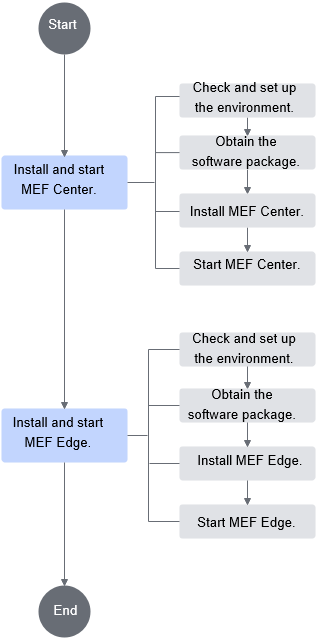
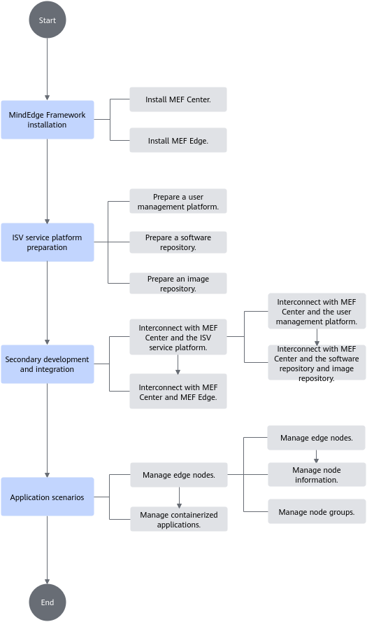

# MEF

<!-- md-trans-meta sourceCommit=unknown translatedAt=2026-06-09T01:10:04.975Z pushedAt=2026-06-09T01:11:14.881Z -->

- [MEF](#mef)
  - [What's New](#whats-new)
  - [Introduction](#introduction)
  - [Directory Structure](#directory-structure)
  - [Version Description](#version-description)
  - [Compatibility Information](#compatibility-information)
  - [Environment Deployment](#environment-deployment)
    - [Obtaining Software Packages](#obtaining-software-packages)
    - [Installation](#installation)
  - [Build Process](#build-process)
    - [Dependency Preparation](#dependency-preparation)
    - [Build MEF](#build-mef)
    - [Notes](#notes)
  - [Test Case](#test-case)
  - [Quick Start](#quick-start)
  - [Feature Description](#feature-description)
  - [API Reference](#api-reference)
  - [FAQ](#faq)
  - [Security Statement](#security-statement)
  - [Branch Maintenance Policy](#branch-maintenance-policy)
  - [Version Maintenance Policy](#version-maintenance-policy)
  - [Disclaimer](#disclaimer)
  - [License](#license)
  - [Contribution Statement](#contribution-statement)
  - [Suggestions and Communication](#suggestions-and-communication)

## What's New

- [2025.12.30]: 🚀 MEF Open-Source Release

## Introduction

MEF is a lightweight edge-cloud collaboration enablement framework designed for integration. It is used to enable intelligent edge devices, providing edge-cloud collaboration capabilities such as edge node management and lifecycle management of edge inference applications. Edge-cloud collaboration management can be performed through MEF Edge and MEF Center. Users can integrate required features by connecting to Independent Software Vendor (ISV) service platforms through secondary development.

- MEF Edge is deployed on intelligent edge devices, responsible for connecting to the central network manager, deploying and managing intelligent inference services (container applications), and providing services for algorithm applications.
- MEF Center is deployed on general-purpose servers, responsible for batch management, service deployment, and system monitoring of edge nodes.

<div align="center">

 [![Zread](https://img.shields.io/badge/Zread-Ask_AI-_.svg?style=flat&color=0052D9&labelColor=000000&logo=data%3Aimage%2Fsvg%2Bxml%3Bbase64%2CPHN2ZyB3aWR0aD0iMTYiIGhlaWdodD0iMTYiIHZpZXdCb3g9IjAgMCAxNiAxNiIgZmlsbD0ibm9uZSIgeG1sbnM9Imh0dHA6Ly93d3cudzMub3JnLzIwMDAvc3ZnIj4KPHBhdGggZD0iTTQuOTYxNTYgMS42MDAxSDIuMjQxNTZDMS44ODgxIDEuNjAwMSAxLjYwMTU2IDEuODg2NjQgMS42MDE1NiAyLjI0MDFWNC45NjAxQzEuNjAxNTYgNS4zMTM1NiAxLjg4ODEgNS42MDAxIDIuMjQxNTYgNS42MDAxSDQuOTYxNTZDNS4zMTUwMiA1LjYwMDEgNS42MDE1NiA1LjMxMzU2IDUuNjAxNTYgNC45NjAxVjIuMjQwMUM1LjYwMTU2IDEuODg2NjQgNS4zMTUwMiAxLjYwMDEgNC45NjE1NiAxLjYwMDFaIiBmaWxsPSIjZmZmIi8%2BCjxwYXRoIGQ9Ik00Ljk2MTU2IDEwLjM5OTlIMi4yNDE1NkMxLjg4ODEgMTAuMzk5OSAxLjYwMTU2IDEwLjY4NjQgMS42MDE1NiAxMS4wMzk5VjEzLjc1OTlDMS42MDE1NiAxNC4xMTM0IDEuODg4MSAxNC4zOTk5IDIuMjQxNTYgMTQuMzk5OUg0Ljk2MTU2QzUuMzE1MDIgMTQuMzk5OSA1LjYwMTU2IDE0LjExMzQgNS42MDE1NiAxMy43NTk5VjExLjAzOTlDNS42MDE1NiAxMC42ODY0IDUuMzE1MDIgMTAuMzk5OSA0Ljk2MTU2IDEwLjM5OTlaIiBmaWxsPSIjZmZmIi8%2BCjxwYXRoIGQ9Ik0xMy43NTg0IDEuNjAwMUgxMS4wMzg0QzEwLjY4NSAxLjYwMDEgMTAuMzk4NCAxLjg4NjY0IDEwLjM5ODQgMi4yNDAxVjQuOTYwMUMxMC4zOTg0IDUuMzEzNTYgMTAuNjg1IDUuNjAwMSAxMS4wMzg0IDUuNjAwMUgxMy43NTg0QzE0LjExMTkgNS42MDAxIDE0LjM5ODQgNS4zMTM1NiAxNC4zOTg0IDQuOTYwMVYyLjI0MDFDMTQuMzk4NCAxLjg4NjY0IDE0LjExMTkgMS42MDAxIDEzLjc1ODQgMS42MDAxWiIgZmlsbD0iI2ZmZiIvPgo8cGF0aCBkPSJNNCAxMkwxMiA0TDQgMTJaIiBmaWxsPSIjZmZmIi8%2BCjxwYXRoIGQ9Ik00IDEyTDEyIDQiIHN0cm9rZT0iI2ZmZiIgc3Ryb2tlLXdpZHRoPSIxLjUiIHN0cm9rZS1saW5lY2FwPSJyb3VuZCIvPgo8L3N2Zz4K&logoColor=ffffff)](https://zread.ai/Ascend/MEF)&nbsp;&nbsp;&nbsp;&nbsp;
 [![DeepWiki](https://img.shields.io/badge/DeepWiki-Ask_AI-_.svg?style=flat&color=0052D9&labelColor=000000&logo=data:image/png;base64,iVBORw0KGgoAAAANSUhEUgAAACwAAAAyCAYAAAAnWDnqAAAAAXNSR0IArs4c6QAAA05JREFUaEPtmUtyEzEQhtWTQyQLHNak2AB7ZnyXZMEjXMGeK/AIi+QuHrMnbChYY7MIh8g01fJoopFb0uhhEqqcbWTp06/uv1saEDv4O3n3dV60RfP947Mm9/SQc0ICFQgzfc4CYZoTPAswgSJCCUJUnAAoRHOAUOcATwbmVLWdGoH//PB8mnKqScAhsD0kYP3j/Yt5LPQe2KvcXmGvRHcDnpxfL2zOYJ1mFwrryWTz0advv1Ut4CJgf5uhDuDj5eUcAUoahrdY/56ebRWeraTjMt/00Sh3UDtjgHtQNHwcRGOC98BJEAEymycmYcWwOprTgcB6VZ5JK5TAJ+fXGLBm3FDAmn6oPPjR4rKCAoJCal2eAiQp2x0vxTPB3ALO2CRkwmDy5WohzBDwSEFKRwPbknEggCPB/imwrycgxX2NzoMCHhPkDwqYMr9tRcP5qNrMZHkVnOjRMWwLCcr8ohBVb1OMjxLwGCvjTikrsBOiA6fNyCrm8V1rP93iVPpwaE+gO0SsWmPiXB+jikdf6SizrT5qKasx5j8ABbHpFTx+vFXp9EnYQmLx02h1QTTrl6eDqxLnGjporxl3NL3agEvXdT0WmEost648sQOYAeJS9Q7bfUVoMGnjo4AZdUMQku50McDcMWcBPvr0SzbTAFDfvJqwLzgxwATnCgnp4wDl6Aa+Ax283gghmj+vj7feE2KBBRMW3FzOpLOADl0Isb5587h/U4gGvkt5v60Z1VLG8BhYjbzRwyQZemwAd6cCR5/XFWLYZRIMpX39AR0tjaGGiGzLVyhse5C9RKC6ai42ppWPKiBagOvaYk8lO7DajerabOZP46Lby5wKjw1HCRx7p9sVMOWGzb/vA1hwiWc6jm3MvQDTogQkiqIhJV0nBQBTU+3okKCFDy9WwferkHjtxib7t3xIUQtHxnIwtx4mpg26/HfwVNVDb4oI9RHmx5WGelRVlrtiw43zboCLaxv46AZeB3IlTkwouebTr1y2NjSpHz68WNFjHvupy3q8TFn3Hos2IAk4Ju5dCo8B3wP7VPr/FGaKiG+T+v+TQqIrOqMTL1VdWV1DdmcbO8KXBz6esmYWYKPwDL5b5FA1a0hwapHiom0r/cKaoqr+27/XcrS5UwSMbQAAAABJRU5ErkJggg==)](https://deepwiki.com/Ascend/MEF)

</div>

## Directory Structure

Key directories are as follows. For a detailed directory introduction, see [Project Directory](./docs/en/dir_structure.md).

    MEF                             # Project root directory
    ├── build                       # Build-related directory
    ├── docs                        # Documentation directory
    │   └── en                      # English documentation directory
    └── src                         # Source code directory
        ├── common-utils            # Common utility library
        ├── device-plugin           # Device plugin component
        ├── mef-center              # MEFCenter central component code
        └── mef-edge                # MEFEdge edge component code

## Version Description

For MEF version mapping details, see [Version Mapping Description](./docs/en/release_notes_MEF.md#version-mapping-description).

## Compatibility Information

Table 1 MEF supported product forms and OSs
<table>
    <tr>
        <th>Installation Node</th>
        <th>Software</th>
        <th>Product Form</th>
        <th>Software Architecture</th>
        <th>OS</th>
    </tr>
    <tr>
        <td>Management node</td>
        <td>MEF Center</td>
        <td>General server</td>
        <td>AArch64<br>x86_64</td>
        <td>Ubuntu 20.04<br>openEuler 22.03</td>
    </tr>
    <tr>
        <td rowspan="2">Compute node</td>
        <td rowspan="2">MEF Edge</td>
        <td>Atlas 200I A2 accelerator module<br>Atlas 200I DK A2</td>
        <td>AArch64</td>
        <td>openEuler 22.03<br>Ubuntu 22.04</td>
    </tr>
    <tr>
        <td>Atlas 500 Pro AI edge server (model: 3000) (supporting the Atlas 300I Pro inference card)</td>
        <td>AArch64</td>
        <td>openEuler 22.03</td>
    </tr>
</table>

## Environment Deployment

### Obtaining Software Packages

You can obtain the official version of the software package through this project, or build it yourself from source.

- [Official version software package](https://gitcode.com/Ascend/MEF/releases)
- To compile and build the software package yourself, see [Build Process](#build-process).

### Installation

Before installation and use, users need to understand the installation notes and prepare the installation environment. For details, see [Installing MEF](docs/en/user_guide/installation_guide.md#mef-installation).



- [Installing and Deploying MEF Center](./docs/en/user_guide/installation_guide.md#installing-and-deploying-mef-center)

- [Installing and Deploying MEF Edge](./docs/en/user_guide/installation_guide.md#installing-and-deploying-mef-edge)

## Build Process

This section uses Ubuntu 20.04 as an example to describe how to generate the MEF software package through source code compilation.

### Dependency Preparation

- Before compiling MEF, ensure that the necessary build tools and dependencies are installed on the system. The reference installation commands are as follows:

```shell
apt-get update
apt-get -y install texinfo gawk libffi-dev zlib1g-dev libssl-dev openssl sqlite3 libsqlite3-dev libnuma-dev numactl libpcre2-dev bison flex build-essential automake autoconf libtool rpm dos2unix libc-dev lcov pkg-config sudo tar git wget unzip zip docker.io python-is-python3 iputils-ping
```

- In addition to the above tools and dependencies, you also need to install Golang and Cmake. The version requirements are as follows. Installation from source code is recommended.

Table 2 Dependency version requirements

| Dependency Name        | Recommended Version     | How to Obtain |
|:------------|:----------| :--- |
| Golang | 1.22.1    | Obtain the source package for compilation and installation. |
| CMake  | 3.16.5 and later | Obtain the source package for compilation and installation. |

### Build MEF

1. Pull the complete MEF source code, and place it in the `/home` directory.
2. Go to the `/home/MEF/build` directory

    ```shell
    cd /home/MEF/build
    ```

3. Modify the `mef-version` field value in the component version configuration file `service_config.ini` to the desired build version. The default value is as follows:

    ```text
    mef-version=7.3.0
    ```

4. Run the following command to execute the build script:

    ```shell
    dos2unix *.sh && chmod +x *.sh
    ./build_all.sh
    ```

5. After execution is complete, obtain the compiled software package in the `/home/MEF/output` directory. Note that both MEF Center and MEF Edge software packages will be compiled under the AArch64 architecture, while only the MEF Center software package will be compiled under the x86_64 architecture.

### Notes

   - The software supports Ubuntu 20.04 as the OS, but its build process uses glibc 2.34 (compiled from source). To avoid incompatibility issues caused by a higher glibc version, it is recommended to perform the build on Ubuntu 20.04.
   - If you encounter issues during the build process, check the error logs and ensure all dependencies and tools are correctly installed.

## Test Case

The method for executing test cases is as follows. Note that test cases must be executed in an x86_64 architecture environment. Since some test cases use gomonkey for runtime function stubbing, which relies on architecture-specific assembly instructions and Go compiler behavior, they need to run on the x86_64 architecture.

1. Before test case execution, prepare the test environment by following the instructions in [Dependency Preparation](#dependency-preparation).
2. Install dependencies for measuring the test coverage and generating visualization reports. If a latest dependency version is incompatible with the Golang version, install a compatible version.

   ```shell
   go install github.com/axw/gocov/gocov@latest
   go install github.com/matm/gocov-html/cmd/gocov-html@latest
   go install gotest.tools/gotestsum@latest
   export PATH=$PATH:$(go env GOPATH)/bin
   ```

3. Execute test cases for each module separately (this project contains multiple modules). For details, see the following:

- Execute the test case under the common-utils module

```shell
cd /home/MEF/src/common-utils/build
dos2unix *.sh && chmod +x *.sh
bash test.sh
```

- Execute the test case under the device-plugin module

```shell
cd /home/MEF/src/device-plugin/build
dos2unix *.sh && chmod +x *.sh
bash test.sh
```

- Execute the test case under the mef-center module

```shell
cd /home/MEF/src/mef-center/build
dos2unix *.sh && chmod +x *.sh
bash test.sh
```

- Execute the test case under the mef-edge module

```shell
cd /home/MEF/src/mef-edge/build
dos2unix *.sh && chmod +x *.sh
bash prepare_dependency.sh
bash test.sh MEF_Edge_SDK
```

## Quick Start

The application process of cloud-edge collaboration mainly includes installing MEF, secondary development and integration, and managing edge nodes and container applications. For details, see [Usage Guide](docs/en/user_guide/usage.md#usage-guide).



## Feature Description

Edge-cloud collaboration management can be achieved through MEF Edge and MEF Center. Users can integrate required functions by connecting to ISV service platforms through secondary development.

- MEF Edge is deployed on intelligent edge devices, responsible for connecting to the central network manager, deploying and managing intelligent inference services (container applications), and providing services for algorithm applications.
- MEF Center is deployed on general-purpose servers, responsible for batch management, service deployment, and system monitoring of edge nodes.

Table 3 MEF features

| Function Type                                                                                               | Detailed Description                                                                           |
|:---------------------------------------------------------------------------------------------------|:---------------------------------------------------------------------------------|
| [Node Management](./docs/en/user_guide/RESTful.md#node-management-apis)   | <ul><li>Supports creating, querying, modifying, and deleting node groups.</li><li>Supports node management, addition, modification, deletion, and query operations.</li></ul>       |
| [Container Application Management](./docs/en/user_guide/RESTful.md#containerized-application-management-apis) | <ul><li>Supports creating, querying, updating, and deleting container applications.</li><li>Supports deploying container applications to node groups, uninstalling from node groups, and uninstalling from individual nodes.</li></ul> |
| [Log Collection](./docs/en/user_guide/RESTful.md#log-collection-apis)   | <ul><li>Supports collecting and exporting MEF Edge logs for troubleshooting and device status monitoring.</li></ul>                     |
| [Configuration Management](./docs/en/user_guide/RESTful.md#configuration-apis)   | <ul><li>Supports importing, querying, and deleting root certificates.</li><li>Supports importing certificate revocation lists.</li><li>Supports configuring image download information, etc.</li></ul>          |
| [Alarm Management](./docs/en/user_guide/RESTful.md#alarm-event-apis)   | <ul><li>Supports querying alarm or event information.</li></ul>                                                   |
| [Software Upgrade](./docs/en/user_guide/RESTful.md#upgrade-apis)   | <ul><li>Supports online upgrade, same-version upgrade, and version rollback of MEF Edge through the MEF Center software upgrade API.</li></ul>                |
| [Northbound API](./docs/en/user_guide/RESTful.md#api-reference)   | <ul><li>Provides APIG services for accepting external access, rate-limiting northbound APIs, and forwarding functions.</li></ul>                               |

## API Reference

For API reference details, see [API Reference](./docs/en/user_guide/RESTful.md#api-reference).

## FAQ

For related FAQs, see [FAQ](docs/en/user_guide/faq.md#faq).

## Security Statement

- Harden the system by following the instructions in [Security Hardening Suggestions](docs/en/user_guide/security_hardening.md#security-hardening).
- The security hardening measures in the _Security Hardening Suggestions_ are basic hardening recommendations. You should re-evaluate the network security posture of the entire system based on specific service requirements. Users should perform relevant configurations according to the security policies of their organization, including but not limited to software versions, password complexity requirements, security configurations (protocols, cipher suites, key lengths, etc.), permission configurations, firewall settings, etc. When necessary, consult industry best practices and security experts.
- Security hardening involves host hardening and container application hardening to prevent potential security risks and ensure the security of devices and container applications. Users should perform security hardening operations based on actual needs.
- Software code or programs downloaded from external sources may pose risks. You must guarantee the security of their functions.
- For details on the communication matrix, see [Communication Matrix](https://www.hiascend.com/document/detail/en/mindedge/730/commumatrix/Communication_matrix_0001.html)
- For details about public network addresses, see [Public Network Addresses](./docs/en/user_guide/appendix.md#public-network-addresses)
- For details about environment variable descriptions, see [Environment Variable Description](docs/en/user_guide/appendix.md#environment-variable-description)
- For details about the user information list, see [User Information List](docs/en/user_guide/appendix.md#user-information-list)

## Branch Maintenance Policy

The maintenance phases for version branches are as follows:

| Status          | Duration     | Description                                                      |
|-------------|--------|---------------------------------------------------------|
| Planned          | 1-3 months  | Planned features.                                                    |
| Development          | 3 months    | New feature development and issue fixes, released regularly.                                      |
| Maintenance          | 3-12 months | Regular branches receive 3 months of maintenance. Long-term support branches receive 12 months of maintenance. Critical bugs are fixed, no new features are merged, and patch versions are released based on the impact of bugs. |
| End of Life (EOL) | N/A    | The branch no longer accepts any modifications                                              |

## Version Maintenance Policy

| Version       | Maintenance Policy | Current Status | Release Date       | Subsequent Status | EOL Date      |
|----------|------|------|------------|------|------------|
| master   | Long-term support | Development   | Under active development and not yet released   | -    | -          |

## Disclaimer

- This repository contains multiple development branches, which may include unfinished, experimental, or untested features. These branches should not be used in any production environment or service-critical projects before an official release. Ensure you use our official release versions to guarantee stability and security.
This project and its contributors are not responsible for any issues, losses, or data corruption resulting from the use of development branches.
- For official versions, please refer to the [official release version](https://gitcode.com/Ascend/MEF/releases).

## License

MEF is licensed under the Mulan PSL v2 License. The corresponding license text can be found in [LICENSE](./docs/LICENSE.md).<br>
Documents under the MEF `docs` directory are licensed under CC-BY 4.0. For details, see [LICENSE](./docs/LICENSE.md).

## Contribution Statement

1. Submit an error report: If you find a non-security-related bug in MEF, first search the `Issues` in the MEF repository to avoid duplicate submissions. If the vulnerability is not yet reported, create a new issue. If a security issue is discovered, do not disclose it publicly; please follow the security issue handling process. Always include complete information when submitting a bug report.
2. Handle security issues: Please notify the project maintainers via email for confirmation and further modification.
3. Resolve existing issues: Check the repository's issue list to find open issues that need attention. Feel free to try resolving one of them.
4. Propose a new feature: Please mark the issue with the `feature` label. We will periodically process and confirm development.
5. Start contributing:
    - Fork the repository of this project.
    - Clone it locally.
    - Create a development branch.
    - Run local self-testing. Ensure all unit tests pass before committing, including new unit tests for the issue you are addressing.
    - Commit your code.
    - Create a Pull Request (PR).
    - Review code: Address review comments and update your PR accordingly. This may involve multiple iterations.
    - Once your PR has received the required number of approvals, the committer will perform the final review.
    - After the review and tests pass, CI will merge your PR into the project's main branch.

## Suggestions and Communication

We welcome your contributions to the community. If you have any questions or suggestions, submit [issues](https://gitcode.com/Ascend/MEF/issues). We will reply as soon as possible. Thank you for your support.
