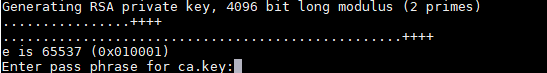
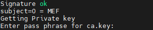

# Common Operations<a name="ZH-CN_TOPIC_0000001674256266"></a>

## Installing Command Dependencies<a name="ZH-CN_TOPIC_0000001722375509"></a>

**Table 1**  Common command dependency installation steps

|Dependency|Installation Command Steps|
|--|--|
|iptables|<li>For Ubuntu operating system, run the following command to install:<ul>```apt install iptables```</ul></li><li>For openEuler operating system, run the following command to install:<ul>```yum install iptables```</ul></li>|
|uname|<li>For Ubuntu operating system, run the following command to install:<ul>```apt install coreutils```</ul></li><li>For openEuler operating system, run the following command to install:<ul>```yum install coreutils```</ul></li>|
|grep|<li>For Ubuntu operating system, run the following command to install:<ul>```apt install grep```</ul></li><li>For openEuler operating system, run the following command to install:<ul>```yum install grep```</ul></li>|
|useradd|<li>For Ubuntu operating system, run the following command to install:<ul>```apt install passwd```</ul></li><li>For openEuler operating system, run the following command to install:<ul>```yum install passwd```</ul></li>|
|dmidecode|<li>For Ubuntu operating system, run the following command to install:<ul>```apt install dmidecode```</ul></li><li>For openEuler operating system, run the following command to install:<ul>```yum install dmidecode```</ul></li>|
|systemctl|<li>For Ubuntu operating system, run the following command to install:<ul>```apt install systemd```</ul></li><li>For openEuler operating system, run the following command to install:<ul>```yum install systemd```</ul></li>|
|haveged|<li>For Ubuntu operating system, run the following command to install:<ul>```apt install haveged```</ul></li><li>For openEuler operating system, run the following command to install:<ul>```yum install haveged```</ul></li><div class="note"><span class="notetitle">**NOTE**</span><div class="notebody">After haveged is installed, run the following commands to start the haveged service:<br>```systemctl enable haveged```<br>```systemctl start haveged```<br></div></div>|
|Docker|Version 18.09 or later. For details, see [Docker official website](https://docs.docker.com/engine/install/). Track Docker vulnerabilities and issues promptly based on the Docker official website and community, and ensure that the Docker version in use incorporates relevant fixes and patches.|

## Configuring Local Domain Mapping<a id="ZH-CN_TOPIC_0000001722295397"></a>

The local domain mapping configuration is used to adapt to third-party image repositories. When the third-party image repository server address provided by the user is a domain name instead of an IP address, local domain mapping must be configured. For details about using the third-party image repository, see [Configuration APIs](./RESTful.md#configuration-apis).

> [!NOTE]
>
>- If the user does not need to use a third-party image repository to obtain containerized application images, or if the third-party image repository server address is an IP address, this interface does not need to be configured.
>- Domain name and IP mappings are saved in the user's "/etc/hosts" file. A maximum of 16 domain mappings can be configured through MEF Edge. When the user repeatedly configures the same domain name, the IP address of the previously configured domain name will be overwritten.
>- If you need to delete a local domain mapping, use the root user to open the "/etc/hosts" file in the background, and select the unwanted domain mapping to delete it.

1. Log in to the device environment as the root user.
2. Run the following command to go to the path where run.sh is located.

    ```bash
    cd <installation_path>/MEFEdge/software/
    ```

3. Run the following command to configure local domain mapping.

    ```bash
    ./run.sh domainconfig --ip=<actual_ip_of_the_third_party_image_repository> --domain=<third_party_image_repository_domain>
    ```

    **Table 1**  domainconfig parameters<a id="domainconfig-parameter-description-table"></a>

    |Parameter|Description|
    |--|--|
    |ip|The actual IP address of the accessible third-party image repository. Only IPv4 is supported. It cannot be an all-zero address (0.0.0.0), a broadcast address (255.255.255.255), or a loopback address (127.0.0.1).|
    |domain|The domain name of the third-party image repository. It supports a length of 3 to 63 characters, consisting of uppercase and lowercase letters, digits, and symbols (.-). It must start and end with an uppercase or lowercase letter or a digit, but cannot consist entirely of digits.<br><div class="note"><span class="notetitle">**NOTE**</span><div class="notebody">The third-party image repository domain cannot be localhost or any other domain equivalent to localhost.</div></div>|

## Restricting System Service Resources<a id="ZH-CN_TOPIC_0000001722295441"></a>

Users can set resource limits for MEF Edge process-related services through Linux system service configuration based on business needs. If users do not set limits, there are no restrictions by default. After setting, the resource usage of CPU and memory can be limited, ensuring that the service does not continuously exceed the limit values.

**Table 1**  Service file paths

|Service Name|Service File Path|
|--|--|
|edgecore|/usr/lib/systemd/system/edgecore.service|
|device-plugin|/usr/lib/systemd/system/device-plugin.service|
|mef-edge-main|/usr/lib/systemd/system/mef-edge-main.service|
|mef-edge-om|/usr/lib/systemd/system/mef-edge-om.service|

1. Log in to the device environment as the root user.
2. Run the following command to modify the service file, then exit with <b>:wq</b>. Take the edgecore service as an example.

    ```bash
    vi /usr/lib/systemd/system/edgecore.service
    ```

    Add or modify the "CPUQuota" and "MemoryMax" configuration items in the [Service] field.

    **Table 2**

    |Configuration Item|Parameter Description|
    |--|--|
    |CPUQuota|Sets the CPU time limit for processes in this unit. It must be set as a percentage ending with "%", indicating the maximum percentage of a single CPU's total time that this unit can use.|
    |MemoryMax|Sets an absolute rigid limit on the maximum memory that processes in this unit can use. The option value can be an absolute size in bytes (with suffixes K, M, G, T based on 1024), a relative size expressed as a percentage (relative to the total physical memory of the system), or the special value `infinity` to indicate no limit.|

    An example of the modified service file is shown below.

    ```text
    [Service]
    UMask=0027
    User=MEFEdge
    ...
    CPUQuota=15%
    MemoryMax=50M
    ```

3. Run the following command to update the service file configuration.

    ```bash
    systemctl daemon-reload
    ```

## Creating a CA Certificate Using OpenSSL<a name="ZH-CN_TOPIC_0000001674256258"></a>

- According to security requirements, the RSA algorithm key length must be at least 3072 bits, and **4096** bits is recommended. Ensure that commands such as "-aes256" are used for key encryption. MD5, SHA1, and RSA1024 pose security risks for encryption and are not recommended.
- Set the certificate validity period appropriately. It is recommended not to exceed 36 months.
- When creating a self-signed certificate, if the entered password is empty, the generated private key will be in plain text, which poses a security risk. It is recommended that the entered password meet certain complexity requirements.
- Password complexity recommendations:
    1. The password must be at least 8 characters long.
    2. The password must contain a combination of at least two of the following character types:
        - At least one lowercase letter.
        - At least one uppercase letter.
        - At least one digit.
        - At least one special character.

**Using OpenSSL to Create a CA Certificate<a name="section375752314414"></a>**

1. Log in to any Linux machine that has the OpenSSL tool installed.
2. Create the "cert_v3" directory and enter it.

    ```bash
    mkdir cert_v3
    cd cert_v3
    ```

3. Under the "cert_v3" directory, create a working directory named "ca" and enter it.

    ```bash
    mkdir ca
    cd ca
    ```

4. Create the OpenSSL configuration file "ca_cert.conf" for the CA certificate with the following content:

    ```text
    [ req ]
     distinguished_name     = req_distinguished_name
     prompt                 = no

    [ req_distinguished_name ]
     O                      = MEF
    [ v3_ca ]
    subjectKeyIdentifier = hash
    authorityKeyIdentifier = keyid:always,issuer
    basicConstraints = critical, CA:true
    keyUsage = critical, digitalSignature, cRLSign, keyCertSign
    ```

5. Create the CA certificate private key file "ca.key".

    ```bash
    openssl genrsa -aes256 -out ca.key 4096
    ```

    

    > **NOTE**
    > Set a strong password. The password must be at least 8 characters long and contain at least two of the following character types: digits, uppercase letters, lowercase letters, and special characters.

6. Create the CSR request file "ca.csr" for the CA certificate.

    ```bash
    openssl req -out ca.csr -key ca.key -new -config ./ca_cert.conf
    ```

7. Create a self-signed CA certificate "ca.crt".

    ```bash
    openssl x509 -req -in ca.csr -out ca.crt -sha256 -days 1000 -extfile ./ca_cert.conf -extensions v3_ca -signkey ca.key
    ```

    

## Viewing Log Information<a id="viewing-log-information"></a>

Describes the log path location and related permission information.

**MEF Center Logs<a name="section12347525165315"></a>**

After MEF Center software is successfully installed, the specific log paths are as follows (the default installation path is "/var"):

- Installation log: "\<log_path\>/mef-center-log/mef-center-install"
- Runtime log: "\<log_path\>/mef-center-log/mef-center-install/mef-center-install-run.log"

    > **NOTE**
    >
    > The time read by mef-center-install-run.log is the host time; the time read by other MEF Center logs is the time inside the container.

- Operation log: "\<log_path\>/mef-center-log/mef-center-install/mef-center-install-operate.log"
- Module logs: "\<log_path\>/mef-center-log/\<module_name\>"

**Viewing MEF Edge Logs<a name="section1779074212536"></a>**

For details about process run logs or software installation logs during MEF Edge software installation, see [Table 1 Log permission description](#log-permission-description). If the log root path is the default path "/var/alog", the log recording location is "/var/alog/MEFEdge\_log", where the log folder permission for each component is 750 and the log file permission is 640. The time for reading MEF Edge logs is the host time.

**Table 1** Log permission description<a id="log-permission-description"></a>

|**Folder**|**Owner**|**Permission**|
|--|--|--|
|MEFEdge_log<br>├── device_plugin<br>├── edge_core<br>├── edge_installer<br>├── edge_main<br>└── edge_om|root<br>root<br>root<br>root<br>MEFEdge<br>root|755<br>750<br>750<br>750<br>750<br>750|

- The run log location for MEF Edge installation and deployment is "/var/alog/MEFEdge\_log/edge\_installer/edge\_installer\_run.log".
- The operation log path for MEF Edge installation and deployment is "/var/alog/MEFEdge_log/edge_installer/edge_installer_operate.log".

**Collecting MEF Edge Logs<a name="section1279784255"></a>**

You can collect the log files of each MEF Edge module to a specified path using the command line.

1. Log in to the MEF Edge device environment as the root user.
2. Execute the following command to enter the path where run.sh is located. The default installation directory is "/usr/local/mindx".

    ```bash
    cd <installation_directory>/MEFEdge/software/
    ```

3. Run the following command to create the directory for storing log collection files.

    ```bash
    mkdir -p /run/collect_log
    ```

4. Run the following command to collect MEF Edge logs.

    ```bash
    ./run.sh collectlog -log_pack_path=<log_collection_file_path> -module=<module_name>
    ```

    **Table 2** collectlog parameters<a id="collectlog-parameters"></a>

    |Parameter|Description|
    |--|--|
    |log_pack_path|The log collection file path can only be /run/collect_log/mef_edge.tar.gz.|
    |module|Module name. The value is "all".|

## Configuring the KMC Encryption Algorithm<a name="ZH-CN_TOPIC_0000001674256334"></a>

Users can configure the KMC encryption algorithm based on service requirements. If no corresponding configuration is added, the default configuration is used.

**Configuring Encryption Algorithm for MEF Center<a name="section58561893819"></a>**

1. Log in to the MEF Center device environment as the root user.
2. Run the following command to enter the MEF Center configuration file path. The default installation directory is "/usr/local".

    ```bash
    cd <installation_path>/MEF-Center/mef-config/public-config
    ```

3. Edit the "algorithms" field in kmc-config.json under this path. The default encryption algorithm is AES_GCM_256.

    ```json
    {
        "algorithms":"Aes256gcm"
    }
    ```

    **Table 1** algorithms fields

    |Value|Description|
    |--|--|
    |Aes256gcm|Default configuration, indicating that the encryption algorithm used is AES_GCM_256.|
    |Aes128gcm|Indicates that the encryption algorithm used is AES_GCM_128.|

4. The configuration takes effect after restarting MEF Center. For details, see [Restarting MEF Center](#restarting-mef-center).

**MEF Edge Encryption Algorithm Configuration<a name="section22913553482a"></a>**

1. Log in to the MEF Edge device environment as the root user.
2. Run the following command to go to the MEF Edge configuration file path and modify the configuration files of edge_om and edge_main respectively. The default installation directory is "/usr/local/mindx".
    - Go to the edge_om configuration file path.

        ```bash
        cd <installation_path>/MEFEdge/config/edge_om
        ```

        Edit the "algorithms" field in the kmc-config.json file under this path. The default encryption algorithm is AES_GCM_256.

        ```json
        {
            "algorithms":"Aes256gcm"
        }
        ```

    - Go to the edge_main configuration file path.

        ```bash
        cd <installation_path>/MEFEdge/config/edge_main
        ```

        Edit the "algorithms" field in the kmc-config.json file under this path. The default encryption algorithm is AES_GCM_256.

        ```json
        {
            "algorithms":"Aes256gcm"
        }
        ```

        **Table 2**  algorithms field description

       |Value|Description|
       |--|--|
       |Aes256gcm|Default configuration, indicating that the encryption algorithm used is AES_GCM_256.|
       |Aes128gcm|Indicates that the encryption algorithm used is AES_GCM_128.|

3. The configuration takes effect after restarting MEF Edge. For details, see [Restarting MEF Edge](#restarting-mef-edge).

## Updating the KMC Encryption Key<a name="ZH-CN_TOPIC_0000001674256250"></a>

Users can periodically configure the KMC encryption component key based on service requirements.

**MEF Center Key Update<a name="section12188114884017"></a>**

1. Log in to the MEF Center device environment as the root user.
2. Run the following command to go to the path where run.sh is located. The default installation directory is "/usr/local".

    ```bash
    cd <installation_path>/MEF-Center/mef-center
    ```

3. Run the following command to update the KMC component key.

    ```bash
    ./run.sh updatekmc
    ```

    The following example output indicates that the key update is successful.

    ```bash
    update kmc keys successful
    ```

> [!NOTE]
> The specific functionality of updatekmc has been deprecated. It is a reserved interface, and users can implement the underlying KMC interface functionality on their own.

**MEF Edge Update Key<a name="section1730595715400"></a>**

1. Log in to the MEF Edge device environment as the root user.
2. Run the following command to go to the path where run.sh is located. The default installation directory is "/usr/local/mindx".

    ```bash
    cd <installation_directory>/MEFEdge/software/
    ```

3. Run the following command to update the KMC component key.

    ```bash
    ./run.sh updatekmc
    ```

    The example output is as follows, indicating that the key update was successful.

    ```text
    Execute [updatekmc] command success!
    ```

> **NOTE**
> The specific functionality of updatekmc has been reduced. It is a reserved interface, and users can implement the underlying kmc interface functionality on their own.

## Starting MEF Center<a id="ZH-CN_TOPIC_0000001722295461"></a>

To start the module, follow the steps below.

1. Log in to the device environment as the root user.
2. Run the following command to go to the path where run.sh is located. The default installation directory is "/usr/local".

    ```bash
    cd <installation_path>/MEF-Center/mef-center
    ```

3. Start the specified module.

    - Run the following command to start all modules.

        ```bash
        ./run.sh start -component=all
        ```

    - Run the following command to start the corresponding module (for example, the gateway management module).

        ```bash
        ./run.sh start -component=nginx-manager
        ```

    <a id="componenttable1"></a>
    **Table 1** Component parameters

    |Parameter|Description|
    |--|--|
    |all|Starts all installed modules.|
    |Module name|Starts a single module. Only one module can be started per command.<ul><li>cert-manager: certificate management module</li><li>edge-manager: container management module</li><li>nginx-manager: gateway management module</li><li>alarm-manager: alarm management module</li></ul>|

    > **NOTE**
    >- ./run.sh start without parameters defaults to starting all modules.
    >- The following commands are functionally equivalent:
    >   - ./run.sh start -component=all
    >   - ./run.sh start --component=all
    >   - ./run.sh start -component all
    >   - ./run.sh start --component all
    >- If the parameter for "./run.sh start" does not contain "-",such as "./run.sh start all",the system will ignore this parameter and continue execution.

    The example output is as follows, indicating that the operation was executed successfully.

    ```text
    start nginx-manager component successful
    ```

## Restarting MEF Center<a id="restarting-mef-center"></a>

1. Log in to the device environment as the root user.
2. Run the following command to go to the path where run.sh is located. The default installation directory is "/usr/local".

    ```bash
    cd <installation_path>/MEF-Center/mef-center
    ```

3. Restart the specified module.

    - Run the following command to restart all modules.

        ```bash
        ./run.sh restart -component=all
        ```

    - Run the following command to restart the corresponding module (such as the gateway management module).

        ```bash
        ./run.sh restart -component=nginx-manager
        ```

    <a id="componenttable2"></a>
    **Table 1**  Component parameters

    |Parameter|Description|
    |--|--|
    |all|Restarts all installed modules.|
    |Module name|Restarts a single module. Only one module can be restarted per command.<ul><li>cert-manager: certificate management module</li><li>edge-manager: container management module</li><li>nginx-manager: gateway management module</li><li>alarm-manager: alarm management module</li></ul>|

    > [!NOTE]
    >- ./run.sh restart without parameters defaults to starting all modules.
    >- The following commands are functionally equivalent:
    >   - ./run.sh restart -component=all
    >   - ./run.sh restart --component=all
    >   - ./run.sh restart -component all
    >   - ./run.sh restart --component all
    >- If the parameter for "./run.sh restart" does not contain "-",such as "./run.sh restart all",the system will ignore this parameter and continue execution.

    The following example output indicates that the operation was successful.

    ```text
    restart nginx-manager component successful
    ```

## Stopping MEF Center<a name="ZH-CN_TOPIC_0000001674256318"></a>

1. Log in to the device environment as the root user.
2. Run the following command to go to the path where run.sh is located. The default installation directory is "/usr/local".

    ```bash
    cd <installation_path>/MEF-Center/mef-center
    ```

3. Stop the specified module.

    - Run the following command to stop all modules.

        ```bash
        ./run.sh stop -component=all
        ```

    - Run the following command to stop the corresponding module (for example, the gateway management module).

        ```bash
        ./run.sh stop -component=nginx-manager
        ```

    <a id="componenttable3"></a>
    **Table 1** Component parameters

    |Parameter|Description|
    |--|--|
    |all|Stops all installed modules.|
    |module name|Stops a single module. A single stop command can only stop one module.<ul><li>cert-manager: certificate management module</li><li>edge-manager: container management module</li><li>nginx-manager: gateway management module</li><li>alarm-manager: alarm management module</li></ul>|

    > [!NOTE]
    >- ./run.sh stop without parameters defaults to starting all modules.
    >- The following commands are functionally equivalent:
    >   - ./run.sh stop -component=all
    >   - ./run.sh stop --component=all
    >   - ./run.sh stop -component all
    >   - ./run.sh stop --component all
    >- If the parameter for "./run.sh stop" does not contain "-",such as "./run.sh stop all",the system will ignore this parameter and continue execution.

    The following example output indicates that the operation was successful.

    ```text
    stop nginx-manager component successful
    ```

## Starting MEF Edge<a name="ZH-CN_TOPIC_0000001674415926"></a>

1. Log in to the MEF Edge device environment as the root user.
2. Run the following command to go to the path where run.sh is located. The default installation directory is "/usr/local/mindx".

    ```bash
    cd <installation_directory>/MEFEdge/software/
    ```

3. Run the following command to start MEF Edge.

    ```bash
    ./run.sh start
    ```

    The example output is as follows, indicating that the startup command was executed successfully.

    ```text
    Execute [start] command success!
    ```

    > [!NOTE]
    >
    > Repeatedly starting the software will generate an alarm. For an example, see [MEF Edge Repeated Start or Stop Alarm](./faq.md#mef-edge-repeated-start-or-stop-alarm).

4. (Optional) Run the following command to check the process startup status.

    ```bash
    ps aux|grep MEFEdge|grep -v grep
    ```

    The example output is as follows, indicating that the MEF Edge process has been successfully started.

    ```text
    root      588808       1  0 09:15 ?        00:00:00 /usr/local/mindx/MEFEdge/software/edge_om/bin/edge-om
    MEFEdge   588827       1  0 09:15 ?        00:00:00 /usr/local/mindx/MEFEdge/software/edge_main/bin/edge-main
    root      588946       1  6 09:15 ?        00:00:13 /usr/local/mindx/MEFEdge/software/edge_core/bin/edgecore --config=/usr/local/mindx/MEFEdge/software/edge_core/config/edgecore.json --logtostderr=false --log_file=/var/alog/MEFEdge_log/edge_core/edge_core_run.log --log_file_max_size=24
    root      588948       1  0 09:15 ?        00:00:00 /usr/local/mindx/MEFEdge/software/device_plugin/bin/device-plugin --logFile=/var/alog/MEFEdge_log/device_plugin/device_plugin_run.log --useAscendDocker=false
    ```

    **Table 1**  Process description

    |Process|Description|
    |--|--|
    |edge-om|Main process, including the upgrade module. Owned by root.|
    |edge-main|Process that connects the MEF Edge edge side and the MEF Center center side. Owned by MEFEdge.|
    |edgecore|edgecore process. Owned by root.|
    |device-plugin|device-plugin process. Owned by root.|

## Restarting MEF Edge<a name="restarting-mef-edge"></a>

1. Log in to the MEF Edge device environment as the root user.
2. Run the following command to go to the path where run.sh is located. The default installation directory is "/usr/local/mindx".

    ```bash
    cd <installation_directory>/MEFEdge/software/
    ```

3. Run the following command to restart MEF Edge.

    ```bash
    ./run.sh restart
    ```

    The example output is as follows, indicating that the restart command is executed successfully.

    ```text
    Execute [restart] command success!
    ```

## Stopping MEF Edge<a name="ZH-CN_TOPIC_0000001722375585"></a>

1. Log in to the MEF Edge device environment as the root user.
2. Run the following command to go to the path where run.sh is located. The default installation directory is "/usr/local/mindx".

    ```bash
    cd <installation_directory>/MEFEdge/software/
    ```

3. Run the following command to stop MEF Edge.

    ```bash
    ./run.sh stop
    ```

    The example output is as follows, indicating that the stop command is executed successfully.

    ```text
    Execute [stop] command success!
    ```

    > [!NOTE]
    > Repeatedly stopping the software will generate an alarm. For details, see [MEF Edge Repeated Start or Stop Alarm](./faq.md#mef-edge-repeated-start-or-stop-alarm).

## Querying the MEF Edge Version<a id="ZH-CN_TOPIC_0000001722375525"></a>

1. Log in to the MEF Edge device environment as the root user.
2. Run the following command to go to the path where run.sh is located.

    ```bash
    cd <installation_directory>/MEFEdge/software/
    ```

3. Run the following command to query the MEF Edge version number.

    ```bash
    ./run.sh -version
    ```

    The example output is as follows.

    ```text
    7.0.RC1
    ```

## Configuring and Querying MEF Edge Certificate Expiration Alarm<a id="configuring-and-querying-mef-edge-certificate-expiration-alarm"></a>

**Configure MEF Center Root Certificate Expiration Alarm<a name="section146055401295"></a>**

MEF Edge supports configuring the time threshold and detection period for the MEF Center root certificate expiration alarm.

1. Log in to the MEF Edge device environment as the root user.
2. Run the following command to go to the path where run.sh is located.

    ```bash
    cd <installation_directory>/MEFEdge/software/
    ```

3. Run the following command to configure the time threshold and detection period for the MEF Center root certificate expiration alarm.

    ```bash
    ./run.sh alarmconfig -cert_threshold=<time_threshold_for_certificate_expiration_alarming> -cert_period=<detection_period_for_certificate_expiration_alarming>
    ```

    **Table 1** alarmconfig parameters

    <a id="alarmconfig-parameter-1"></a>

    |Parameter|Description|
    |--|--|
    |cert_threshold|Optional. Certificate alarm expiration time threshold, value range [7, 180], default value 90.|
    |cert_period|Optional. Certificate alarm detection period, value range [1, certificate alarm expiration time threshold - 3], default value 7.|

    The example output below indicates successful configuration.

    ```text
    Execute [alarmconfig] command success!
    ```

4. Takes effect after starting or restarting MEF Edge.

**Query MEF Center Root Certificate Expiration Alarm<a name="section1014315803318"></a>**

MEF Edge supports querying the MEF Center root certificate expiration alarm time threshold and detection period.

1. Log in to the MEF Edge device environment as the root user.
2. Run the following command to go to the path where run.sh is located.

    ```bash
    cd <installation_directory>/MEFEdge/software/
    ```

3. After starting MEF Edge, run the following command to query the MEF Center root certificate expiration alarm time threshold and detection period.

    ```bash
    ./run.sh getalarmconfig
    ```

    The following example output indicates a successful query, returning the current MEF Center root certificate expiration alarm time threshold (cert\_threshold) and detection period (cert\_period).

    ```text
    cert_period is [1], the unit is day
    cert_threshold is [90], the unit is day
    Execute [getalarmconfig] command success!
    ```

## Configuring and Querying MEF Center Certificate Expiration Alarm<a id="ZH-CN_TOPIC_0000001722295489"></a>

MEF Center supports configuring and querying the root certificate, software repository certificate, and image repository certificate of third-party management platforms.

**Configuring Certificate Expiration Alarms<a name="section11903143018329"></a>**

MEF Center supports configuring the time threshold and detection period for certificate expiration alarms.

1. Log in to the MEF Center device environment as the root user.
2. Run the following command to go to the path where run.sh is located. The default installation directory is "/usr/local".

    ```bash
    cd <installation_path>/MEF-Center/mef-center
    ```

3. Run the following command to configure the certificate expiration alarm time threshold and detection period.

    ```bash
    ./run.sh alarmconfig -cert_threshold=<certificate_expiration_alarm_time_threshold> -cert_period=<certificate_expiration_alarm_detection_period>
    ```

    **Table 1** alarmconfig parameters

    <a id="alarmconfigtable-2"></a>

    |Parameter|Description|
    |--|--|
    |cert_threshold|Optional. Certificate alarm expiration time threshold. Value range: [7, 180]. Default value: 90.|
    |cert_period|Optional. Certificate alarm detection period. Value range: [1, Certificate alarm expiration time threshold - 3]. Default value: 7.|

    The following example output indicates that the configuration is successful.

    ```text
    update alarm config successful
    ```

4. Takes effect after starting or restarting MEF Center.

**Querying Certificate Expiration Alarm<a name="section1014315803318"></a>**

MEF Center supports querying the certificate expiration alarm time threshold and detection period.

1. Log in to the MEF Center device environment as the root user.
2. Run the following command to enter the path where run.sh is located. The default installation directory is "/usr/local".

    ```bash
    cd <installation_path>/MEF-Center/mef-center
    ```

3. Run the following command to query the certificate expiration alarm time threshold and detection period.

    ```bash
    ./run.sh getalarmconfig
    ```

    The following example output indicates a successful query, returning the current certificate expiration alarm time threshold (cert\_threshold) and detection period (cert\_period).

    ```text
    cert_period is [1], the unit is day
    cert_threshold is [90], the unit is day
    get alarm config successful
    ```

## Querying Backup Information About the Root Certificate Imported to MEF Center<a name="ZH-CN_TOPIC_0000001897652898"></a>

1. Log in to the MEF Center device environment as the root user.
2. Run the following command to navigate to the path where run.sh is located. The default installation directory is "/usr/local/MEF-Center/mef-center".

    ```bash
    cd <installation_directory>/MEF-Center/mef-center
    ```

3. Run the following command to obtain root certificate backup information.

    ```bash
    ./run.sh getunusedcert -name=<certificate_name>
    ```

    **Table 1** getunusedcert parameter<a id="getunusedcerttable"></a>

    |Parameter|Description|
    |--|--|
    |name|Mandatory. Certificate name. The value can be: <ul><li>north: integrator certificate</li><li>software: software repository root certificate</li><li>image: image repository certificate</li></ul>|

    The following is an example output, indicating that the command is executed successfully.

    ```text
    /usr/local/MEF-Center/mef-config/cert-manager/root-ca/north/root.crt.pre
    get unused certificates of [north] ca successfully
    ```

    > **NOTE**
    > If no root certificate has been backed up, the command will also be executed successfully, but the certificate path will not be displayed.

## Deleting the Backup Root Certificate Imported to MEF Center<a name="ZH-CN_TOPIC_0000001937852401"></a>

1. Log in to the MEF Center device environment as the root user.
2. Run the following command to go to the path where run.sh is located. The default installation directory is "/usr/local/MEF-Center/mef-center".

    ```bash
    cd <installation_directory>/MEF-Center/mef-center
    ```

3. Run the following command to delete unused backup root certificates. When deleting a certificate, you need to enter yes or no to confirm the deletion operation.

    ```bash
    ./run.sh deletecert -name=<certificate_name>
    ```

    **Table 1**  deletecert parameter description<a id="deletecerttable"></a>

    |Parameter|Description|
    |--|--|
    |name|Required. Certificate name. Values: <ul><li>north: integration party certificate</li><li>software: software repository root certificate</li><li>image: image repository certificate</li></ul>|

    The following is an example output, indicating that the command was executed successfully.

    ```text
    delete unused certificates of [north] ca successfully
    ```

## Restoring the Root Certificate Imported to MEF Center<a name="ZH-CN_TOPIC_0000001897812786"></a>

1. Log in to the MEF Center device environment as the root user.
2. Run the following command to go to the path where run.sh is located. The default installation directory is "/usr/local/MEF-Center/mef-center".

    ```bash
    cd <installation_directory>/MEF-Center/mef-center
    ```

3. Run the following command to restore the backed-up root certificate.

    ```bash
    ./run.sh restorecert -name=<certificate_name>
    ```

    **Table 1** restorecert parameter description<a id="restorecerttable"></a>

    |Parameter|Description|
    |--|--|
    |name|Required. Certificate name. Values:<ul><li>north: integrator certificate</li><li>software: software repository certificate</li><li>image: image repository certificate</li></ul>|

    The following example output indicates that the command is executed successfully.

    ```text
    restore unused certificates of [north] ca successfully
    ```

    > **NOTE**
    > After restoration, the current certificate will be replaced by the backed-up certificate. After the integrator certificate is restored, you need to restart MEF Center for it to take effect. After the software repository or image repository certificate is restored, it takes about 5 minutes to take effect automatically.

## Querying the Backup Information About the MEF Edge Root Certificate for Cloud-Edge Interconnection<a name="ZH-CN_TOPIC_0000001897812790"></a>

1. Log in to the MEF Edge device environment as the root user.
2. Run the following command to go to the path where run.sh is located. The default installation directory is "/usr/local/mindx".

    ```bash
    cd <installation_directory>/MEFEdge/software/
    ```

3. Run the following command to query the backup information of the MEF Edge cloud-edge interconnection root certificate.

    ```bash
    ./run.sh getunusedcert -name=<certificate_name>
    ```

    **Table 1**  getunusedcert parameter<a id="getunusedcert-parameter"></a>

    |Parameter|Description|
    |--|--|
    |name|Required. The name of the certificate to be queried. Currently, only the value "cloud_root" is supported, indicating the cloud-edge interconnection root certificate.|

    The example output is as follows, indicating that the query command is executed successfully. Only the path of the backup certificate is displayed, and no other information is shown.

    ```text
    /usr/local/mindx/MEFEdge/config/edge_main/hub_certs_import/cloud_root.crt.pre
    Execute [getunusedcert] command success!
    ```

    > **NOTE**
    >- The backup file of the cloud-edge interconnection root certificate is generated only after repeated gateway management configurations. It is not generated during the initial gateway management configuration.
    >- The automatic update function of the MEF Edge cloud-edge interconnection root certificate does not apply to this scenario, and no certificate backup is automatically generated.

## Deleting the Unused MEF Edge Root Certificate for Cloud-Edge Interconnection<a name="ZH-CN_TOPIC_0000001937852405"></a>

1. Log in to the MEF Edge device environment as the root user.
2. Run the following command to go to the path where run.sh is located. The default installation directory is "/usr/local/mindx".

    ```bash
    cd <installation_directory>/MEFEdge/software/
    ```

3. Run the following command to delete unused MEF Edge cloud-edge interconnection root certificates.

    ```bash
    ./run.sh deletecert -name=<certificate_name>
    ```

    **Table 1** deletecert parameter description<a id="deletecert-parameter-description"></a>

    |Parameter|Description|
    |--|--|
    |name|Mandatory. Name of the certificate to be deleted. Currently, only the value "cloud_root" is supported, indicating the cloud-edge interconnection root certificate.|

    The following example output shows the path for backing up the certificate and requires the user to enter yes or no to confirm the deletion.

    ```text
    the following cert will be deleted, are you sure ? [yes | no]                                                                       /usr/local/mindx/MEFEdge/config/edge_main/hub_certs_import/cloud_root.crt.pre
    ```

    After confirming the deletion, the example output is as follows, indicating the deletion is successful.

    ```text
    delete certificate [cloud_root] successfully
    Execute [deletecert] command success!
    ```

    > **NOTE**
    > Entering the certificate name automatically maps to the certificate path. Manually specifying the certificate path is not supported in this operation.

## Restoring the Backup MEF Edge Root Certificate for Cloud-Edge Interconnection<a name="ZH-CN_TOPIC_0000001897652902"></a>

1. Log in to the MEF Edge device environment as the root user.
2. Run the following command to go to the path where run.sh is located. The default installation directory is "/usr/local/mindx".

    ```bash
    cd <installation_directory>/MEFEdge/software/
    ```

3. Run the following command to restore the backed-up MEF Edge cloud-edge interconnection root certificate.

    ```bash
    ./run.sh restorecert -name=<certificate_name>
    ```

    **Table 1** restorecert parameter description<a id="restorecert-parameter-description"></a>

    |Parameter|Description|
    |--|--|
    |name|Mandatory. The name of the certificate to be restored. Currently, only the value "cloud_root" is supported, indicating the cloud-edge interconnection root certificate.|

    The following example output indicates that the certificate restoration command was executed successfully.

    ```text
    restore certificate [cloud_root] successfully
    Execute [restorecert] command success!
    ```

    > [!NOTE]
    >
    > After the restoration is successful, the current certificate will be replaced with the backed-up certificate. MEF Edge must be restarted for the change to take effect.

## Importing a CRL<a name="ZH-CN_TOPIC_0000001674415934"></a>

**Importing the MEF Center Certificate Revocation List<a name="section5883292510"></a>**

MEF Edge supports importing the MEF Center certificate revocation list, which can be used to verify the validity of the MEF Center service certificate.

1. Log in to the MEF Edge device environment as the root user.
2. Run the following command to go to the path where run.sh is located.

    ```bash
    cd <installation_directory>/MEFEdge/software/
    ```

3. After completing [authentication and integration between MEF Center and MEF Edge for NMS configuration](./usage.md#ZH-CN_TOPIC_0000001722295385), run the following command to import the MEF Center revocation list into MEF Edge. The revocation list only supports PEM format and must be within its validity period.

    ```bash
    ./run.sh importcrl -crl_path=<crl_path> -peer=mef_center
    ```

    The following example output indicates that the MEF Center revocation list has been successfully imported.

    ```text
    Execute [importcrl] command success!
    ```

    > **NOTE**
    > After reconfiguring the NMS, MEF Edge will clear the previously imported MEF Center certificate revocation list.

    **Table 1**  importcrl parameters<a id="importcrltable"></a>

    |Parameter|Mandatory|Description|
    |--|--|--|
    |crl_path|Yes|The crl_path directory does not support soft links and only supports absolute paths. The path length must be less than 4096, the directory level must be less than 99, and the group and other users must not have write permission. The owner must be root. The file specified by crl_path must be owned by root, the group and other users must not have write permission, and the file size must not exceed 1 MB.|
    |peer|Yes|Only "mef_center" is supported.|

**Importing a Third-Party Management Platform Revocation List<a name="section1953132505412"></a>**

MEF Center supports importing the corresponding revocation list chain of the root certificate chain of the integration party that is connected to MEF Center, which is used to cancel the RESTful request access permission of the revoked integration party service certificate.

- Method 1: Call the [Importing the CRL](./RESTful.md#ZH-CN_TOPIC_0000001621540625) API to import the third-party management platform revocation list.
- Method 2: Import the third-party management platform revocation list through the command line. See the following steps.

1. Log in to the MEF Center device environment as the root user.
2. Run the following command to enter the path where run.sh is located. The default installation directory is "/usr/local".

    ```bash
    cd <installation_path>/MEF-Center/mef-center
    ```

3. After completing [Integrating with the User Management Platform](./usage.md#ZH-CN_TOPIC_0000001722375517), run the following command to import the Certificate Revocation List (CRL) into MEF Center. The CRL only supports PEM format, must be within its validity period, have the same number of levels as the integrated party's root certificate chain, and must include the CRL issued by each level of root certificate in the imported integrated party's root certificate chain. Running this command repeatedly will update the imported CRL. After importing the CRL, you need to manually restart MEF Center for it to take effect.

    ```bash
    ./run.sh importcrl -crl_path=<crl_path> -peer=north
    ```

    The following example output indicates that the third-party management platform CRL has been successfully imported.

    ```text
    import crl successful
    ```

    > [!NOTE]
    >
    > After performing the certificate exchange operation to re-import the third-party management platform certificate, MEF Center will clear the previously imported CRL.

    **Table 2**  importcrl parameter description

    |Parameter|Required|Description|
    |--|--|--|
    |crl_path|Yes|File path of the CRL to import. Only absolute paths are supported, and symbolic links are not allowed. The path length must be less than 4096, and the file size must not exceed 1 MB.|
    |peer|Yes|Specifies the purpose of the imported CRL. Only `north` is supported, which means importing the integration party's certificate revocation list.|

## Querying the MEF Center Root Certificate<a id="ZH-CN_TOPIC_0000001674256346"></a>

1. Log in to the MEF Edge device environment as the root user.
2. Run the following command to go to the path where `run.sh` is located.

    ```bash
    cd <installation_directory>/MEFEdge/software/
    ```

3. Run the following command to query the MEF Center root certificate.

    ```bash
    ./run.sh getcertinfo -certname=center
    ```

    **Table 1** getcertinfo parameter description<a id="getcertinfo-parameter-description"></a>

    |Parameter|Required|Description|
    |--|--|--|
    |certname|Required|Queries the MEF Center root certificate. The value is "center".|

    The example output is as follows.

    ```text
    MEFCenter Southern Root Certificate:
        xxxxxxxxxxxxxxxxxxxxxxxxxxxxxxxxxxxxxxxxxxxxxxxxx
        xxxxxxxxxxxxxxxxxxxxxxxxxxxxxxxxxxxxxxxxxxxxxxxxx
    Execute [getcertinfo] command success!
    ```

## Creating an Inference Image<a id="ZH-CN_TOPIC_0000001674256274"></a>

This chapter describes how to create an image that contains the inference program.

- This document uses a resnet50 image classification example, which has been compiled and includes a model. The sample package is "vpc\_resnet50\_imagenet\_classification.tar.gz", and the sample executable is "main", located in the extracted "vpc\_resnet50\_imagenet\_classification/out" directory. Upload the sample package to any directory on the server, such as "/home/test".

**Typical Service Scenario Example<a name="zh-cn_topic_0000001539813896_zh-cn_topic_0000001525988820_section9989171974715"></a>**

In AI applications, the NPU computing power of edge devices is required. The following shows how to create the corresponding inference image, for reference only.

This image has the following characteristics:

- This image runs as the HwHiAiUser.
- The containerized application does not require privileged containers, capability sets, or host networking during deployment.

**Prerequisites<a name="zh-cn_topic_0000001539813896_zh-cn_topic_0000001525988820_section144511875018"></a>**

- The container OS image is prepared by the user.
- Obtain the offline inference engine package and the service inference program package as shown in the following table.

**Table 1**  Required software

<a name="zh-cn_topic_0000001539813896_t5d85786017a743deb534dc4a7dea13ed"></a>
<table><thead align="left"><tr id="zh-cn_topic_0000001539813896_r136f2ba079b54377a649b15a5e5bea0a"><th class="cellrowborder" valign="top" width="40%" id="mcps1.2.4.1.1"><p id="ac34538825d5f4ccca372187c2330c104"><a name="ac34538825d5f4ccca372187c2330c104"></a><a name="ac34538825d5f4ccca372187c2330c104"></a>Software Package</p>
</th>
<th class="cellrowborder" valign="top" width="30%" id="mcps1.2.4.1.2"><p id="aa2861cf7e670403db757957ba7b6b2e7"><a name="aa2861cf7e670403db757957ba7b6b2e7"></a><a name="aa2861cf7e670403db757957ba7b6b2e7"></a>Description</p>
</th>
<th class="cellrowborder" valign="top" width="30%" id="mcps1.2.4.1.3"><p id="zh-cn_topic_0000001539813896_p1782443419117"><a name="zh-cn_topic_0000001539813896_p1782443419117"></a><a name="zh-cn_topic_0000001539813896_p1782443419117"></a>Obtaining Method</p>
</th>
</tr>
</thead>
<tbody><tr id="zh-cn_topic_0000001539813896_ra7fc19b9ea5649e2b4010e390a6d0dde"><td class="cellrowborder" valign="top" width="40%" headers="mcps1.2.4.1.1 "><p id="ade53ce7851c94bf6983788962729c2d0"><a name="ade53ce7851c94bf6983788962729c2d0"></a><a name="ade53ce7851c94bf6983788962729c2d0"></a>Ascend-cann-<span id="ph886918154216"><a name="ph886918154216"></a><a name="ph886918154216"></a>toolkit</span>_<em id="zh-cn_topic_0000001539813896_zh-cn_topic_0000001525988820_zh-cn_topic_0000001209186286_zh-cn_topic_0000001136212988_zh-cn_topic_0000001126397281_i19347115435420"><a name="zh-cn_topic_0000001539813896_zh-cn_topic_0000001525988820_zh-cn_topic_0000001209186286_zh-cn_topic_0000001136212988_zh-cn_topic_0000001126397281_i19347115435420"></a><a name="zh-cn_topic_0000001539813896_zh-cn_topic_0000001525988820_zh-cn_topic_0000001209186286_zh-cn_topic_0000001136212988_zh-cn_topic_0000001126397281_i19347115435420"></a>{version}</em>_linux-aarch64.run</p>
<p id="p9131511439"><a name="p9131511439"></a><a name="p9131511439"></a>Ascend-cann-310b-ops_<em id="i16366613134319"><a name="i16366613134319"></a><a name="i16366613134319"></a>{version}</em>_linux-aarch64.run</p>
</td>
<td class="cellrowborder" valign="top" width="30%" headers="mcps1.2.4.1.2 "><p id="zh-cn_topic_0000001539813896_p208251234112"><a name="zh-cn_topic_0000001539813896_p208251234112"></a><a name="zh-cn_topic_0000001539813896_p208251234112"></a>Offline inference engine package.</p>
<p id="zh-cn_topic_0000001539813896_zh-cn_topic_0000001525988820_p476222165316"><a name="zh-cn_topic_0000001539813896_zh-cn_topic_0000001525988820_p476222165316"></a><a name="zh-cn_topic_0000001539813896_zh-cn_topic_0000001525988820_p476222165316"></a><em id="zh-cn_topic_0000001539813896_zh-cn_topic_0000001525988820_zh-cn_topic_0000001209186286_zh-cn_topic_0000001136212988_zh-cn_topic_0000001126397281_i11954175412164"><a name="zh-cn_topic_0000001539813896_zh-cn_topic_0000001525988820_zh-cn_topic_0000001209186286_zh-cn_topic_0000001136212988_zh-cn_topic_0000001126397281_i11954175412164"></a><a name="zh-cn_topic_0000001539813896_zh-cn_topic_0000001525988820_zh-cn_topic_0000001209186286_zh-cn_topic_0000001136212988_zh-cn_topic_0000001126397281_i11954175412164"></a>{version}</em> indicates the software package version. Version <span id="ph877923618445"><a name="ph877923618445"></a><a name="ph877923618445"></a>8.5.0</span> is recommended.</p>
</td>
<td class="cellrowborder" valign="top" width="30%" headers="mcps1.2.4.1.3 "><p id="zh-cn_topic_0000001539813896_p206856153466"><a name="zh-cn_topic_0000001539813896_p206856153466"></a><a name="zh-cn_topic_0000001539813896_p206856153466"></a><a href="https://www.hiascend.com/zh/developer/download/community/result?module=ed%2Bcann" target="_blank" rel="noopener noreferrer">Obtaining Link</a></p>
</td>
</tr>
<tr id="zh-cn_topic_0000001539813896_zh-cn_topic_0000001525988820_zh-cn_topic_0000001209186286_zh-cn_topic_0000001136212988_zh-cn_topic_0000001126397281_row196091530813"><td class="cellrowborder" valign="top" width="40%" headers="mcps1.2.4.1.1 "><p id="zh-cn_topic_0000001539813896_zh-cn_topic_0000001525988820_p9769222534"><a name="zh-cn_topic_0000001539813896_zh-cn_topic_0000001525988820_p9769222534"></a><a name="zh-cn_topic_0000001539813896_zh-cn_topic_0000001525988820_p9769222534"></a>Dockerfile</p>
</td>
<td class="cellrowborder" valign="top" width="30%" headers="mcps1.2.4.1.2 "><p id="zh-cn_topic_0000001539813896_zh-cn_topic_0000001525988820_p67642211530"><a name="zh-cn_topic_0000001539813896_zh-cn_topic_0000001525988820_p67642211530"></a><a name="zh-cn_topic_0000001539813896_zh-cn_topic_0000001525988820_p67642211530"></a>Required for building the image.</p>
</td>
<td class="cellrowborder" valign="top" width="30%" headers="mcps1.2.4.1.3 "><p id="zh-cn_topic_0000001539813896_zh-cn_topic_0000001525988820_p87682275312"><a name="zh-cn_topic_0000001539813896_zh-cn_topic_0000001525988820_p87682275312"></a><a name="zh-cn_topic_0000001539813896_zh-cn_topic_0000001525988820_p87682275312"></a>Prepared by the user based on service requirements.</p>
</td>
</tr>
<tr id="zh-cn_topic_0000001539813896_zh-cn_topic_0000001525988820_row0658324155414"><td class="cellrowborder" valign="top" width="40%" headers="mcps1.2.4.1.1 "><p id="a3ad8aeeac2224d86809df8caf197918d"><a name="a3ad8aeeac2224d86809df8caf197918d"></a><a name="a3ad8aeeac2224d86809df8caf197918d"></a>Service Inference Program Package</p>
</td>
<td class="cellrowborder" valign="top" width="30%" headers="mcps1.2.4.1.2 "><p id="a17fdae25c8004ef3bca716b0f5623dee"><a name="a17fdae25c8004ef3bca716b0f5623dee"></a><a name="a17fdae25c8004ef3bca716b0f5623dee"></a>A collection of service inference programs, including model files, inference code, configuration files, etc. It can be in tar, tar.gz, or other formats. The install.sh command for installing the service inference program must be adapted to actual conditions.</p>
<div class="note" id="zh-cn_topic_0000001539813896_zh-cn_topic_0000001525988820_zh-cn_topic_0000001209186286_note17531635164111"><a name="zh-cn_topic_0000001539813896_zh-cn_topic_0000001525988820_zh-cn_topic_0000001209186286_note17531635164111"></a><a name="zh-cn_topic_0000001539813896_zh-cn_topic_0000001525988820_zh-cn_topic_0000001209186286_note17531635164111"></a><span class="notetitle">**NOTE**</span><div class="notebody"><p id="zh-cn_topic_0000001539813896_zh-cn_topic_0000001525988820_p12218142211613"><a name="zh-cn_topic_0000001539813896_zh-cn_topic_0000001525988820_p12218142211613"></a><a name="zh-cn_topic_0000001539813896_zh-cn_topic_0000001525988820_p12218142211613"></a>The running user in the containerized application must have the relevant permissions for the service inference program package.</p>
</div></div>
</td>
<td class="cellrowborder" valign="top" width="30%" headers="mcps1.2.4.1.3 "><p id="zh-cn_topic_0000001539813896_zh-cn_topic_0000001525988820_p14659112435414"><a name="zh-cn_topic_0000001539813896_zh-cn_topic_0000001525988820_p14659112435414"></a><a name="zh-cn_topic_0000001539813896_zh-cn_topic_0000001525988820_p14659112435414"></a>Prepared by the user based on service requirements.</p>
</td>
</tr>
<tr id="zh-cn_topic_0000001539813896_zh-cn_topic_0000001525988820_row13536131013217"><td class="cellrowborder" valign="top" width="40%" headers="mcps1.2.4.1.1 "><p id="zh-cn_topic_0000001539813896_zh-cn_topic_0000001525988820_p753651062116"><a name="zh-cn_topic_0000001539813896_zh-cn_topic_0000001525988820_p753651062116"></a><a name="zh-cn_topic_0000001539813896_zh-cn_topic_0000001525988820_p753651062116"></a>slog.conf</p>
</td>
<td class="cellrowborder" valign="top" width="30%" headers="mcps1.2.4.1.2 "><p id="zh-cn_topic_0000001539813896_zh-cn_topic_0000001525988820_p1753615102211"><a name="zh-cn_topic_0000001539813896_zh-cn_topic_0000001525988820_p1753615102211"></a><a name="zh-cn_topic_0000001539813896_zh-cn_topic_0000001525988820_p1753615102211"></a>Log configuration file. Each inference image requires an independent configuration file, so it must be copied into the image when building the inference image.</p>
</td>
<td class="cellrowborder" valign="top" width="30%" headers="mcps1.2.4.1.3 "><p id="zh-cn_topic_0000001539813896_zh-cn_topic_0000001525988820_p20796114882112"><a name="zh-cn_topic_0000001539813896_zh-cn_topic_0000001525988820_p20796114882112"></a><a name="zh-cn_topic_0000001539813896_zh-cn_topic_0000001525988820_p20796114882112"></a>Obtained from the image building environment or the user's running environment.</p>
</td>
</tr>
<tr id="zh-cn_topic_0000001539813896_zh-cn_topic_0000001525988820_row3990182615545"><td class="cellrowborder" valign="top" width="40%" headers="mcps1.2.4.1.1 "><p id="adace9e2d3990450da34a1c96e8d5d77f"><a name="adace9e2d3990450da34a1c96e8d5d77f"></a><a name="adace9e2d3990450da34a1c96e8d5d77f"></a>install.sh</p>
</td>
<td class="cellrowborder" valign="top" width="30%" headers="mcps1.2.4.1.2 "><p id="ab69df42683f54b40a0e9f0bde61e1c64"><a name="ab69df42683f54b40a0e9f0bde61e1c64"></a><a name="ab69df42683f54b40a0e9f0bde61e1c64"></a>Installation script for the service inference program.</p>
</td>
<td class="cellrowborder" valign="top" width="30%" headers="mcps1.2.4.1.3 "><p id="zh-cn_topic_0000001539813896_zh-cn_topic_0000001525988820_p1991172675413"><a name="zh-cn_topic_0000001539813896_zh-cn_topic_0000001525988820_p1991172675413"></a><a name="zh-cn_topic_0000001539813896_zh-cn_topic_0000001525988820_p1991172675413"></a>Prepared by the user based on service requirements.</p>
</td>
</tr>
<tr id="zh-cn_topic_0000001539813896_zh-cn_topic_0000001525988820_row2230112965419"><td class="cellrowborder" valign="top" width="40%" headers="mcps1.2.4.1.1 "><p id="a07a15b3ad6d14030a6acf9d1fdbc82c5"><a name="a07a15b3ad6d14030a6acf9d1fdbc82c5"></a><a name="a07a15b3ad6d14030a6acf9d1fdbc82c5"></a>run.sh</p>
</td>
<td class="cellrowborder" valign="top" width="30%" headers="mcps1.2.4.1.2 "><p id="ad924bd5d3a3c4eb2bc87a444d86842a2"><a name="ad924bd5d3a3c4eb2bc87a444d86842a2"></a><a name="ad924bd5d3a3c4eb2bc87a444d86842a2"></a>Running script for the service inference program.</p>
</td>
<td class="cellrowborder" valign="top" width="30%" headers="mcps1.2.4.1.3 "><p id="zh-cn_topic_0000001539813896_zh-cn_topic_0000001525988820_p323012294548"><a name="zh-cn_topic_0000001539813896_zh-cn_topic_0000001525988820_p323012294548"></a><a name="zh-cn_topic_0000001539813896_zh-cn_topic_0000001525988820_p323012294548"></a>Prepared by the user based on service requirements.</p>
</td>
</tr>
</tbody>
</table>

**Software Digital Signature Verification<a name="section958783123413"></a>**

To prevent software packages from being maliciously tampered with during transmission or storage, download the corresponding digital signature file for integrity verification when downloading the software package.

Click [PGP Digital Signature Toolkit](https://support.huawei.com/enterprise/en/tool/pgp-verify-TL1000000054) to obtain the toolkit. After decompressing the toolkit, perform PGP digital signature verification on the downloaded software package by following the _OpenPGP Signature Verification Guide_ in the folder. If the verification fails, do not use the software package. Visit [Support and Services](https://www.hiascend.com/support) to get help from the forum or submit a service ticket.

**Procedure<a name="zh-cn_topic_0000001539813896_zh-cn_topic_0000001525988820_section3905121210295"></a>**

1. <a id="step-1"></a>Upload the prepared software packages and scripts to the same directory (for example, "/home/test").
    - Ascend-cann-toolkit\__\{version\}_\_linux-aarch64.run
    - Ascend-cann-310b-ops_<i>{version}</i>_linux-aarch64.run
    - Service inference program package
    - Dockerfile
    - slog.conf
    - install\.sh
    - run\.sh

2. Perform the following steps to prepare the Dockerfile.
    1. Log in as the **root** user and run the following commands in sequence to query and record the UIDs and GIDs of the users HwHiAiUser, HwBaseUser, and HwDmUser in the image environment (these will be used in the "Dockerfile").

        ```text
        id HwHiAiUser
        id HwBaseUser
        id HwDmUser
        ```

3. Go to the software package upload directory in [Step 1](#step-1) and run the following command to create a Dockerfile (example file name: "Dockerfile").

        ```bash
        vi Dockerfile
        ```

4. Write the following content and run the <b>:wq</b> command to save. This example uses the Ubuntu Arm operating system (the following content is only an example; users should perform secondary development based on actual conditions and their own understanding).

        ```text
        # Container operating system and TAG, modify according to actual conditions
        FROM ubuntu:22.04

        ARG TOOLKIT_PKG
        ARG OPS_PKG
        ARG DIST_PKG
        # This document uses the /usr/local/Ascend directory as an example of the CANN installation directory. If you want to install it in another directory, modify it to your desired directory.
        ARG ASCEND_BASE=/usr/local/Ascend
        WORKDIR /home/AscendWork
        COPY $TOOLKIT_PKG .
        COPY $OPS_PKG .
        COPY $DIST_PKG .
        COPY install.sh .

        # The inference program needs to use the underlying driver, which depends on three users: HwHiAiUser, HwDmUser, and HwBaseUser.
        # Create the user and group for running inference applications. For example, use the UIDs and GIDs of HwHiAiUser, HwDmUser, and HwBaseUser found in step 2, point 1, which are 1000, 1101, and 1102 respectively.
        RUN umask 0022 && \
            groupadd  HwHiAiUser -g 1000 && \
            useradd -d /home/HwHiAiUser -u 1000 -g 1000 -m -s /bin/bash HwHiAiUser && \
            groupadd HwDmUser -g 1101 && \
            useradd -d /home/HwDmUser -u 1101 -g 1101 -m -s /bin/bash HwDmUser && \
            usermod -aG HwDmUser HwHiAiUser && \
            groupadd HwBaseUser -g 1102 && \
            useradd -d /home/HwBaseUser -u 1102 -g 1102 -m -s /bin/bash HwBaseUser && \
            usermod -aG HwBaseUser HwHiAiUser

        # CANN installation depends on Python.
        RUN apt-get update && apt-get upgrade -y
        RUN apt-get install -y python3 python3-pip ca-certificates

        # Install CANN and decompress the inference program.
        RUN chmod +x $TOOLKIT_PKG && \
            chmod +x $OPS_PKG && \
            ./$TOOLKIT_PKG --install --install-path=$ASCEND_BASE --install-for-all --whitelist=nnrt --quiet --force && \
            ./$OPS_PKG --install --install-path=$ASCEND_BASE --install-for-all --whitelist=nnrt --quiet --force && \
            sh install.sh && \
            chown -R HwHiAiUser:HwHiAiUser /home/AscendWork/ && \
            rm $TOOLKIT_PKG && \
            rm $OPS_PKG && \
            rm $DIST_PKG && \
            rm install.sh

        ENV LD_LIBRARY_PATH=/usr/local/Ascend/driver/lib64:/usr/lib64
        ENV LD_PRELOAD=/lib/aarch64-linux-gnu/libc.so.6

        RUN ln -sf /lib /lib64 && \
            mkdir /var/dmp && \
            mkdir /usr/slog && \
            chown HwHiAiUser:HwHiAiUser /usr/slog && \
            chown HwHiAiUser:HwHiAiUser /var/dmp

        # Copy the log configuration file.
        COPY --chown=HwHiAiUser:HwHiAiUser slog.conf /etc

        COPY --chown=HwHiAiUser:HwHiAiUser run.sh /home/AscendWork/run.sh
        RUN chmod 640 /etc/slog.conf && \
            chmod +x /home/AscendWork/run.sh

        # If you do not need to use the AICPU operator，delete the following "#"
        #RUN cp /usr/local/Ascend/ascend-toolkit/latest/opp/Ascend/aicpu/Ascend-aicpu_syskernels.tar.gz /home/HwHiAiUser/ && \
        #    rm -rf /usr/local/Ascend/ascend-toolkit/latest/opp/Ascend/aicpu/Ascend-aicpu_syskernels.tar.gz && \
        #    echo $(wc -c /home/HwHiAiUser/Ascend-aicpu_syskernels.tar.gz|awk ' {print$1} ') > /home/HwHiAiUser/aicpu_package_install.info && \
        #    tail -c +8449 /home/HwHiAiUser/Ascend-aicpu_syskernels.tar.gz > /home/HwHiAiUser/aicpu.tar.gz && \
        #    rm -rf /home/HwHiAiUser/Ascend-aicpu_syskernels.tar.gz && \
        #    chown HwHiAiUser:HwHiAiUser /home/HwHiAiUser/aicpu.tar.gz && \
        #    mkdir -p /home/HwHiAiUser/aicpu_kernels
        #RUN tar -xvf /home/HwHiAiUser/aicpu.tar.gz -C /home/HwHiAiUser/ 2>/dev/null;exit 0
        #RUN rm -rf /home/HwHiAiUser/aicpu.tar.gz && \
        #    mv /home/HwHiAiUser/aicpu_kernels_device/* /home/HwHiAiUser/aicpu_kernels/ && \
        #    chown -R HwHiAiUser:HwHiAiUser /home/HwHiAiUser/

        # If you do not need to use the AICPU operator，delete the following "#"
        #RUN rm -rf /usr/local/Ascend/ascend-toolkit/latest/opp/Ascend/aicpu/Ascend-aicpu_syskernels.tar.gz && \
        #    chown -R HwHiAiUser:HwHiAiUser /home/HwHiAiUser/

        USER 1000
        CMD bash /home/AscendWork/run.sh
        ```

    1. After creating the Dockerfile, run the following command to modify the Dockerfile file permissions.

        ```bash
        chmod 600 Dockerfile
        ```

    2. Example of install.sh:

        ```bash
        cd /home/AscendWork
        #Decompress the service inference program package. Adapt based on the package format.
        tar -xzvf vpc_resnet50_imagenet_classification.tar.gz
        ```

        Example of run.sh:

        ```shell
        #!/bin/bash
        mkdir /dev/shm/dmp
        nohup /var/dmp_daemon -I -M -U 8087 >&/dev/null &
        /var/slogd -d
        # Import the CANN environment variables. Adjust the path based on the actual CANN installation path.
        source /usr/local/Ascend/ascend-toolkit/latest/set_env.sh
        #Navigate to the directory containing the executable file of the service inference program. Users need to modify the path based on the actual situation.
        cd /home/AscendWork/vpc_resnet50_imagenet_classification/out
        #Run the executable file. Users need to modify this based on the actual application.
        ./main
        ```

5. Go to the directory where the software package is located and run the following command to build the container image.

    ```bash
    docker build -t image-name:tag --build-arg OPS_PKG=ops-name --build-arg TOOLKIT_PKG=toolkit-name --build-arg DIST_PKG=distpackage-name .
    ```

    The message "Successfully built xxx" indicates that the image has been built successfully. The command explanation is shown in [Table 2 Command parameters](#command-parameters).

> [!NOTE]
> Be careful not to omit the "." at the end of the command.

**Table 2** Command parameters<a id="command-parameters"></a>

|Parameter|Description|
|--|--|
|image-name:tag|Image name and tag, which can be set by the user.|
|TOOLKIT_PKG|`toolkit-name` is the name of the offline inference engine package. Be careful not to omit the file extension. The user should replace it as needed.|
|OPS_PKG|`ops-name` is the name of the offline inference engine operator package. Be careful not to omit the file extension. The user should replace it as needed.|
|DIST_PKG|`istpackage-name` is the name of the service inference program compressed package. Be careful not to omit the file extension. The user should replace it as needed.|

1. Run the following command to save the container image to disk.

    ```bash
    docker save image-name:tag |gzip -c > image-name.tar.gz
    ```
