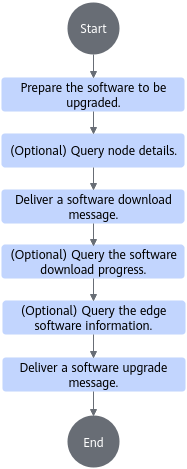

# MEF Installation<a name="ZH-CN_TOPIC_0000001722375521"></a>

<!-- md-trans-meta sourceCommit=unknown translatedAt=2026-06-09T01:19:04.641Z pushedAt=2026-06-09T01:46:23.927Z -->

## Installation Procedure<a name="ZH-CN_TOPIC_0000001674256270"></a>

**Figure 1** MEF installation procedure<a name="fig99444416538"></a>


## Before You Start<a name="ZH-CN_TOPIC_0000001722295421"></a>

Common installation notes for MEF Center and MEF Edge.

- MEF Center and MEF Edge must be installed on different servers.
- MEF Center and MEF Edge must maintain the same software version.
- The versions of CloudCore and edgecore used must be consistent.
- The GNU LIBC version in all environments must not be lower than 2.28.
- The Docker version in all environments must be 18.09 or later.
- Properly configure the K8s pressure disk eviction threshold to ensure that the disk usage of physical nodes does not exceed 85% and the remaining space is no less than 200 MB.

- Check and ensure that the device is running properly.

## Installing and Deploying MEF Center<a name="ZH-CN_TOPIC_0000001674415918"></a>

### Environment Preparation<a name="ZH-CN_TOPIC_0000001674256282"></a>

#### Supported Device Models<a name="ZH-CN_TOPIC_0000001674256226"></a>

MEF Center supports deployment on general-purpose servers for management nodes. Currently, it only supports installation and deployment on single-master cluster devices.

- Ensure that the device's operating system is Ubuntu or openEuler.
- Supported software architectures are AArch64 and x86_64.
- For recommended resource specifications, refer to [Table 2 Recommended resource specifications](#table2).

**Table 1** Supported operating systems

|Operating System|Version Description|
|--|--|
|Ubuntu|20.04<br><div class="notice"><span class="notetitle">**NOTE:**</span><div class="noticebody">The Ubuntu 20.04 system enables swap partition by default upon startup. Enabling swap partition will cause K8s startup failure. Users need to manually disable the swap partition by executing the **swapoff -a** command.</div></div>|
|openEuler|22.03|

**Table 2** Recommended resource specifications<a id="table2"></a>

|Configuration Item|Typical Server Configuration|MEF Center Resource Requirements (Managing 50 Edge Nodes)|MEF Center Resource Requirements (Managing 200 Edge Nodes)|MEF Center Resource Requirements (Managing 700 Edge Nodes)|MEF Center Resource Requirements (Managing 1,024 Edge Nodes)|
|--|--|--|--|--|--|
|CPU|2 \* Kunpeng 920 5220 Processors (2\*32 Cores)|It is recommended to reserve 8 CPU cores for MEF|It is recommended to reserve 16 CPU cores for MEF|It is recommended to reserve 32 CPU cores for MEF|It is recommended to reserve 48 CPU cores for MEF|
|Memory|12 \* 16 GB (DDR4, 2933 MT/s)|It is recommended to reserve 10 GB of memory for MEF|It is recommended to reserve 10 GB of memory for MEF|It is recommended to reserve 20 GB of memory for MEF|It is recommended to reserve 25 GB of memory for MEF|
|Disk Space|2 \* 480 GB SATA HDD|It is recommended to reserve more than 10 GB of disk space for MEF|It is recommended to reserve more than 10 GB of disk space for MEF|It is recommended to reserve more than 20 GB of disk space for MEF|It is recommended to reserve more than 20 GB of disk space for MEF|

#### Installation Environment Setup<a name="ZH-CN_TOPIC_0000001674256214"></a>

Prepare the dependencies required in the installation environment.

**Preparing the Base Image<a name="section026910214410"></a>**

1. Log in to the device environment where MEF Center will be installed.
2. Run the following command to obtain the base image.

    ```bash
    docker pull ubuntu:22.04
    ```

    > [!NOTE]
    > MEF Center components are deployed in containers. The Ubuntu base image is used as the container base image to build container images for MEF Center components. Manually deleting this image will prevent containers from starting properly.

**Preparing the Open-Source System<a name="section158713543105"></a>**

> [!NOTE]
>
>- For open source and third-party software integrated by users, please track vulnerabilities and issues in the community and fix them in a timely manner. You can, but are not limited to, check known vulnerabilities of the corresponding open source software version through the [CVE (Common Vulnerabilities and Exposures) official website](https://cve.mitre.org/cve/search_cve_list.html), and fix them by upgrading versions, applying patch packages, etc.
>- Open source software and third-party software may have insecure items such as supporting insecure cryptographic algorithm suites (e.g., cipher suites containing CBC symmetric encryption algorithms), supporting insecure protocols like TLS 1.0 and TLS 1.1, and services listening on all zeros. Please perform strict security hardening and fix related issues before use.

The following open source systems need to be installed in the environment:

- Kubernetes (K8s) version 1.19\~1.22. For specific installation operations, see the [Kubernetes official website](https://kubernetes.io/zh/docs/setup/production-environment/tools/).
- KubeEdge, CloudCore version 1.12.2, and the CloudCore that MEF Center depends on must run as a systemd system service. For specific installation operations, see the [KubeEdge official website](https://kubeedge.io/).

    After installing CloudCore, you need to execute the following commands to manually delete the original root certificate and service certificate of CloudCore. New certificates will be automatically generated after restarting CloudCore.

    ```bash
    rm -rf /etc/kubeedge/ca /etc/kubeedge/certs
    kubectl delete secret casecret cloudcoresecret -n kubeedge
    systemctl restart cloudcore
    ```

    >[!NOTE]
    >
    >If the user does not use the recommended CloudCore version of KubeEdge, the functions of MEF Center may not work properly.

- Docker version 18.09 or later. For specific installation instructions, see the [Docker official website](https://docs.docker.com/engine/install/). Track Docker vulnerabilities and issues promptly according to the Docker official website and community, and ensure that the Docker version in use incorporates the relevant fix patches.

**Preparing Command Dependencies<a name="section327517455329"></a>**

The following dependencies must exist in the environment. For some installation methods, see [Installing Command Dependencies](./common_operations.md#installing-command-dependencies).

> [!NOTE]
>For open source and third-party dependency software integrated by users, track vulnerabilities and issues in the community and fix them promptly. It is recommended to fix them through version upgrades, patch package updates, and other methods.

**Table 1** Dependency description

|Dependency|Description|Command Dependencies for Installation Check|
|--|--|--|
|sh|Used to execute sh commands.|System built-in command. If damaged, manually replace the binary file to ensure the command is available.|
|cp|The command is mainly used to copy files or directories.|System built-in command. If damaged, manually replace the binary file to ensure the command is available.|
|uname|The command is used to display system information.|Confirm by executing the **uname** command. If the uname command exists, it indicates that uname is installed and no further installation is required.|
|grep|The command is used to find strings in files that match specified criteria.|Confirm by executing the **grep** command. If the grep command exists, it indicates that grep is installed and no further installation is required.|
|useradd|The command is used to create user accounts.|Confirm by executing the **useradd** command. If the useradd command exists, it indicates that useradd is installed and no further installation is required.|
|(Optional) haveged|KMC encryption relies on random numbers. To prevent random number exhaustion, installing haveged is recommended.|Confirm by executing the **ps -axu \| grep haveged** command. If haveged appears in the output, it indicates that haveged is installed and no further installation is required.|

#### Obtaining Software Package<a name="ZH-CN_TOPIC_0000001722375485"></a>

**Downloading Software Package<a name="section4499122813189"></a>**

Before software installation, obtain the software package according to the following table.

**Table 1** Downloading software

|Component Name|Description|How to Obtain|
|--|--|--|
|MEF Center|MEF Center software package|[Download Link](https://gitcode.com/Ascend/MEF/releases) (Select a software package of your desired version.)|

### Installation Notes<a name="ZH-CN_TOPIC_0000001674416026"></a>

**K8s-related Notes<a name="section194350171124"></a>**

- If K8s applies taint labels to cluster nodes due to resource constraints such as memory, disk space, or CPU, service deployment may fail.
- After installing K8s, if the Master node contains taints, users must manually configure the taint tolerance policy for the Master node and the taint tolerance policy for the MEF Center service Pods.
- If K8s triggers the node pressure eviction mechanism due to insufficient node memory, disk, PID, or other resources when deploying and running MEF Center, services may fail to run normally. If services run abnormally, see the [Node Pressure Eviction Mechanism Causes MEF Center to Run Abnormally](./faq.md#ZH-CN_TOPIC_0000001780849121) section for troubleshooting.
- If users configure the resources allocated by K8s to device nodes themselves, MEF Center requires at least 1.5 CPU cores and 1.5 GB of memory, in addition to the resources occupied by K8s by default.
- After installing K8s, you can manually set the validity period of the certificate issued by MEF Center to K8s. Users can modify the `--cluster-signing-duration` field in the `kube-controller-manager.yaml` file (the default value is 1 year). It is recommended to set this field to `87600h` (10 years).
- If the ports used by K8s and KubeEdge are blocked, the cloud-edge connection between MEF Center and MEF Edge will fail. For port details, refer to [Table 1 MEF Center Port Usage Description](./usage.md#MEF-Center).

**Installation Environment<a name="section113771154111314"></a>**

- Check whether the disk space is sufficient. Insufficient disk space will cause the software to fail to install properly. MEF Center requires available space ≥ 750 MB.
- If the mef-center-node node label exists on the corresponding node in the current environment, the installation will fail.
- If an image with the same name and tag as an ascend-*module name* (e.g., ascend-*cert-manager:v1*) exists in the current environment, the installation will fail.
- If the node port specified in the nginx-manager module configuration file is occupied, the startup will fail.
- If the specified installation path, log path, or log dump path is on a temporary file system, the installation will fail.
- It is recommended to select an installation path with 755 permissions. Background commands may modify the path permissions to 755.
- If the installation is forcibly terminated, it will result in the inability to reinstall or introduce unknown security risks to the environment. Please [uninstall MEF Center](#uninstalling-mef-center) before reinstalling.
- The software does not support repeated installation.

**MEFCenter User Description<a name="section8108103141516"></a>**

Some running processes of MEF Center use a non-root user with the username MEFCenter. This user cannot log in. You can view the user ID (uid) and group ID (gid) of this user in the process. Stopping or uninstalling the software will not delete the MEFCenter user from the system.

- During installation, a regular user named MEFCenter will be created, with the default user ID and group ID both set to 8000. If these user ID and group ID already exist in the current system, the system will reassign new IDs.
- When installing the MEF Center software, the software will check whether the MEFCenter user can log in. If login is enabled, the installation will be prohibited (to reduce security risks). In this case, you must first modify the user to be non-login, and then reinstall the MEF Center software.
- If the specified account already exists in the system, the username and group name of the existing account must be MEFCenter and of the nologin type; otherwise, the installation will fail. Additionally, the MEFCenter group must not contain other users, and the MEFCenter user must not have a home directory.
- If the specified account does not exist in the system, no file or directory with the same name as the specified account can exist under the /home directory; otherwise, the installation will fail.

### Installing Software <a name="ZH-CN_TOPIC_0000001722375529"></a>

1. Log in to the environment where MEF Center will be installed as the root user.
2. Upload the obtained software package to any path on the device (it is recommended that the directory permission is set to root and is not writable by other users).
3. Decompress the software package.
    1. Run the following command to decompress the software package.

        ```bash
        unzip Ascend-mindxedge-mefcenter_{version}_linux-{arch}.zip
        ```

        **Table 1** Extracted file

        |File Name|Description|
        |--|--|
        |Ascend-mindxedge-mefcenter_*{version}*_linux-*{arch}*.tar.gz|Installation package|

        > [!NOTE]
        > The actual package name of Ascend-mindxedge-mefcenter\__\{version\}_\_linux-_\{arch\}_.zip shall prevail.

    2. Run the following command to decompress the obtained tar.gz package again.

        ```bash
        tar -zxvf Ascend-mindxedge-mefcenter_{version}_linux-{arch}.tar.gz
        ```

        **Table 2** Extracted directories

        |Directory|Description|
        |--|--|
        |installer/|MEF Center installation module|
        |cert-manager/|Certificate management module|
        |edge-manager/|Container management module|
        |nginx-manager/|Gateway management module|
        |alarm-manager/|Alarm management module|

4. Install MEF Center.
    1. Go to the installation path.

        ```bash
        cd software upload path/installer
        ```

    2. Run the following command to install MEF Center.

        ```bash
        ./install.sh
        ```

        When installing MEF Center, the cert-manager (certificate management), nginx-manager (gateway management), edge-manager (container management), and alarm-manager (alarm management) modules are automatically installed. For other parameters, see [Table 3 install.sh command parameter description](#installtable).

        **Table 3**  install.sh description<a id="installtable"></a>

       |Parameter|Mandatory (Yes/No)|Description|
       |--|--|--|
       |install_path|No|Installation path parameter, the installation path of MEF Center. If this parameter is not specified, the default installation will be performed, and the default installation path is /usr/local. An absolute path must be used when specifying the installation path.|
       |log_path|No|Log path parameter, the log installation path of MEF Center. If this parameter is not specified, the default installation will be performed, and the default installation path is /var. An absolute path must be used when specifying the installation path. It is recommended to reserve 5.3 GB of disk space for this directory.|
       |log_backup_path|No|Log dump path parameter, the log dump path of MEF Center. If this parameter is not specified, the default installation will be performed, and the default installation path is /var. An absolute path must be used when specifying the installation path. It is recommended to reserve 5.3 GB of disk space for this directory.|

        > [!NOTE]
        > The parameter formats supported by install.sh (taking the -install\_path parameter as an example):
        >- ./install.sh -install\_path: If no sub-parameter is provided, the command is executed using the default installation path "/usr/local".
        >- ./install.sh -install\_path=*/usr/local* or ./install.sh --install\_path=*/usr/local*
        >- ./install.sh -install\_path */usr/local* or ./install.sh --install\_path */usr/local*
        >- All the above command formats can run normally. If a parameter of the install.sh command does not start with "-", such as ./install.sh h, the parameter will be ignored and execution will continue.
        >- The installation path, log path, and dump log path must not be located in a temporary file system and do not support soft links. The path value length must be less than 4096, the directory hierarchy must be less than 99 layers, and the group and other users must not have write permissions, with the owner being root.
        >- -version/--version: Used to query the software version.
        >- -h/--h/-help/--help: Used to print help information.

    3. The echo example is as follows, indicating that MEF Center has been installed successfully.

        ```text
        install MEF center success
        ```

        After successful installation, the software is deployed in the `Installation Path/MEF-Center` directory, logs are stored in the `Log Path/mef-center-log` directory, and dump logs are stored in the `Log Dump Path/mef-center-log-backup` directory. For specific log paths, see [Viewing Log Information](./common_operations.md#viewing-log-information).

        > [!NOTE]
        > Modifying the system time may cause dump logs to be lost.

5. Start MEF Center.

    1. Run the following command to go to the directory where MEF Center is located.

        ```bash
        cd installation path/MEF-Center/mef-center
        ```

    2. Run the following command to start all MEF Center modules.

        ```bash
        ./run.sh start
        ```

    The following is an example of the output, indicating that the operation is successful.

    ```text
    start all component successful
    ```

    The run.sh command requires root privileges. The run.sh command includes several subcommands; refer to [Table 4 run.sh parameter description](#run.sh).

    **Table 4**  run.sh description<a id="run.sh"></a>

    |Command|Subcommand|Description|
    |--|--|--|
    |start|[start parameters](./common_operations.md#starting-mef-center)|Starts MEF Center.|
    |restart|[restart parameters](./common_operations.md#restarting-mef-center)|Restart the MEF Center module|
    |stop|[stop parameters](./common_operations.md#componenttable3)|Stops MEF Center.|
    |upgrade|[upgrade parameter](#upgradetable1)|Upgrades MEF Center.|
    |uninstall|None|Uninstall the MEF Center software|
    |exchangeca|[exchangeca parameters](./usage.md#exchangecatable)|Exchanges the root certificate with MEF Center.|
    |importcrl|[importcrl parameters](./common_operations.md#importcrltable)|Imports the CRL of a third-party management platform.|
    |updatekmc|None|Updates the KMC encryption key (reserved API)|
    |alarmconfig|[alarmconfig parameters](./common_operations.md#alarmconfigtable-2)|Configures alarms. See [Configuring and Querying Certificate Expiration Alarms for MEF Center](./common_operations.md#configuring-and-querying-mef-center-certificate-expiration-alarm).|
    |getalarmconfig|None|Obtains alarm configurations. See [Configuring and Querying Certificate Expiration Alarms for MEF Center](./common_operations.md#configuring-and-querying-mef-center-certificate-expiration-alarm).|
    |getunusedcert|[getunusedcert parameter description](./common_operations.md#getunusedcerttable)|Queries the backup information of the root certificates imported to MEF Center.|
    |deletecert|[deletecert parameter description](./common_operations.md#deletecerttable)|Deletes the backup root certificates imported to MEF Center.|
    |restorecert|[restorecert parameter description](./common_operations.md#restorecerttable)|Restores the root certificates imported to MEF Center.|
    |-h/--h/-help/--help|None|Prints help information.|
    |-version/--version|None|Prints the binary version.|

**Follow-up Procedure<a name="section18124144410477"></a>**

If the displayed output is similar to the following, it indicates that the module has failed to start (using edge-manager as an example). You can try restarting the module. For detailed operations on restarting the module, see [Restarting MEF Center](./common_operations.md#restarting-mef-center).

```bash
start component edge-manager failed
```

## Installing and Deploying MEF Edge<a name="ZH-CN_TOPIC_0000001722295453"></a>

### Environment Preparation<a name="ZH-CN_TOPIC_0000001674256254"></a>

#### Supported Device Models<a name="ZH-CN_TOPIC_0000001722295425"></a>

MEF Edge supports deployment on edge computing nodes. The currently supported software architecture is AArch64 only.

**Table 1**  Supported device models

|Product Form|OS|
|--|--|
|Atlas 200I A2 Accelerator Module<br>Atlas 200I DK A2 Developer Kit|openEuler 22.03<br>Ubuntu 22.04|
|Atlas 500 Pro Intelligent Edge Server (Model 3000) (with Atlas 300I Pro Inference Card)|openEuler 22.03|

> [!NOTE]
> The Atlas 500 Pro Intelligent Edge Server (Model 3000) supports multiple inference card scenarios, but mixing different inference cards is currently not supported.

#### Installation Environment Setup<a name="ZH-CN_TOPIC_0000001722295493"></a>

**Preparing Command Dependencies<a name="section220963111517"></a>**

> [!NOTE]
>
>- For open source and third-party dependency software integrated by users, please track vulnerabilities and issues within the community and fix them in a timely manner. You can, but are not limited to, check known vulnerabilities of the corresponding open source software version through the [CVE (Common Vulnerabilities and Exposures) official website](https://cve.mitre.org/cve/search_cve_list.html), and fix them by upgrading versions, applying patch packages, or other methods.
>- Open source software and third-party software may have insecure items such as support for insecure cipher algorithm suites (e.g., cipher suites containing CBC symmetric encryption algorithms), support for insecure protocols like TLS1.0 and TLS1.1, and services listening on all zeros. Please perform strict security hardening and fix related issues before use.

The following dependencies must be present in the environment. For some installation methods, refer to [Installing Command Dependencies](./common_operations.md#installing-command-dependencies).

**Table 1** Dependency description

|Dependency|Description|Command Check|
|--|--|--|
|cat|Command used to read and merge files, and write their content to standard output.|System built-in command. If damaged, manually replace the binary to ensure the command is available.|
|arch|Used to obtain system architecture information.|System built-in command. If damaged, manually replace the binary to ensure the command is available.|
|file|Used to obtain file information.|System built-in command. If damaged, manually replace the binary to ensure the command is available.|
|docker|Used to execute Docker commands.|Confirm by executing the **docker** command. If the docker command exists, Docker is already installed and does not need to be reinstalled. If the docker group does not exist in the environment, execute the **groupadd -g docker** command to create the docker group.|
|dmidecode|Command used to obtain host hardware information via DMI.|Confirm by executing the **dmidecode** command. If the dmidecode command exists, dmidecode is already installed and does not need to be reinstalled.|
|systemctl|Command used to manage system services.|Confirm by executing the **systemctl** command. If the systemctl command exists, systemctl is already installed and does not need to be reinstalled.|
|useradd|Command used to create user accounts.|Confirm by executing the **useradd** command. If the useradd command exists, useradd is already installed and does not need to be reinstalled.|
|iptables|Command used to manage network packet processing and forwarding.|Confirm by executing the **iptables** command. If the iptables command exists, iptables is already installed and does not need to be reinstalled.|
|(Optional) haveged|KMC encryption relies on random numbers. To prevent random number exhaustion, installing haveged is recommended.|Confirm by executing the **ps -axu \| grep haveged** command. If haveged appears in the output, it is already installed and does not need to be reinstalled.|
|(Optional) sqlite|Used for database backup to prevent database corruption during backup or restoration.|Confirm by executing the sqlite3 command. If the sqlite3 command exists, sqlite is already installed and does not need to be reinstalled.|
|(Optional) rsync|Used for log backup to prevent log loss in the temporary file system caused by device restart.|Confirm by executing the **rsync** command. If the rsync command exists, rsync is already installed and does not need to be reinstalled.|

#### Obtaining Software Package<a name="ZH-CN_TOPIC_0000001722375593"></a>

**Downloading Software Package<a name="section195816188917"></a>**

Before software installation, obtain the software package according to the following table.

**Table 1**  Downloading software

|Software Package|Description|How to Obtain|
|--|--|--|
|MEF Edge|MEF Edge software package|[Download Link](https://gitcode.com/Ascend/MEF/releases) (Select the corresponding version to obtain the software package)|

#### (Optional) Device Serial Number Configuration<a name="ZH-CN_TOPIC_0000001722295513"></a>

When installing MEF Edge, the software needs to obtain the serial number (SN) of the device. The SN can be set in the following two ways:

> [!NOTE]
> The Atlas 500 Pro Intelligent Edge Server (Model 3000) uses the system-generated SN by default. Skip this section.

- Method 1: Manually configure the SN in the serial number configuration file. If the user has written a specified SN into the serial number configuration file before installation, the software will obtain the SN from this configuration file during installation.
- Method 2: The software automatically generates a random SN. If the user has not written a specified SN into the serial number configuration file before installation, the software will automatically generate a random SN during installation.

**Manually Configuring the SN in the SN Configuration File<a name="section20245125117535"></a>**

If the user has written a specified SN into the serial number configuration file before installation, the software will obtain the SN from this configuration file during installation.

1. Go to the path where the serial number configuration file is located: "_Software package extraction directory_/config/edge_installer/".
2. Open the configuration file and write the value corresponding to the "serialNumber" field at the following location.

    ```json
    {
      "serialNumber": ""
    }
    ```

    > [!NOTE]
    >
    >- The "serialNumber" must meet the following format requirements; otherwise, MEF Center cannot deliver batch requirements through this "serialNumber": It supports lowercase letters, uppercase letters, digits, underscores, and hyphens. It cannot start or end with an underscore or hyphen. The maximum length is 64 bytes.
    >- This value must be the same as the actual serial number of the device; otherwise, unknown issues may occur when MEF Center manages the device through this "serialNumber".
    >- This value cannot be the same as the serial number of an already managed device; otherwise, management will fail.

### Installation Notes<a name="ZH-CN_TOPIC_0000001674256302"></a>

**Installation Environment<a name="section1195304815134"></a>**

- Check whether the disk space is sufficient. Insufficient disk space may prevent the software from being installed properly. MEF Edge requires at least 520 MB of available space, log files require at least 84 MB of available space, and log dump files require at least 108 MB of available space.
- Because some MEF Edge components require root permissions, the system has high privileges. You are advised to isolate the management plane from the service plane (by assigning different network ports and network segments to the management and service planes to ensure that the management plane cannot be accessed through the service plane). Install MEF Edge on the management plane to prevent applications on the service plane from obtaining root permissions through MEF Edge after being compromised.
- MEF Edge currently supports only IPv4, not IPv6.
- You are advised to select an installation path with 755 permissions. Background commands may change the path permissions to 755.
- If the installation, log, or log dump path is in a temporary file system, the content in the path will be cleared after the device restarts.
- If the installation is forcibly terminated, it may become impossible to reinstall or introduce unknown security risks to the environment. Please [uninstall MEF Edge](#ZH-CN_TOPIC_0000001722375581) before reinstalling.
- If the remaining disk space of "/var/lib/docker" falls below 10%, pressure eviction will be triggered, cleaning up deployed Pods and images.

**Network Requirements<a name="section1184143784219"></a>**

To ensure the normal use of the MEF system and avoid issues such as lagging or excessively slow upload and download tasks, the network bandwidth of the edge device where MEF Edge resides must meet the basic requirements. The recommended values are as follows.

- The bandwidth between the edge device where MEF Edge resides and the MEF Center general-purpose server must be ≥ 50 Mbps.
- Other network requirements: Latency < 30 ms, packet loss rate < 3%.

**MEFEdge User Description<a name="section49131623171212"></a>**

Some running processes of MEF Edge use a non-root user with the username MEFEdge. This user cannot log in. You can view the user ID (uid) and group ID (gid) of this user in the processes. Stopping or uninstalling the software will not delete the MEFEdge user from the system.

- During installation, the MEF Edge software will create a regular user MEFEdge, with the default user ID and group ID both set to 1225. If this user ID and group ID already exist in the current system, the system will reassign new IDs.
- During installation, the MEF Edge software will check whether the MEFEdge user can log in. If login is permitted, the installation will be prohibited from continuing (to reduce security risks). In this case, you need to modify the user to be non-login first, and then reinstall the MEF Edge software.
- If the specified account already exists on the system, the username and group name of the existing account must be MEFEdge and of the nologin type; otherwise, the installation will fail. Additionally, the MEFEdge group must not contain any other users, and the MEFEdge user must not have a home directory.
- If the specified account does not exist on the system, no file or directory with the same name as the specified account can exist under the system's home directory; otherwise, the installation will fail.

### Installing the Software<a name="ZH-CN_TOPIC_0000001722375533"></a>

1. Log in to the device environment where MEF Edge is to be installed as the root user.
2. Upload the obtained software package to any path on the device (the directory must be owned by root, and its permissions must be set so that the group and other users cannot write to it).
3. Decompress the software package.

    1. Run the following command to decompress the software package.

        ```bash
        unzip Ascend-mindxedge-mefedgesdk_{version}_linux-aarch64.zip
        ```

        **Table 1** Extracted file

       |File Name|Description|
       |--|--|
       |Ascend-mindxedge-mefedgesdk_*{version}*_linux-aarch64.tar.gz|Installation package|

        > [!NOTE]
        >
        > The actual package name of Ascend-mindxedge-mefedgesdk\__\{version\}_\_linux-aarch64.zip shall prevail.

    2. Run the following command to decompress the .tar.gz package obtained after extraction again.

        ```bash
        tar -zxvf Ascend-mindxedge-mefedgesdk_{version}_linux-aarch64.tar.gz
        ```

    **Table 2**  Extracted files or directories

    |File or Directory|Description|
    |--|--|
    |config/|Configuration directory|
    |software/|Software directory|
    |install\.sh|Installation script file|
    |version.xml|Software version file|

4. Install MEF Edge.
    1. The MEF Edge software can be installed using the default installation or by specifying a custom path. It is recommended to use the default installation. For the default installation path, see [Table 3 install.sh parameter description](#installtable3).
        - Default installation.

            ```bash
            ./install.sh
            ```

        - Installation with a specified path. An example of the installation command is as follows.

            ```bash
            ./install.sh --install_dir=installation path --log_dir=log path --log_backup_dir=Log dump path
            ```

            **Table 3**  install.sh parameters<a id="installtable3"></a>

            |Parameter|Optional|Description|
            |--|--|--|
            |install_dir|Optional|Used to specify the installation directory location. If this parameter is not included, a default installation will be performed, with the default path being /usr/local/mindx.|
            |log_dir|Optional|Used to specify the log directory location. If this parameter is not included, a default installation will be performed, with the default log path being /var/alog.|
            |log_backup_dir|Optional|Used to specify the log dump directory location. If this parameter is not included, a default installation will be performed, with the default log dump path being /home/log.|
            |allow_tmpfs|Optional|Parameter indicating whether installation and log dumping on a temporary file system are allowed. If this parameter is not included, installation and log dumping on a temporary file system are not allowed by default.<br>(Optional) Supported sub-parameters: <ul><li>true: Indicates that the installation path and log dump path are allowed on a temporary file system.</li><li>false: Defaults to false when this sub-parameter is not included. Indicates that the installation path and log dump path are not allowed on a temporary file system.</li></ul><div class="notice"><span class="notetitle">**NOTE**</span><div class="noticebody">If the sub-parameter is set to true, logs and software may be lost. Users are responsible for ensuring the security and availability of related functions.</div></div><div class="note"><span class="notetitle">**NOTE**</span><div class="notebody">If the specified path is on a temporary file system and the allow_tmpfs parameter is set to disallow installation on a temporary file system, the software installation will fail.</div></div>|

            > **NOTE**
            > install.sh parameter description:
            >- Parameters that do not match the predefined installation parameters, when entered in the format ./install.sh **-xxx** or ./install.sh **--xxx**, will cause the installer to terminate prematurely due to a parameter error.
            >- When entered in the format ./install.sh **xxx**, the parameter will be directly ignored, the installer will continue to execute, and the default installation path will be used.
            >- When specifying installation, log, and log dump paths for installation, you must specify paths that exist on the current device and are absolute paths.
            >- The length of the installation, log, and log dump paths must be less than 4096 characters, the directory hierarchy must be less than 99 levels, the owner must be root, the group and other users must not have write permissions, and the paths must not contain symbolic links.
            >- -version/--version: Used to query the software version.
            >- -h/--h/-help/--help: Used to print help information.

    2. The following example indicates that MEF Edge has been installed successfully.

        ```text
        install MEFEdge success
        ```

        After successful installation, the software is deployed in the "_Installation Path_/MEFEdge" directory, logs are stored in the "_Log Path_/MEFEdge_log" directory, and dump logs are stored in the "_Log Dump Path_/MEFEdge_logbackup" directory. For specific log paths and permission information, see [Viewing Log Information](./common_operations.md#viewing-log-information).

5. (Optional) After completing the MEF Edge installation, you can set resource limits for MEF Edge process-related services by referring to [Restricting System Service Resources](./common_operations.md#restricting-system-service-resources), limiting the resource usage of CPU and memory so that the service does not continuously exceed the limits.
6. Start MEF Edge.
    1. Run the following command to navigate to the directory where run.sh is located.

        ```bash
        cd installation path/MEFEdge/software/
        ```

    2. Run the following command to start MEF Edge.

        ```bash
        ./run.sh start
        ```

    The following example of the output indicates that the startup command has been executed successfully.

    ```text
    Execute [start] command success!
    ```

    The run.sh command requires root privileges to execute. The run.sh command includes several subcommands. Refer to [Table 4 run.sh parameters](#runtable).

    **Table 4** run.sh parameters<a id="runtable"></a>

    <table><thead align="left"><tr id="row1312512764820"><th class="cellrowborder" valign="top" width="19.81%" id="mcps1.2.4.1.1"><p id="p1912512714482"><a name="p1912512714482"></a><a name="p1912512714482"></a>Command</p>
    </th>
    <th class="cellrowborder" valign="top" width="33.6%" id="mcps1.2.4.1.2"><p id="p7601728181612"><a name="p7601728181612"></a><a name="p7601728181612"></a>Subcommand Reference</p>
    </th>
    <th class="cellrowborder" valign="top" width="46.589999999999996%" id="mcps1.2.4.1.3"><p id="p2125117164817"><a name="p2125117164817"></a><a name="p2125117164817"></a>Description</p>
    </th>
    </tr>
    </thead>
    <tbody><tr id="row37377171527"><td class="cellrowborder" valign="top" width="19.81%" headers="mcps1.2.4.1.1 "><p id="p11599133035819"><a name="p11599133035819"></a><a name="p11599133035819"></a>netconfig</p>
    </td>
    <td class="cellrowborder" valign="top" width="33.6%" headers="mcps1.2.4.1.2 "><p id="p5601172861614"><a name="p5601172861614"></a><a name="p5601172861614"></a><a id="./usage.md#netconfig-parameters">netconfig parameters</a></p>
    </td>
    <td class="cellrowborder" valign="top" width="46.589999999999996%" headers="mcps1.2.4.1.3 "><p id="p135991530125818"><a name="p135991530125818"></a><a name="p135991530125818"></a>Performs network management configuration operations for connecting <span id="ph374313818523"><a name="ph374313818523"></a><a name="ph374313818523"></a>MEF Edge</span> and <span id="ph17253174072711"><a name="ph17253174072711"></a><a name="ph17253174072711"></a>MEF Center</span>.</p>
    </td>
    </tr>
    <tr id="row1771217710818"><td class="cellrowborder" valign="top" width="19.81%" headers="mcps1.2.4.1.1 "><p id="p77121771188"><a name="p77121771188"></a><a name="p77121771188"></a>getnetconfig</p>
    </td>
    <td class="cellrowborder" valign="top" width="33.6%" headers="mcps1.2.4.1.2 "><p id="p37121375811"><a name="p37121375811"></a><a name="p37121375811"></a>None</p>
    </td>
    <td class="cellrowborder" valign="top" width="46.589999999999996%" headers="mcps1.2.4.1.3 "><div class="p" id="p16712971811"><a name="p16712971811"></a><a name="p16712971811"></a>Obtains the current network management configuration mode information.<a name="ul691943481112"></a><a name="ul691943481112"></a><ul id="ul691943481112"><li>MEF: <span id="ph1448154452514"><a name="ph1448154452514"></a><a name="ph1448154452514"></a>MEF Center</span> and <span id="ph41181418185513"><a name="ph41181418185513"></a><a name="ph41181418185513"></a>MEF Edge</span> cloud-edge authentication, exit code 2 (currently only this mode is supported).</li><li>FD: Exit code 0 (default echo when network management is not configured after installation, currently unavailable).</li></ul>
    </div>
    <div class="note" id="note53358801513"><a name="note53358801513"></a><a name="note53358801513"></a><span class="notetitle">[!NOTE] Description</span><div class="notebody"><p id="p11335198201516"><a name="p11335198201516"></a><a name="p11335198201516"></a>The reserved exit code is 1; the error exit code for failure to obtain network management configuration mode information is 255.</p>
    </div></div>
    </td>
    </tr>
    <tr id="row253613511538"><td class="cellrowborder" valign="top" width="19.81%" headers="mcps1.2.4.1.1 "><p id="p185371654539"><a name="p185371654539"></a><a name="p185371654539"></a>domainconfig</p>
    </td>
    <td class="cellrowborder" valign="top" width="33.6%" headers="mcps1.2.4.1.2 "><p id="p136011128151619"><a name="p136011128151619"></a><a name="p136011128151619"></a><a href="./common_operations.md#domainconfig-parameter-description-table">domainconfig parameter</a></p>
    </td>
    <td class="cellrowborder" valign="top" width="46.589999999999996%" headers="mcps1.2.4.1.3 "><p id="p35370518530"><a name="p35370518530"></a><a name="p35370518530"></a>Performs local domain name mapping configuration operations.</p>
    </td>
    </tr>
    <tr id="row13180164052"><td class="cellrowborder" valign="top" width="19.81%" headers="mcps1.2.4.1.1 "><p id="p118074857"><a name="p118074857"></a><a name="p118074857"></a>alarmconfig</p>
    </td>
    <td class="cellrowborder" valign="top" width="33.6%" headers="mcps1.2.4.1.2 "><p id="p91811141259"><a name="p91811141259"></a><a name="p91811141259"></a><a href="./common_operations.md#alarmconfig-parameter-1">alarmconfig parameters</a></p>
    </td>
    <td class="cellrowborder" valign="top" width="46.589999999999996%" headers="mcps1.2.4.1.3 "><p id="p151811441653"><a name="p151811441653"></a><a name="p151811441653"></a>Performs alarm configuration operations. Currently, only <span id="ph3479163410495"><a name="ph3479163410495"></a><a name="ph3479163410495"></a>MEF Edge</span> root certificate expiration alarms are supported. See <a href="./common_operations.md#configuring-and-querying-mef-edge-certificate-expiration-alarm">MEF Edge Configuring and Querying Certificate Expiration Alarms</a>.</p>
    </td>
    </tr>
    <tr id="row666242320517"><td class="cellrowborder" valign="top" width="19.81%" headers="mcps1.2.4.1.1 "><p id="p1466218231257"><a name="p1466218231257"></a><a name="p1466218231257"></a>getalarmconfig</p>
    </td>
    <td class="cellrowborder" valign="top" width="33.6%" headers="mcps1.2.4.1.2 "><p id="p9662823955"><a name="p9662823955"></a><a name="p9662823955"></a>None</p>
    </td>
    <td class="cellrowborder" valign="top" width="46.589999999999996%" headers="mcps1.2.4.1.3 "><p id="p1662132315513"><a name="p1662132315513"></a><a name="p1662132315513"></a>Obtains alarm configuration information. Currently, only <span id="ph17989164765012"><a name="ph17989164765012"></a><a name="ph17989164765012"></a>MEF Edge</span> root certificate expiration alarms are supported. See <a href="./common_operations.md#configuring-and-querying-mef-edge-certificate-expiration-alarm">MEF Edge Configuring and Querying Certificate Expiration Alarms</a>.</p>
    </td>
    </tr>
    <tr id="row111391757087"><td class="cellrowborder" valign="top" width="19.81%" headers="mcps1.2.4.1.1 "><p id="p141396571081"><a name="p141396571081"></a><a name="p141396571081"></a>effect</p>
    </td>
    <td class="cellrowborder" valign="top" width="33.6%" headers="mcps1.2.4.1.2 "><p id="p51394572816"><a name="p51394572816"></a><a name="p51394572816"></a>None</p>
    </td>
    <td class="cellrowborder" valign="top" width="46.589999999999996%" headers="mcps1.2.4.1.3 "><p id="p11391578818"><a name="p11391578818"></a><a name="p11391578818"></a>Makes the upgraded <span id="ph10518553135414"><a name="ph10518553135414"></a><a name="ph10518553135414"></a>MEF Edge</span> software take effect.</p>
    </td>
    </tr>
    <tr id="row141254715485"><td class="cellrowborder" valign="top" width="19.81%" headers="mcps1.2.4.1.1 "><p id="p1312520712489"><a name="p1312520712489"></a><a name="p1312520712489"></a>start</p>
    </td>
    <td class="cellrowborder" valign="top" width="33.6%" headers="mcps1.2.4.1.2 "><p id="p18601182813163"><a name="p18601182813163"></a><a name="p18601182813163"></a>None</p>
    </td>
    <td class="cellrowborder" valign="top" width="46.589999999999996%" headers="mcps1.2.4.1.3 "><p id="p412577144820"><a name="p412577144820"></a><a name="p412577144820"></a>Starts the <span id="ph1738613449522"><a name="ph1738613449522"></a><a name="ph1738613449522"></a>MEF Edge</span> software.</p>
    </td>
    </tr>
    <tr id="row1612547184818"><td class="cellrowborder" valign="top" width="19.81%" headers="mcps1.2.4.1.1 "><p id="p1727784125216"><a name="p1727784125216"></a><a name="p1727784125216"></a>restart</p>
    </td>
    <td class="cellrowborder" valign="top" width="33.6%" headers="mcps1.2.4.1.2 "><p id="p19602182811162"><a name="p19602182811162"></a><a name="p19602182811162"></a>None</p>
    </td>
    <td class="cellrowborder" valign="top" width="46.589999999999996%" headers="mcps1.2.4.1.3 "><p id="p9125177154813"><a name="p9125177154813"></a><a name="p9125177154813"></a>Restarts the <span id="ph3916144517522"><a name="ph3916144517522"></a><a name="ph3916144517522"></a>MEF Edge</span> software.</p>
    </td>
    </tr>
    <tr id="row1012527104815"><td class="cellrowborder" valign="top" width="19.81%" headers="mcps1.2.4.1.1 "><p id="p142602054185218"><a name="p142602054185218"></a><a name="p142602054185218"></a>stop</p>
    </td>
    <td class="cellrowborder" valign="top" width="33.6%" headers="mcps1.2.4.1.2 "><p id="p156021428131611"><a name="p156021428131611"></a><a name="p156021428131611"></a>None</p>
    </td>
    <td class="cellrowborder" valign="top" width="46.589999999999996%" headers="mcps1.2.4.1.3 "><p id="p1512520724816"><a name="p1512520724816"></a><a name="p1512520724816"></a>Stops the <span id="ph11495547135213"><a name="ph11495547135213"></a><a name="ph11495547135213"></a>MEF Edge</span> software.</p>
    </td>
    </tr>
    <tr id="row114551419135320"><td class="cellrowborder" valign="top" width="19.81%" headers="mcps1.2.4.1.1 "><p id="p1245512198531"><a name="p1245512198531"></a><a name="p1245512198531"></a>uninstall</p>
    </td>
    <td class="cellrowborder" valign="top" width="33.6%" headers="mcps1.2.4.1.2 "><p id="p12602102814163"><a name="p12602102814163"></a><a name="p12602102814163"></a>None</p>
    </td>
    <td class="cellrowborder" valign="top" width="46.589999999999996%" headers="mcps1.2.4.1.3 "><p id="p5456151925314"><a name="p5456151925314"></a><a name="p5456151925314"></a>Uninstalls the <span id="ph11910194818522"><a name="ph11910194818522"></a><a name="ph11910194818522"></a>MEF Edge</span> software.</p>
    </td>
    </tr>
    <tr id="row1314118286584"><td class="cellrowborder" valign="top" width="19.81%" headers="mcps1.2.4.1.1 "><p id="p71411028195814"><a name="p71411028195814"></a><a name="p71411028195814"></a>upgrade</p>
    </td>
    <td class="cellrowborder" valign="top" width="33.6%" headers="mcps1.2.4.1.2 "><p id="p560212818163"><a name="p560212818163"></a><a name="p560212818163"></a><a id="#upgradetable1">upgrade parameter</a></p>
    </td>
    <td class="cellrowborder" valign="top" width="46.589999999999996%" headers="mcps1.2.4.1.3 "><p id="p121411228115810"><a name="p121411228115810"></a><a name="p121411228115810"></a>Upgrades the <span id="ph19293195105212"><a name="ph19293195105212"></a><a name="ph19293195105212"></a>MEF Edge</span> software.</p>
    </td>
    </tr>
    <tr id="row1383564014610"><td class="cellrowborder" valign="top" width="19.81%" headers="mcps1.2.4.1.1 "><p id="p18351240262"><a name="p18351240262"></a><a name="p18351240262"></a>updatekmc</p>
    </td>
    <td class="cellrowborder" valign="top" width="33.6%" headers="mcps1.2.4.1.2 "><p id="p16835144015615"><a name="p16835144015615"></a><a name="p16835144015615"></a>None</p>
    </td>
    <td class="cellrowborder" valign="top" width="46.589999999999996%" headers="mcps1.2.4.1.3 "><p id="p283511402616"><a name="p283511402616"></a><a name="p283511402616"></a>Updates the <span id="ph15778720103"><a name="ph15778720103"></a><a name="ph15778720103"></a>KMC</span> encryption key (reserved interface).</p>
    </td>
    </tr>
    <tr id="row448814232176"><td class="cellrowborder" valign="top" width="19.81%" headers="mcps1.2.4.1.1 "><p id="p248914234177"><a name="p248914234177"></a><a name="p248914234177"></a>getcertinfo</p>
    </td>
    <td class="cellrowborder" valign="top" width="33.6%" headers="mcps1.2.4.1.2 "><p id="p8629488240"><a name="p8629488240"></a><a name="p8629488240"></a><a href="./common_operations.md#getcertinfo-parameter-description">getcertinfo Parameter Description</a></p>
    </td>
    <td class="cellrowborder" valign="top" width="46.589999999999996%" headers="mcps1.2.4.1.3 "><p id="p948992381719"><a name="p948992381719"></a><a name="p948992381719"></a>Queries the <span id="ph166721474533"><a name="ph166721474533"></a><a name="ph166721474533"></a>MEF Edge</span> root certificate. See <a href="./common_operations.md#querying-the-mef-center-root-certificate">Querying the MEF Center Root Certificate</a>.</p>
    </td>
    </tr>
    <tr id="row11255953145717"><td class="cellrowborder" valign="top" width="19.81%" headers="mcps1.2.4.1.1 "><p id="p172553539576"><a name="p172553539576"></a><a name="p172553539576"></a>importcrl</p>
    </td>
    <td class="cellrowborder" valign="top" width="33.6%" headers="mcps1.2.4.1.2 "><p id="p13255553125717"><a name="p13255553125717"></a><a name="p13255553125717"></a><a id="./common_operations.md#importcrltable">importcrl Parameter Description</a></p>
    </td>
    <td class="cellrowborder" valign="top" width="46.589999999999996%" headers="mcps1.2.4.1.3 "><p id="p2025518537574"><a name="p2025518537574"></a><a name="p2025518537574"></a>Imports the <span id="ph963219501532"><a name="ph963219501532"></a><a name="ph963219501532"></a>MEF Edge</span> certificate revocation list.</p>
    </td>
    </tr>
    <tr id="row169321733966"><td class="cellrowborder" valign="top" width="19.81%" headers="mcps1.2.4.1.1 "><p id="p6932433269"><a name="p6932433269"></a><a name="p6932433269"></a>collectlog</p>
    </td>
    <td class="cellrowborder" valign="top" width="33.6%" headers="mcps1.2.4.1.2 "><p id="p19932103313618"><a name="p19932103313618"></a><a name="p19932103313618"></a><a id="./common_operations.md#collectlog-parameters">collectlog Parameter Description Table</a></p>
    </td>
    <td class="cellrowborder" valign="top" width="46.589999999999996%" headers="mcps1.2.4.1.3 "><p id="p179327339617"><a name="p179327339617"></a><a name="p179327339617"></a>Collects <span id="ph5777102420246"><a name="ph5777102420246"></a><a name="ph5777102420246"></a>MEF Edge</span> logs.</p>
    </td>
    </tr>
    <tr id="row38131420172316"><td class="cellrowborder" valign="top" width="19.81%" headers="mcps1.2.4.1.1 "><p id="p1081392052313"><a name="p1081392052313"></a><a name="p1081392052313"></a>getunusedcert</p>
    </td>
    <td class="cellrowborder" valign="top" width="33.6%" headers="mcps1.2.4.1.2 "><p id="p78137206232"><a name="p78137206232"></a><a name="p78137206232"></a><a id="./common_operations.md#getunusedcerttable">getunusedcert parameter</a></p>
    </td>
    <td class="cellrowborder" valign="top" width="46.589999999999996%" headers="mcps1.2.4.1.3 "><p id="p6813162062311"><a name="p6813162062311"></a><a name="p6813162062311"></a>Queries the backup information of the <span id="ph172851612113211"><a name="ph172851612113211"></a><a name="ph172851612113211"></a>MEF Edge</span> cloud-edge interconnection root certificate.</p>
    </td>
    </tr>
    <tr id="row11575192217237"><td class="cellrowborder" valign="top" width="19.81%" headers="mcps1.2.4.1.1 "><p id="p165761322192313"><a name="p165761322192313"></a><a name="p165761322192313"></a>deletecert</p>
    </td>
    <td class="cellrowborder" valign="top" width="33.6%" headers="mcps1.2.4.1.2 "><p id="p12576122112311"><a name="p12576122112311"></a><a name="p12576122112311"></a><a href="./common_operations.md#deletecert-parameter-description">deletecert Parameter Description</a></p>
    </td>
    <td class="cellrowborder" valign="top" width="46.589999999999996%" headers="mcps1.2.4.1.3 "><p id="p18576152215232"><a name="p18576152215232"></a><a name="p18576152215232"></a>Deletes unused <span id="ph116271086292"><a name="ph116271086292"></a><a name="ph116271086292"></a>MEF Edge</span> cloud-edge interconnection root certificates.</p>
    </td>
    </tr>
    <tr id="row164693245239"><td class="cellrowborder" valign="top" width="19.81%" headers="mcps1.2.4.1.1 "><p id="p8469924172315"><a name="p8469924172315"></a><a name="p8469924172315"></a>restorecert</p>
    </td>
    <td class="cellrowborder" valign="top" width="33.6%" headers="mcps1.2.4.1.2 "><p id="p1261442512284"><a name="p1261442512284"></a><a name="p1261442512284"></a><a href="./common_operations.md#restorecert-parameter-description">restorecert Parameter Description</a></p>
    </td>
    <td class="cellrowborder" valign="top" width="46.589999999999996%" headers="mcps1.2.4.1.3 "><p id="p7469124122318"><a name="p7469124122318"></a><a name="p7469124122318"></a>Restores the backed-up <span id="ph6228106172814"><a name="ph6228106172814"></a><a name="ph6228106172814"></a>MEF Edge</span> cloud-edge interconnection root certificate.</p>
    </td>
    </tr>
    <tr id="row156610341758"><td class="cellrowborder" valign="top" width="19.81%" headers="mcps1.2.4.1.1 "><p id="p13677341457"><a name="p13677341457"></a><a name="p13677341457"></a>-version/--version</p>
    </td>
    <td class="cellrowborder" valign="top" width="33.6%" headers="mcps1.2.4.1.2 "><p id="p360217283166"><a name="p360217283166"></a><a name="p360217283166"></a>None</p>
    </td>
    <td class="cellrowborder" valign="top" width="46.589999999999996%" headers="mcps1.2.4.1.3 "><p id="p146763419514"><a name="p146763419514"></a><a name="p146763419514"></a>Prints version information. See <a href="./common_operations.md#querying-the-mef-edge-version">Querying MEF Edge Version</a>.</p>
    </td>
    </tr>
    <tr id="row174504363516"><td class="cellrowborder" valign="top" width="19.81%" headers="mcps1.2.4.1.1 "><p id="p164517362514"><a name="p164517362514"></a><a name="p164517362514"></a>-h/--h/-help/--help</p>
    </td>
    <td class="cellrowborder" valign="top" width="33.6%" headers="mcps1.2.4.1.2 "><p id="p36021328131610"><a name="p36021328131610"></a><a name="p36021328131610"></a>None</p>
    </td>
    <td class="cellrowborder" valign="top" width="46.589999999999996%" headers="mcps1.2.4.1.3 "><p id="p8451193618517"><a name="p8451193618517"></a><a name="p8451193618517"></a>Prints help information.</p>
    </td>
    </tr>
    </tbody>
    </table>

# MEF Upgrade<a name="ZH-CN_TOPIC_0000001674415978"></a>

## Upgrading MEF<a name="ZH-CN_TOPIC_0000001722295517"></a>

MEF Center supports users to manually import the upgrade package to the backend environment for offline upgrade. The specific upgrade steps are as follows.

**Procedure<a name="section1852218184718"></a>**

1. Log in as the root user.
2. Upload the obtained MEF Center software package to any path. This path must be owned by root, non-writable by the group and other users, and must not contain soft links.
3. Run the following command to enter the installation path. The default path is "/usr/local".

    ```bash
    cd MEF-Center installation path/MEF-Center/mef-center
    ```

4. Run the following command to upgrade the MEF Center software.

    ```bash
    ./run.sh upgrade -file=upgrade tar.gz package upload path
    ```

    **Table 1**  upgrade parameter<a id="upgradetable1"></a>

    |Parameter|Description|
    |--|--|
    |-file|Upload path of the MEF Center upgrade tar.gz package, which must include the software package name. Only absolute paths are supported.|

5. The following is an example of the echo output, indicating that the MEF Center software upgrade is successful.

    ```text
    upgrade MEF-Center successful
    ```

    > [!NOTICE]
    > After the upgrade operation is successfully executed, if you need to run other commands of run.sh, you must re-execute the `cd MEFCenter installation path/MEF-Center/mef-center` command to enter the software installation path before performing specific operations.

## Upgrading MEF Edge<a name="ZH-CN_TOPIC_0000001722295477"></a>

### Using Command Line<a name="ZH-CN_TOPIC_0000001674415950"></a>

MEF Edge supports users in manually importing the upgrade software package to the edge device for offline upgrade. The specific upgrade steps are as follows.

**Procedure<a name="section589391822917"></a>**

1. Log in to the backend environment as the root user.
2. Upload the obtained MEF Edge software package to any path.

    > [!NOTE]
    >
    > The path must be owned by root, must not have write permissions for the group or other users, and must not contain symbolic links.

3. Run the following command to enter the installation path. The default installation path is "/usr/local/mindx".

    ```bash
    cd MEFEdge installation path/MEFEdge/software
    ```

4. Run the following command to upgrade the MEF Edge software.

    Upgrade the MEF Edge software through the command line. Upgrading by uploading decompressed files is supported.

    1. Upload the decompressed files of the MEF Edge software.

        ```bash
        ./run.sh upgrade -file=MEFEdge upgrade tar.gz [-delay=true]
        ```

    2. When upgrading the MEF Edge software with delayed activation (i.e., the "delay" value is "true"), the upgrade will take effect after the following command is executed.

        ```bash
        ./run.sh effect
        ```

    The following example of the echo output indicates that the MEF Edge software has been upgraded successfully.

    ```text
    Execute [upgrade] command success!
    ```

    > [!NOTE]
    >- The logs during the upgrade process are located in "/_Log Path_/MEFEdge\_log/edge\_installer", where edge\_installer\_run.log is the runtime log and edge\_installer\_operate.log is the operation log.
    >- During the upgrade process, the system automatically performs signature verification and decompression of the software package. The decompression path is "/home/data/mefedge/unpack/edge\_installer".
    >- If the MEF Edge software is currently running, the system will automatically restart the MEF Edge software after a successful upgrade. At this time, the connection between MEF Edge and MEF Center will be interrupted.
    >- After the upgrade operation is successfully executed, if you need to execute other commands of run.sh, you need to re-execute the **cd  _MEFEdge Installation Path_/MEFEdge/software** command to enter the software installation path before performing specific operations.

    **Table 1**  upgrade parameter<a id="upgradetable1"></a>

    |Parameter|Description|
    |--|--|
    |-file|Upload path of the MEF Edge upgrade tar.gz package, which needs to specify the software package name; only absolute paths are supported.|
    |-delay|Optional. Selects whether the MEF Edge upgrade via the tar.gz package takes effect with a delay (takes effect after use). The value is "true" or "false", and the default is "false". If "true", this upgrade will take effect after executing the ./run.sh effect command.|

### Upgrading MEF Edge Online via MEF Center<a name="ZH-CN_TOPIC_0000001674415910"></a>

This section guides developers on upgrading MEF Edge based on the MEF Center interface. The operation steps can be performed as shown in [Figure 1](#fig114085158279) below.

> [!NOTE]
> The upgrade scenario involves the account and password of the integrated third-party software repository, which are managed uniformly by the third-party software repository.

**Figure 1** MEF Edge upgrade flowchart<a name="fig114085158279"></a>


**Upgrade Procedure Introduction<a name="section1313451918520"></a>**

**Table 1**  Upgrade procedure

<table><thead align="left"><tr id="zh-cn_topic_0235159015_row234335421710"><th class="cellrowborder" valign="top" width="11.61883811618838%" id="mcps1.2.5.1.1"><p id="p2063678601"><a name="p2063678601"></a><a name="p2063678601"></a>Scenario</p>
</th>
<th class="cellrowborder" valign="top" width="22.047795220477955%" id="mcps1.2.5.1.2"><p id="p147413201269"><a name="p147413201269"></a><a name="p147413201269"></a>Step</p>
</th>
<th class="cellrowborder" valign="top" width="37.45625437456254%" id="mcps1.2.5.1.3"><p id="p16749201269"><a name="p16749201269"></a><a name="p16749201269"></a>Description</p>
</th>
<th class="cellrowborder" valign="top" width="28.877112288771123%" id="mcps1.2.5.1.4"><p id="p27416206617"><a name="p27416206617"></a><a name="p27416206617"></a>API Reference</p>
</th>
</tr>
</thead>
<tbody><tr id="row17875193841213"><td class="cellrowborder" rowspan="2" valign="top" width="11.61883811618838%" headers="mcps1.2.5.1.1 "><p id="p563611816014"><a name="p563611816014"></a><a name="p563611816014"></a>Pre-upgrade Preparation</p>
</td>
<td class="cellrowborder" valign="top" width="22.047795220477955%" headers="mcps1.2.5.1.2 "><p id="p148761338171220"><a name="p148761338171220"></a><a name="p148761338171220"></a>Prepare the software to be upgraded</p>
</td>
<td class="cellrowborder" valign="top" width="37.45625437456254%" headers="mcps1.2.5.1.3 "><p id="p19876638161217"><a name="p19876638161217"></a><a name="p19876638161217"></a>If using a software repository to prepare the software to be upgraded, users need to ensure the network connection between the <span id="ph19778112584"><a name="ph19778112584"></a><a name="ph19778112584"></a>MEF Edge</span> device and the software repository, and that the software repository itself is functional.</p>
<p id="p5258105620157"><a name="p5258105620157"></a><a name="p5258105620157"></a>At a minimum, ensure that the HTTPS URL specified when sending the software download message can access the software to be upgraded.</p>
</td>
<td class="cellrowborder" valign="top" width="28.877112288771123%" headers="mcps1.2.5.1.4 "><p id="p13823850182017"><a name="p13823850182017"></a><a name="p13823850182017"></a>For details on software repository preparation and integration, see </p>
<p id="p475314712119"><a name="p475314712119"></a><a name="p475314712119"></a><a href="./usage.md#preparing-the-software-repository">Preparing the Software Repository</a>.</p>
<p id="p39453441426"><a name="p39453441426"></a><a name="p39453441426"></a><a href="./usage.md#ZH-CN_TOPIC_0000001674256310">Integrating with the Software Repository</a></p>
</td>
</tr>
<tr id="row11263104692618"><td class="cellrowborder" valign="top" headers="mcps1.2.5.1.1 "><p id="p12639461269"><a name="p12639461269"></a><a name="p12639461269"></a>(Optional) Query node details</p>
</td>
<td class="cellrowborder" valign="top" headers="mcps1.2.5.1.2 "><p id="p1526414463265"><a name="p1526414463265"></a><a name="p1526414463265"></a>During software upgrade, the request involves the device serial number of the <span id="ph19301930193618"><a name="ph19301930193618"></a><a name="ph19301930193618"></a>MEF Edge</span> edge device. If the user is unsure of the device serial number, they can query node details via the RESTful API to view the device serial number of the corresponding node.</p>
</td>
<td class="cellrowborder" valign="top" headers="mcps1.2.5.1.3 "><p id="p12264194672612"><a name="p12264194672612"></a><a name="p12264194672612"></a>For details, see <a href="./RESTful.md#querying-node-details">Querying Node Details</a>.</p>
</td>
</tr>
<tr id="row10995167205718"><td class="cellrowborder" rowspan="4" valign="top" width="11.61883811618838%" headers="mcps1.2.5.1.1 "><p id="p189105083517"><a name="p189105083517"></a><a name="p189105083517"></a>Upgrading <span id="ph1411117213369"><a name="ph1411117213369"></a><a name="ph1411117213369"></a>MEF Edge</span> Software</p>
</td>
<td class="cellrowborder" valign="top" width="22.047795220477955%" headers="mcps1.2.5.1.2 "><p id="p674102016613"><a name="p674102016613"></a><a name="p674102016613"></a>Send software download message</p>
</td>
<td class="cellrowborder" valign="top" width="37.45625437456254%" headers="mcps1.2.5.1.3 "><p id="p47472018613"><a name="p47472018613"></a><a name="p47472018613"></a>Send a software download message via the RESTful API to trigger the edge device to download the software to be upgraded.</p>
</td>
<td class="cellrowborder" rowspan="4" valign="top" width="28.877112288771123%" headers="mcps1.2.5.1.4 "><p id="p39217491449"><a name="p39217491449"></a><a name="p39217491449"></a>For upgrade APIs, see <a href="./RESTful.md#upgrade-apis">Upgrade APIs</a>.</p>
</td>
</tr>
<tr id="row163371281978"><td class="cellrowborder" valign="top" headers="mcps1.2.5.1.1 "><p id="p322621165614"><a name="p322621165614"></a><a name="p322621165614"></a>(Optional) Query software download progress</p>
</td>
<td class="cellrowborder" valign="top" headers="mcps1.2.5.1.2 "><p id="p53389281713"><a name="p53389281713"></a><a name="p53389281713"></a>While sending the software download message, the software download progress can be queried via the RESTful API.</p>
</td>
</tr>
<tr id="row43757329287"><td class="cellrowborder" valign="top" headers="mcps1.2.5.1.1 "><p id="p23751632132811"><a name="p23751632132811"></a><a name="p23751632132811"></a>(Optional) Query software information</p>
</td>
<td class="cellrowborder" valign="top" headers="mcps1.2.5.1.2 "><p id="p1537563214286"><a name="p1537563214286"></a><a name="p1537563214286"></a>After triggering the software download, the current <span id="ph1785201816594"><a name="ph1785201816594"></a><a name="ph1785201816594"></a>MEF Edge</span> software information, including the current software version and the version to be upgraded, can be queried via the RESTful API.</p>
</td>
</tr>
<tr id="row1922465412119"><td class="cellrowborder" valign="top" headers="mcps1.2.5.1.1 "><p id="p19750201463"><a name="p19750201463"></a><a name="p19750201463"></a>Send software upgrade message</p>
</td>
<td class="cellrowborder" valign="top" headers="mcps1.2.5.1.2 "><p id="p1575220563"><a name="p1575220563"></a><a name="p1575220563"></a>Send a software upgrade message via the RESTful API to trigger the edge device to upgrade the <span id="ph16571646154319"><a name="ph16571646154319"></a><a name="ph16571646154319"></a>MEF Edge</span> software.</p>
</td>
</tr>
</tbody>
</table>

# Uninstallation<a name="ZH-CN_TOPIC_0000001722295393"></a>

## Uninstalling MEF Center<a id="卸载 mef-center"></a>

> [!NOTE]
>
>- When uninstalling MEF Center software, the system will clear the mef-center namespace. If users have stored other data in this namespace, it will also be cleared.
>- When uninstalling MEF Center software, the system will delete the mef-center-node label on the current node. Failure to properly delete this node label will prevent reinstallation.
>- If the one-click uninstallation via command line fails after forcibly terminating the installation, manually delete the MEF Center folder under the previous installation path (the default installation path is "/usr/local").

1. Log in to the device environment as the root user.
2. Run the following command to enter the path where MEF Center is located.

    ```bash
    cd installation path/MEF-Center/mef-center
    ```

3. Run the following command to uninstall the MEF Center software.

    ```bash
    ./run.sh uninstall
    ```

    The following example of the output indicates that the MEF Center software has been successfully uninstalled.

    ```text
    uninstall MEF-Center successful
    ```

## Uninstalling MEF Edge<a id="ZH-CN_TOPIC_0000001722375581"></a>

> [!NOTE]
>
>- The uninstall operation will clear all MEF Edge software-related files, configurations, and all containers in the environment.
>- If the one-click uninstall via command line fails after a forced termination of the installation, manually delete the MEF Edge folder under the previous installation path (the default installation path is "/usr/local/mindx").
>- After uninstalling MEF Edge, you need to call the interface on the MEF Center that manages the MEF Edge ([Deleting Nodes Not Managed by MEF](./RESTful.md#deleting-nodes-not-managed-by-mef) or [Deleting Nodes Managed by MEF](./RESTful.md#deleting-nodes-managed-by-mef)) to delete the corresponding MEF Edge node. Otherwise, functional abnormalities may occur.

1. Log in to the device environment as the root user.
2. Run the following command to go to the path where MEF Edge is located.

    ```bash
    cd installation path/MEFEdge/software/
    ```

3. Run the following command to uninstall the MEF Edge software.

    ```bash
    ./run.sh uninstall
    ```

    When the echo output is similar to the following, it indicates that the MEF Edge software has been uninstalled.

    ```text
    Execute [uninstall] command success!
    ```

    Log location after uninstallation:

    - Runtime log location: `Log Directory/MEFEdge_log/edge_installer/edge_installer_run.log`
    - Operation log location: `Log Directory/MEFEdge_log/edge_installer/edge_installer_operate.log`

    > [!NOTE]
    >
    > `./run.sh uninstall` does not take any parameters. If the command is entered in the form of `./run.sh uninstall -xxx`, `./run.sh uninstall --xxx`, or `./run.sh uninstall xxx`, the parameter will be ignored and the uninstaller will continue to execute.
