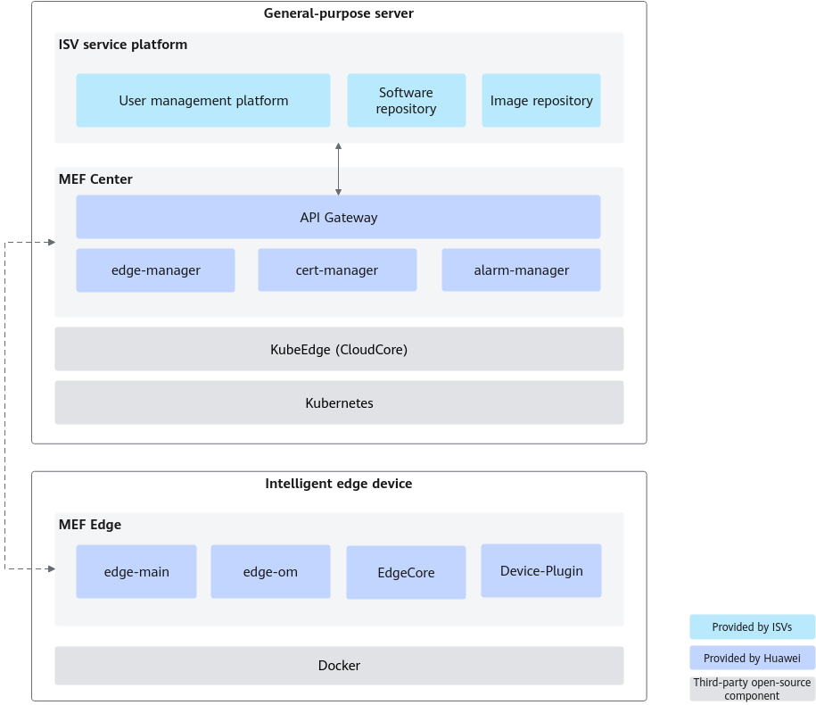
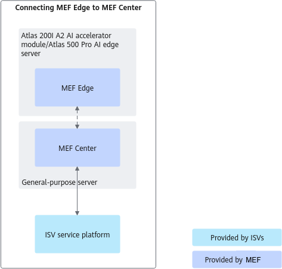

# Introduction

<!-- md-trans-meta sourceCommit=unknown translatedAt=2026-06-09T01:18:21.622Z pushedAt=2026-06-09T01:46:25.958Z -->

**Background**

With the evolution of AI technology, the demand for intelligent transformation in industries such as transportation, energy, and security has become increasingly strong, leading to more implementations of device-edge-cloud applications. Massive numbers of terminal devices generate data in real time, and centralized cloud computing struggles to accommodate the need for frequent data interaction in terms of bandwidth load, network latency, and data management costs, further highlighting the value of edge computing. The growth in edge computing demand inevitably brings an increase in the number of edge computing devices. How to manage a large number of edge devices and how to deploy edge computing applications to edge devices in batches have become key concerns for system administrators.

**Product Definition**

MEF is a lightweight device-edge-cloud synergy enablement framework positioned for integration. As part of the Ascend inference solution, MEF is used for intelligent edge device enablement, providing edge node management and intelligent inference service (containerized application) management functions. Edge-cloud synergy management can be performed through MEF Edge and MEF Center, and users can integrate required functions through secondary development and integration with ISV (Independent Software Vendor) business platforms.

- MEF Edge is deployed on intelligent edge devices, responsible for interfacing with the central network management system, completing the deployment and management of intelligent inference services (containerized applications), and providing services for algorithm applications.
- MEF Center is deployed on general-purpose servers, responsible for batch management of edge nodes, service deployment, and system monitoring.

**Product Value**

MEF provides benefits both on the service plane and management plane.

**Table 1** Product value

| Plane | Product Value |
|--|--|
| Service Plane | MEF features an open ecosystem and full-stack enablement, facilitating integration and lowering the barrier to entry for users. |
| Management Plane | MEF is extremely simple and easy to use, secure, and reliable. |

# MEF Architecture

MEF relies on the open-source system KubeEdge to establish and manage the control link between MEF Center and MEF Edge. MEF Center provides RESTful interfaces for users, which can be integrated and called by other third-party applications, allowing them to access services through the interface.

**Figure 1** MEF architecture

- MEF Center is the central management software used by MEF to provide external interfaces for integration with ISV business platforms and for cloud-edge synergy with MEF Edge. This software integrates modules such as the node management module and the container management module, providing functions like node management services and containerized application management services.

    **Table 1** MEF Center module description

    |Module|Module Function|
    |--|--|
    |APIG (API Gateway)|Provides bidirectional authentication and RESTful interfaces for ISV business platforms. Used by ISV business platforms to invoke and use services provided by MEF Center.|
    |edge-manager|Edge node management module and containerized application management module. Manages edge node access and containerized applications running on nodes.|
    |cert-manager|Certificate management module. Used for unified management of internal and external certificates used by MEF.|
    |alarm-manager|Alarm management module. Used to manage alarms and events for MEF Edge and MEF Center.|

- MEF Edge is the edge management software that interfaces with MEF Center. MEF Edge primarily receives messages from MEF Center and collects and forwards relevant information to MEF Center, enabling functions such as software installation and upgrade, and full lifecycle management of containerized applications. At the same time, MEF has offline autonomy capabilities: when the link between the edge node where MEF Edge resides and the central node where MEF Center resides is interrupted, the inference service on the edge node is not interrupted; if the edge node restarts, the inference service can automatically recover after the edge node restart is complete.

    **Table 2** MEF Edge module description

    |Module|Module Function|
    |--|--|
    |edge-om|Main process module, including the upgrade module, etc.|
    |edge-main|Process module for interfacing MEF Edge and MEF Center.|
    |EdgeCore|The edge-side component of the open-source system KubeEdge. Responsible for container lifecycle management on edge nodes.|
    |Device-Plugin|Device discovery plugin for NPU (Ascend AI Processor).|

# Application Scenario

The primary use cases of MEF include edge node management and containerized application management. By onboarding edge nodes from clusters into the MEF system, MEF enables unified management of edge node information, providing functions such as node onboarding, querying, modifying, and deleting node or node group information. As a fundamental feature of MEF, containerized application management handles the full lifecycle management of user applications. User applications are published as container images, and MEF manages these containerized application images, covering functions such as adding, deleting, modifying, and querying containerized applications.

MEF achieves cloud-edge synergy through the integration of MEF Edge with MEF Center, and externally interfaces with ISV business platforms via northbound interfaces to manage edge nodes and containerized applications.

**Figure 1** MEF integration mode

**Procedure of Connecting MEF Edge to MEF Center**

**Figure 2** Cloud-edge collaboration between MEF Edge and MEF Center

The cloud-edge collaboration procedure for integrating MEF Edge with MEF Center mainly includes: installing MEF, secondary development and integration of MEF, and managing edge nodes and containerized applications. Installing MEF is divided into the preparation and installation of MEF Center and MEF Edge. After users complete secondary development such as customization modifications, MEF is integrated with the developer platform, externally interfacing with the ISV business platform through the northbound interface, and internally implementing cloud-edge integration between MEF Center and MEF Edge. Management of edge nodes and containerized applications is then carried out through the ISV business platform.

# Supported Product Models and OSs

**Table 1** Product list supported by the integration mode of MEF Edge with MEF Center

<table><thead align="left"><tr id="row919217382919"><th class="cellrowborder" valign="top" width="20%" id="mcps1.2.6.1.1">
Installation Node

</th>
<th class="cellrowborder" valign="top" width="20%" id="mcps1.2.6.1.2">
Software

</th>
<th class="cellrowborder" valign="top" width="20%" id="mcps1.2.6.1.3">
Product Form

</th>
<th class="cellrowborder" valign="top" width="20%" id="mcps1.2.6.1.4">
Software Architecture

</th>
<th class="cellrowborder" valign="top" width="20%" id="mcps1.2.6.1.5">
OS

</th>
</tr>
</thead>
<tbody><tr id="row719216381197"><td class="cellrowborder" valign="top" width="20%" headers="mcps1.2.6.1.1 ">
Management Node

</td>
<td class="cellrowborder" valign="top" width="20%" headers="mcps1.2.6.1.2 ">
MEF Center

</td>
<td class="cellrowborder" valign="top" width="20%" headers="mcps1.2.6.1.3 ">
General-Purpose Server

</td>
<td class="cellrowborder" valign="top" width="20%" headers="mcps1.2.6.1.4 ">
AArch64 and x86_64

</td>
<td class="cellrowborder" valign="top" width="20%" headers="mcps1.2.6.1.5 ">
Ubuntu 20.04

openEuler 22.03

</td>
</tr>
<tr id="row219203820914"><td class="cellrowborder" rowspan="2" valign="top" width="20%" headers="mcps1.2.6.1.1 ">
Compute Node

</td>
<td class="cellrowborder" rowspan="2" valign="top" width="20%" headers="mcps1.2.6.1.2 ">
MEF Edge

</td>
<td class="cellrowborder" valign="top" width="20%" headers="mcps1.2.6.1.3 ">
Atlas 200I A2 Acceleration Module

Atlas 200I DK A2 Developer Kit

</td>
<td class="cellrowborder" valign="top" width="20%" headers="mcps1.2.6.1.4 ">
AArch64

</td>
<td class="cellrowborder" valign="top" width="20%" headers="mcps1.2.6.1.5 ">
openEuler 22.03

Ubuntu 22.04

</td>
</tr>
<tr id="row11488658181115"><td class="cellrowborder" valign="top" headers="mcps1.2.6.1.1 ">
Atlas 500 Pro Intelligent Edge Server (Model 3000) (with Atlas 300I Pro Inference Card)

</td>
<td class="cellrowborder" valign="top" headers="mcps1.2.6.1.2 ">
AArch64

</td>
<td class="cellrowborder" valign="top" headers="mcps1.2.6.1.3 ">
openEuler 22.03

</td>
</tr>
</tbody>
</table>
