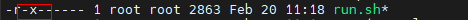
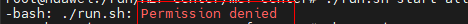

# Troubleshooting<a name="ZH-CN_TOPIC_0000001722295481"></a>

<!-- md-trans-meta sourceCommit=unknown translatedAt=2026-06-09T01:19:23.790Z pushedAt=2026-06-09T01:46:31.878Z -->

## MEF Center run.sh Command Execution Failure<a name="ZH-CN_TOPIC_0000001674256306"></a>

### MEF Center run.sh Command Access Denied<a name="ZH-CN_TOPIC_0000001722295501"></a>

**Symptom<a name="section13754951112814"></a>**

The `run.sh` command fails to execute even with the x Permission (executable Permission), and the echo shows `Permission denied`. An example is shown below.

**Figure 1** Directory permission<a name="fig6240121814544"></a>


**Figure 2** ./run.sh execution failure<a name="fig0572103614540"></a>


**Root Cause Analysis<a name="section77551626153617"></a>**

The mount point of the current path may have the `noexec` parameter set, preventing command execution in this path.

**Solution<a name="section157021112307"></a>**

- Method 1: Change to a path without the `noexec` parameter to install the software and run it.
- Method 2: Use the `bash` command to execute run.sh. An example is shown below.

    ```bash
    bash ./run.sh start all
    ```

### MEF Center run.sh Command Execution Connection Timeout<a name="ZH-CN_TOPIC_0000001674256242"></a>

**Symptom Description<a name="section13754951112814"></a>**

The `run.sh` command execution failed, and the log shows `unable to connect to the server: Gateway Time-out`.

**Root Cause Analysis<a name="section77551626153617"></a>**

The system proxy may cause kubectl to be unavailable. This could be due to proxy configuration issues, preventing the center side from establishing a connection with K8s.

**Solution<a name="section157021112307"></a>**

Run the following command to disable the HTTPS connection and use the default K8s connection.

```bash
unset https_proxy
```

## MEF Edge run.sh Command Execution Failure<a name="ZH-CN_TOPIC_0000001674416042"></a>

**Symptom Description<a name="section13754951112814"></a>**

The `run.sh` command fails to execute even with x Permission (executable Permission), and the echo shows `Permission denied`. An example is shown below.

**Figure 1**  Directory Permission<a name="fig6240121814544"></a>


**Figure 2** ./run.sh execution failure<a name="fig0572103614540"></a>


**Root Cause Analysis<a name="section77551626153617"></a>**

The mount point of the current path may have the `noexec` parameter set, preventing commands from being executed in this path.

**Solution<a name="section157021112307"></a>**

- Method 1: Change to a path without the `noexec` parameter to install the software and run it.
- Method 2: Use the `bash` command to execute run\.sh, as shown in the following example.

    ```bash
    bash ./run.sh start
    ```

## MEF Edge Query for MEF Center Root Certificate Failure<a name="ZH-CN_TOPIC_0000001674416038"></a>

**Symptom<a name="section1965862418191"></a>**

When querying the MEF Center root certificate on the MEF Edge device environment via the command line, `Execute [getcertinfo] command failed.` is returned. The specific error message is as follows.

```text
get cert info failed, cert does not exist. Execute command [netconfig] first.
```

**Solution<a name="section1919182851920"></a>**

The MEF Center root certificate can only be queried and obtained via getcertinfo after the network management is configured and the certificate is imported. Please first complete the integration by referring to [Authentication and Integration Between MEF Center and MEF Edge](./usage.md#ZH-CN_TOPIC_0000001722295385).

## MEF Center and MEF Edge Failed to Configure NMS<a id="ZH-CN_TOPIC_0000001674416002"></a>

**Symptom<a name="section281692625610"></a>**

The MEF Center and MEF Edge failed to execute the network management configuration command. The echo example is as follows.

```text
Execute [netconfig] command failed!
```

**Solution<a name="section19769112012133"></a>**

1. Open the [MEF Edge installation and deployment run log](./common_operations.md#viewing-log-information) (the default location is `/var/alog/MEFEdge_log/edge_installer/edge_installer_run.log`).
2. Check the log for the cause of the network management configuration failure.
    - If the error is as follows, check the token correctness.

        ```text
        token is incorrect
        https return error status code: 401
        ```

        If token authentication fails more than 5 times (including test_connect test attempts), MEF Center will lock this authentication integration for 5 minutes. Please re-initiate the integration after 5 minutes and enter the correct token.

        ```text
        ip is lock
        https return error status code: 423
        ```

    - For other errors, try checking the network connectivity between MEF Center and MEF Edge, or whether other parameters in the NMS configuration are correct.

3. Retry [Authentication and Integration Between MEF Center and MEF Edge](./usage.md#ZH-CN_TOPIC_0000001722295385).

## MEF Center Uninstallation Failure<a name="ZH-CN_TOPIC_0000001722295401"></a>

**Symptom Description<a name="section13754951112814"></a>**

MEF Center uninstallation fails, returning an error indicating that the referenced image cannot be deleted. An example is shown below.

```text
delete ascend-nginx-manager's docker image command exec failed: Error response from daemon: conflict: unable to remove repository reference `ascend-nginx-manager:v1` (must force) - container xxxxxxxxx is using its referenced image xxxxxxxxx
```

**Root Cause Analysis<a name="section77551626153617"></a>**

After MEF Center is installed, component images named `ascend-_module name_:_tag_` (e.g., `ascend-_cert-manager_:_v1_`) are generated. If containers using such component images are started and run through methods other than MEF Center at the time of uninstallation, the uninstallation will fail.

**Solution<a name="section157021112307"></a>**

Please manually delete the container occupying the image and then try uninstalling MEF Center again.

## MEF Edge Automatic Update of MEF Center Root Certificate Failure<a id="ZH-CN_TOPIC_0000001722295437"></a>

**Symptom Description<a name="section13754951112814"></a>**

After MEF Center performs an automatic update of the MEF Center root certificate, MEF Edge is unable to successfully connect to MEF Center. An error example is shown below.

```text
check edgehub client cert error: get cert from center error: Post \"https***\": x509: certificate signed by unknown authority
```

**Root Cause Analysis<a name="section77551626153617"></a>**

When MEF Center automatically updates the root certificate, MEF Edge fails to complete the automatic update of the MEF Center root certificate normally due to network interruption or other reasons. After the MEF Center root certificate is forcibly updated, the expired MEF Center root certificate on the MEF Edge device cannot be successfully verified, resulting in an integration failure.

**Solution<a name="section157021112307"></a>**

Re-obtain the MEF Center root certificate and cloud-edge authentication token, and configure the network management on the MEF Edge device. For specific operations, see [Authentication and Integration Between MEF Center and MEF Edge](./usage.md#ZH-CN_TOPIC_0000001722295385).
