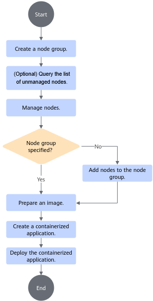

# Usage Guide<a name="ZH-CN_TOPIC_0000001674256294"></a>

<!-- md-trans-meta sourceCommit=unknown translatedAt=2026-06-09T01:20:22.454Z pushedAt=2026-06-09T01:46:33.652Z -->

## Preparations<a name="ZH-CN_TOPIC_0000001722295409"></a>

MEF provides the function of managing containerized applications on edge nodes, including edge node access management and containerized application management. Through secondary development and docking with the ISV service platform, users can use the RESTful API of MEF Center to initialize the configuration of third-party image repositories and software repositories, pull images, and upgrade MEF Edge software packages.

**MEF Center Development Precautions<a name="section37459330376"></a>**

On the device environment of MEF Center, MEF has occupied the following ports. Avoid using the same ports when developing third-party components.

**Table 1** Ports used by MEF Center<a id="MEF-Center"></a>

|Destination Port|Component|Port Description|
|--|--|--|
|30003|MEF Center|Service port for edge nodes to dock with the MEF Center network management|
|30004|MEF Center|Port for testing the connection and authentication information when edge nodes dock with the MEF Center network management|
|10002|CloudCore|Used for operations such as certificate acquisition when the edge node's edgecore docks with CloudCore|
|10000|CloudCore|Used for service interaction when the edge node's edgecore docks with CloudCore|
|6443|K8s|Listening port of the K8s API server, providing services for the MEF Center client|
|30035|MEF Center|Used to access the RESTful API provided by MEF Center|

**Preparing the User Management Platform<a name="section7851111143812"></a>**

Users need to prepare a user management platform capable of transmission via HTTPS. After exchanging root certificates with MEF Center for authentication, the platform successfully docks through a RESTful API and uses the functions provided by MEF.

**Preparing the Image Repository<a name="section44409575391"></a>**

Users need to prepare an open-source image repository or their own image repository that complies with Docker interface standards. The image repository must support uploading and pulling images via HTTPS.

**Preparing the Software Repository<a id="preparing-the-software-repository"></a>**

Users need to prepare an open-source software repository or their own software repository with a unified RESTful API. The software repository must support file upload and download via HTTPS.

## Connecting MEF Center to Service Platforms<a name="ZH-CN_TOPIC_0000001722375561"></a>

Use the northbound RESTful API to dock with the user management platform, image repository, and software repository.

### Integrating with the User Management Platform<a id="ZH-CN_TOPIC_0000001722375517"></a>

The external interface of MEF Center requires mutual certificate authentication with third-party platforms.

1. Exchange the root certificates of MEF Center and the third-party management platform. MEF Center must have cert-manager started to perform certificate exchange.

    Run the following command to exchange certificates.

    ```bash
    installation path/MEF-Center/mef-center/run.sh exchangeca -export_path MEF root certificate path -import_path management platform root certificate path
    ```

    > [!NOTE]
    >
    >- If you need to update the root certificate of the third-party management platform after docking, MEF Center must restart nginx-manager after running the certificate exchange command. For details, see [Restarting MEF Center](./common_operations.md#restarting-mef-center).
    >- The validity period of the root certificate is recommended to be longer than the [detection period for certificate alarms](./common_operations.md#configuring-and-querying-mef-center-certificate-expiration-alarm) (default value: 7).
    >- Importing a root certificate repeatedly backs up the previously imported certificate.

    **Table 1**  exchangeca parameters<a id="exchangecatable"></a>

    |Parameter|Description|
    |--|--|
    |-export_path/--export_path|Path to save the MEF root certificate file, used for third-party modules to authenticate MEF Center. The file name must be specified. This file path only supports absolute paths and must not be an existing file.|
    |-import_path/--import_path|Path to the management platform root certificate file, used for MEF Center to authenticate third-party modules. The file name must be specified. Supports certificate chains with a maximum of 10 levels and single certificate verification. This file path only supports absolute paths. The management platform root certificate must meet the following requirements: <ul><li>The certificate must be in PEM format.</li><li>The signature in the root CA certificate must be correct.</li><li>The root CA certificate must be within its validity period.</li><li>The certificate must be an X.509 V3 digital certificate. The "Basic Constraints" extension field of the root CA certificate must indicate "CA", and the "Key Usage" extension field must include "Certificate Signing".</li><li>The key must use the RSA algorithm with a length of at least 3072 bits, and the digest algorithm must be SHA256, SHA384, or SHA512; or ECDSA with a length of at least 256 bits.</li></ul>|

    > [!NOTE]
    >
    >- The directory for export\_path does not support soft links. The path length must be less than 4096 characters, the directory hierarchy must be fewer than 99 levels, and the group and other users must not have write permissions. The owner must be root.
    >- The file specified by export\_path must have root as the owner, the group and other users must not have write permissions, and the file size must not exceed 1 MB.
    >- The file specified by import\_path must exist, have root as the owner, the group and other users must not have write permissions, and the file size must not exceed 1 MB.

    - A response example like the following or a command return value of 0 indicates that the operation was successful.

        ```text
        exchange certs successful
        ```

    - If the response example is as follows or the command return value is 4, wait for cert-manager initialization to complete and then retry the certificate exchange.

        ```text
        the root ca has not yet generated, please start cert manager first
        exchange certs failed
        ```

2. Confirm the docking result. Call the version query interface to confirm the docking result. A successful call indicates successful docking.

    ```bash
    https://{ip}:{port}/edgemanager/v1/version
    ```

    For details about the interface, see [Querying the edge-manager Version](./RESTful.md#querying-the-edge-manager-version).

    > [!NOTE]
    > After the certificate exchange is successful, wait for 1s before confirming the docking result.

**Follow-up Procedure<a name="section1311312511389"></a>**

If you need to obtain the root certificate information of a third-party management platform, see [Obtaining Integrator Certificate Information](./RESTful.md#obtaining-integrator-certificate-information).

### Integrating with the Image Repository<a id="ZH-CN_TOPIC_0000001674416006"></a>

To use a third-party image repository, users must first import the root certificate of the image repository and then configure the image download information to complete the docking. When configuring a third-party image repository, the account and password provided by the third-party image repository will be used. The security of this account and password is the responsibility of the user.

1. Import the root certificate of the image repository.

    To use a third-party image repository, users must first import the image repository certificate.

    ```bash
    https://{ip}:{port}/certmanager/v1/certificates/import
    ```

    For specific interface details, see [Importing the Root Certificate](./RESTful.md#importing-the-root-certificate).

2. Import the image repository configuration.

    Used to configure the third-party image repository address and account password. The repository server address supports domain names or IP addresses. When the interface is called repeatedly, the existing image download information configuration will be updated.

    ```bash
    https://{ip}:{port}/edgemanager/v1/image/config
    ```

    For details about the interface, see [Configuring Image Download Information](./RESTful.md#configuring-image-download-information).

3. (Optional) Configure the mapping between domain names and IP addresses.

    If a domain name is used when importing the image repository configuration, you need to configure the mapping between the domain name and IP address in the "/etc/hosts" file of the MEF Edge host directory on the edge device. For details, see [Configuring Local Domain Name Mapping](./common_operations.md#ZH-CN_TOPIC_0000001722295397).

    ```bash
    ./run.sh domainconfig -domain=xxx -ip=xxx
    ```

### Integrating with the Software Repository<a id="ZH-CN_TOPIC_0000001674256310"></a>

To use a third-party software repository, you need to first import the root certificate of the software repository to complete the docking.

```bash
https://{ip}:{port}/certmanager/v1/certificates/import
```

For details about the API, see [Importing the Root Certificate](./RESTful.md#importing-the-root-certificate).

## Authentication and Integration Between MEF Center and MEF Edge<a id="ZH-CN_TOPIC_0000001722295385"></a>

Obtain the MEF Center root certificate and cloud-edge authentication token, and perform network management configuration on the MEF Edge device for mutual authentication and cloud-edge docking between MEF Center and MEF Edge.

**Prerequisites<a name="section9259204510567"></a>**

The system time of the device to be managed must be consistent with the system time of MEF Center. Otherwise, docking with MEF Center may fail.

**Procedure<a name="section1073368171320"></a>**

1. Log in to the MEF Edge device environment as the root user.
2. Obtain the MEF Center root certificate and cloud-edge authentication token.
    1. Export the root certificate. For details, see [Exporting the Root Certificate](./RESTful.md#exporting-the-root-certificate). Select "hub_svr" for the URL parameter.
    2. Obtain a valid cloud-edge authentication token. For details, see [Obtaining the Cloud-Edge Authentication Token](./RESTful.md#ZH-CN_TOPIC_0000001566531326). The obtained token is valid for 7 days.

3. Upload the MEF Center root certificate to any path on the MEF Edge device. It is recommended that the directory permission be set to non-writable for other users.
4. Run the following command to go to the path where the network management configuration file is located.

    ```bash
    cd installation path/MEFEdge/software/
    ```

5. Run the following command to perform network management configuration.

    ```bash
    ./run.sh netconfig -root_ca=<MEF Center root certificate path/certificate name.crt> -ip=<MEF Center IP> [-port=<MEF Center port>] [-net_type=MEF]  [-test_connect=true] [-auth_port=<MEF Center authentication port>]
    ```

    **Table 1**  netconfig parameters<a id="netconfig-parameters"></a>

    |Parameter|Mandatory/Optional|Description|
    |--|--|--|
    |root_ca|Mandatory|Indicates the path of the imported MEF Center root certificate file, which must be an absolute path. The path must be owned by root, with no write permission for the group and other users, and the file size must not exceed 1 MB.<div><div class="note"><span class="notetitle">[!NOTE] Note:</span><div class="notebody">If the device cannot dock with MEF Center because the certificate has expired or been revoked, re-import the MEF Center root certificate file.</div></div></div>|
    |ip|Mandatory|The access IP address of MEF Center.<div><div class="note"><span class="notetitle">[!NOTE] Note:</span><div class="notebody">Only IPv4 is supported. The all-zero address (0.0.0.0), broadcast address (255.255.255.255), and local IP addresses are not allowed.</div></div></div>|
    |port|Optional|Indicates the port number of MEF Center, with a value range of 1025 to 65535. If this parameter is not configured, the default port 30003 is used. If the port number has been configured multiple times, the most recently configured port number takes effect.|
    |net_type|Optional|Indicates the network management mode. The value is MEF. If this parameter is not configured, the default value is MEF.|
    |test_connect|Optional|Indicates whether to test the connectivity between the MEF Edge device and MEF Center during network management configuration. The default value is true. If this value is not configured, the connectivity test is performed by default.<ul><li>If this parameter is configured and set to true, the connectivity between the device and MEF Center is tested. If the test fails, docking with MEF Center fails.</li><li>If this parameter is configured and set to false, the connectivity between the device and MEF Center is not tested, but this may cause subsequent docking with MEF Center to fail.</li></ul>|
    |auth_port|Optional|The port number used by MEF Center for authentication, with a value range of 1025 to 65535. This parameter is optional. If this parameter is not configured, the default port 30004 is used.|

6. Enter the cloud-edge authentication token as prompted to complete the docking.

    ```text
    Please enter token:
    ```

    The response example is as follows, indicating that the docking is successful. If the docking fails, see [MEF Center and MEF Edge Failed to Configure NMS](./troubleshooting.md#ZH-CN_TOPIC_0000001674416002).

    ```text
    Execute [netconfig] command success!
    ```

7. After the docking is successful, run the following command to restart MEF Edge.

    ```bash
    ./run.sh restart
    ```

    The response example is as follows, indicating that the restart command was executed successfully.

    ```text
    Execute [restart] command success!
    ```

> [!NOTE]
>
>- MEF Center does not support migrating containerized applications. Before reconfiguring network management, you are advised to [uninstall deployed containers](./RESTful.md#uninstalling-a-container-application) to avoid resource residue.
>- To configure the time threshold and detection period for MEF Center root certificate expiration alarms, see [Configuring and Querying MEF Edge Certificate Expiration Alarm](./common_operations.md#configuring-and-querying-mef-edge-certificate-expiration-alarm).
>- After reconfiguring network management parameters, you need to restart MEF Edge for the changes to take effect.

## Deploying Containerized Applications<a id="ZH-CN_TOPIC_0000001722375569"></a>

This chapter guides developers on deploying containerized applications through the RESTful APIs provided by MEF Center, following the operation steps shown in [Figure 1](#fig1367012586547) below.

> [!NOTE]
>
> It is recommended not to operate cluster resources (such as containerized applications) on MEF Center nodes through commands or API calls, as this may cause MEF Center environment exceptions.

**Figure 1**  Deploying a containerized application<a id="fig1367012586547"></a>


**Introduction to the containerized application deployment process<a name="section871716499479"></a>**

**Table 1**  Containerized application deployment process
<table><thead align="left"><tr id="zh-cn_topic_0235159015_row234335421710"><th class="cellrowborder" valign="top" width="12.7%" id="mcps1.2.5.1.1"><p id="p889383005413"><a name="p889383005413"></a><a name="p889383005413"></a>Scenario</p>
</th>
<th class="cellrowborder" valign="top" width="20.330000000000002%" id="mcps1.2.5.1.2"><p id="p147413201269"><a name="p147413201269"></a><a name="p147413201269"></a>Operation</p>
</th>
<th class="cellrowborder" valign="top" width="35.85%" id="mcps1.2.5.1.3"><p id="p16749201269"><a name="p16749201269"></a><a name="p16749201269"></a>Description</p>
</th>
<th class="cellrowborder" valign="top" width="31.119999999999997%" id="mcps1.2.5.1.4"><p id="p27416206617"><a name="p27416206617"></a><a name="p27416206617"></a>API Reference</p>
</th>
</tr>
</thead>
<tbody><tr id="row10995167205718"><td class="cellrowborder" rowspan="7" valign="top" width="12.7%" headers="mcps1.2.5.1.1 "><p id="p04141721204315"><a name="p04141721204315"></a><a name="p04141721204315"></a>Managing edge nodes</p>
</td>
<td class="cellrowborder" valign="top" width="20.330000000000002%" headers="mcps1.2.5.1.2 "><p id="p81351543181212"><a name="p81351543181212"></a><a name="p81351543181212"></a>Creating a node group</p>
</td>
<td class="cellrowborder" valign="top" width="35.85%" headers="mcps1.2.5.1.3 "><p id="p1113504310124"><a name="p1113504310124"></a><a name="p1113504310124"></a>Create a node group through RESTful APIs or use an existing node group.</p>
</td>
<td class="cellrowborder" rowspan="7" valign="top" width="31.119999999999997%" headers="mcps1.2.5.1.4 "><p id="p624110516551"><a name="p624110516551"></a><a name="p624110516551"></a>For details about the node management API, see <a href="./RESTful.md#ZH-CN_TOPIC_0000001577280885">Node Management APIs</a>.</p>
</td>
</tr>
<tr id="row163371281978"><td class="cellrowborder" valign="top" headers="mcps1.2.5.1.1 "><p id="p14241556122"><a name="p14241556122"></a><a name="p14241556122"></a>(Optional) Querying the list of unmanaged nodes</p>
</td>
<td class="cellrowborder" valign="top" headers="mcps1.2.5.1.2 "><p id="p94241155141210"><a name="p94241155141210"></a><a name="p94241155141210"></a>Before managing nodes, you can query the list of unmanaged nodes through RESTful APIs to find the node ID corresponding to the current unmanaged <span id="ph5796105872215"><a name="ph5796105872215"></a><a name="ph5796105872215"></a>MEF Edge</span> device node.</p>
</td>
</tr>
<tr id="row43757329287"><td class="cellrowborder" valign="top" headers="mcps1.2.5.1.1 "><p id="p642418554129"><a name="p642418554129"></a><a name="p642418554129"></a>Managing a node</p>
</td>
<td class="cellrowborder" valign="top" headers="mcps1.2.5.1.2 "><p id="p144241655191217"><a name="p144241655191217"></a><a name="p144241655191217"></a>Manage a node through RESTful APIs.</p>
</td>
</tr>
<tr id="row1922465412119"><td class="cellrowborder" valign="top" headers="mcps1.2.5.1.1 "><p id="p4424135515126"><a name="p4424135515126"></a><a name="p4424135515126"></a>(Optional) Adding a node to a node group</p>
</td>
<td class="cellrowborder" valign="top" headers="mcps1.2.5.1.2 "><p id="p12424175531219"><a name="p12424175531219"></a><a name="p12424175531219"></a>If "groupIDs" is not specified when managing a node, you can add the node to a specified node group through RESTful APIs.</p>
</td>
</tr>
<tr id="row595114820457"><td class="cellrowborder" valign="top" headers="mcps1.2.5.1.1 "><p id="p495217484451"><a name="p495217484451"></a><a name="p495217484451"></a>(Optional) Modifying a node</p>
</td>
<td class="cellrowborder" valign="top" headers="mcps1.2.5.1.2 "><p id="p9952194812459"><a name="p9952194812459"></a><a name="p9952194812459"></a>Modify the name and description of a node through RESTful APIs.</p>
</td>
</tr>
<tr id="row10250948192317"><td class="cellrowborder" valign="top" headers="mcps1.2.5.1.1 "><p id="p182501148192315"><a name="p182501148192315"></a><a name="p182501148192315"></a>(Optional) Deleting a node</p>
</td>
<td class="cellrowborder" valign="top" headers="mcps1.2.5.1.2 "><p id="p142501148132316"><a name="p142501148132316"></a><a name="p142501148132316"></a>Delete nodes in batches through RESTful APIs.</p>
</td>
</tr>
<tr id="row144191717254"><td class="cellrowborder" valign="top" headers="mcps1.2.5.1.1 "><p id="p74198732515"><a name="p74198732515"></a><a name="p74198732515"></a>(Optional) Removing a node from a node group</p>
</td>
<td class="cellrowborder" valign="top" headers="mcps1.2.5.1.2 "><p id="p04191975256"><a name="p04191975256"></a><a name="p04191975256"></a>Remove a node from a specified node group through RESTful APIs to delete the pod of a single containerized application and uninstall the corresponding containerized application.</p>
</td>
</tr>
<tr id="row48414131310"><td class="cellrowborder" valign="top" width="12.7%" headers="mcps1.2.5.1.1 "><p id="p6893183025419"><a name="p6893183025419"></a><a name="p6893183025419"></a>Preparing container images</p>
</td>
<td class="cellrowborder" valign="top" width="20.330000000000002%" headers="mcps1.2.5.1.2 "><p id="p1966111716158"><a name="p1966111716158"></a><a name="p1966111716158"></a>Preparing container images</p>
</td>
<td class="cellrowborder" valign="top" width="35.85%" headers="mcps1.2.5.1.3 "><p id="p1666181741512"><a name="p1666181741512"></a><a name="p1666181741512"></a><span id="ph13170154424716"><a name="ph13170154424716"></a><a name="ph13170154424716"></a>MEF</span> can use containerized application images in three ways: through the Docker public image repository, a third-party image repository, or manually importing images to <span id="ph3525163816271"><a name="ph3525163816271"></a><a name="ph3525163816271"></a>MEF Edge</span>.</p>
<p id="p14661517161515"><a name="p14661517161515"></a><a name="p14661517161515"></a>When using an image repository, you need to ensure that the network connection between the <span id="ph18301043115713"><a name="ph18301043115713"></a><a name="ph18301043115713"></a>MEF Edge</span> device and the image repository is functional, and that the image repository itself is usable.</p><div class="note"><span class="notetitle">[!NOTE] Note:</span><div class="notebody">When deploying a containerized application, the image repository account and password issued by the third-party image repository will be used. This account and password are managed by the third party.</div></div>
</td>
<td class="cellrowborder" valign="top" width="31.119999999999997%" headers="mcps1.2.5.1.4 "><a name="ul362985313248"></a><a name="ul362985313248"></a><ul id="ul362985313248"><li>If you manually import images in the <span id="ph33441146105719"><a name="ph33441146105719"></a><a name="ph33441146105719"></a>MEF Edge</span> device environment, you can use the following Docker command in any path to import: <strong id="b185143414551"><a name="b185143414551"></a><a name="b185143414551"></a>docker load -i xxxx.tar.gz</strong></li><li>If you need to use a third-party image repository to obtain images, for details about the process, see <a href="./RESTful.md#configuration-api-introduction">Configuration APIs</a>.</li><li>For details about how to create container images, see <a href="./common_operations.md#creating-an-inference-image">Creating an Inference Image</a> or the <span class="menucascade" id="menucascade856261318102"><a name="menucascade856261318102"></a><a name="menucascade856261318102"></a>"<span class="uicontrol" id="uicontrol17562613171014"><a name="uicontrol17562613171014"></a><a name="uicontrol17562613171014"></a>Container Deployment Scenario</span> &gt; <span class="uicontrol" id="uicontrol562491818103"><a name="uicontrol562491818103"></a><a name="uicontrol562491818103"></a>Creating a Container Image</span>"</span> section in <span id="ph1126911412338"><a name="ph1126911412338"></a><a name="ph1126911412338"></a><a href="https://support.huawei.com/enterprise/zh/doc/EDOC1100423566" target="_blank" rel="noopener noreferrer">Atlas 200I A2 Acceleration Module Ascend Software Quick Installation Guide</a></span>.</li></ul>
</td>
</tr>
<tr id="row14249152715157"><td class="cellrowborder" rowspan="7" valign="top" width="12.7%" headers="mcps1.2.5.1.1 "><p id="p68097363440"><a name="p68097363440"></a><a name="p68097363440"></a>Managing containerized applications</p>
</td>
<td class="cellrowborder" valign="top" width="20.330000000000002%" headers="mcps1.2.5.1.2 "><p id="p126424412152"><a name="p126424412152"></a><a name="p126424412152"></a>Creating a containerized application</p>
</td>
<td class="cellrowborder" valign="top" width="35.85%" headers="mcps1.2.5.1.3 "><p id="p5264194481514"><a name="p5264194481514"></a><a name="p5264194481514"></a>Create a containerized application for a node group through RESTful APIs.</p>
</td>
<td class="cellrowborder" rowspan="7" valign="top" width="31.119999999999997%" headers="mcps1.2.5.1.4 "><p id="p2334184885417"><a name="p2334184885417"></a><a name="p2334184885417"></a>For details about the containerized application management API, see <a href="./RESTful.md#ZH-CN_TOPIC_0000001577441409">Containerized Application Management APIs</a>.</p><div class="note"><span class="notetitle">[!NOTE] Note:</span><div class="notebody">If you deploy containerized applications that are not managed by MEF Center to device nodes, the containerized applications may fail to be deployed due to insufficient resources.</div></div>
</td>
</tr>
<tr id="row59891229102617"><td class="cellrowborder" valign="top" headers="mcps1.2.5.1.1 "><p id="p16989629112612"><a name="p16989629112612"></a><a name="p16989629112612"></a>(Optional) Querying the containerized application list</p>
</td>
<td class="cellrowborder" valign="top" headers="mcps1.2.5.1.2 "><p id="p498932992616"><a name="p498932992616"></a><a name="p498932992616"></a>Query the list of containerized applications to be deployed through RESTful APIs.</p>
</td>
</tr>
<tr id="row134721051141512"><td class="cellrowborder" valign="top" headers="mcps1.2.5.1.1 "><p id="p1344555751512"><a name="p1344555751512"></a><a name="p1344555751512"></a>Deploying a containerized application</p>
</td>
<td class="cellrowborder" valign="top" headers="mcps1.2.5.1.2 "><p id="p144595771519"><a name="p144595771519"></a><a name="p144595771519"></a>Create a containerized application for a node group through RESTful APIs.</p>
</td>
</tr>
<tr id="row124111802167"><td class="cellrowborder" valign="top" headers="mcps1.2.5.1.1 "><p id="p17471185141613"><a name="p17471185141613"></a><a name="p17471185141613"></a>(Optional) Querying the deployed containerized application list</p>
</td>
<td class="cellrowborder" valign="top" headers="mcps1.2.5.1.2 "><p id="p14711055166"><a name="p14711055166"></a><a name="p14711055166"></a>After deploying a containerized application, you can query the list of deployed containerized applications through RESTful APIs.</p>
</td>
</tr>
<tr id="row2045711226477"><td class="cellrowborder" valign="top" headers="mcps1.2.5.1.1 "><p id="p10457162220478"><a name="p10457162220478"></a><a name="p10457162220478"></a>(Optional) Updating a containerized application</p>
</td>
<td class="cellrowborder" valign="top" headers="mcps1.2.5.1.2 "><p id="p245752284719"><a name="p245752284719"></a><a name="p245752284719"></a>Update the corresponding deployed containerized application through RESTful APIs. Currently, only modifications to the container image name and container image version are supported.</p>
</td>
</tr>
<tr id="row1033823610479"><td class="cellrowborder" valign="top" headers="mcps1.2.5.1.1 "><p id="p1484210467478"><a name="p1484210467478"></a><a name="p1484210467478"></a>(Optional) Uninstalling a containerized application</p>
</td>
<td class="cellrowborder" valign="top" headers="mcps1.2.5.1.2 "><p id="p20338636144711"><a name="p20338636144711"></a><a name="p20338636144711"></a>Uninstall a containerized application through RESTful APIs.</p>
</td>
</tr>
<tr id="row10377257134717"><td class="cellrowborder" valign="top" headers="mcps1.2.5.1.1 "><p id="p83774578477"><a name="p83774578477"></a><a name="p83774578477"></a>(Optional) Deleting a containerized application</p>
</td>
<td class="cellrowborder" valign="top" headers="mcps1.2.5.1.2 "><p id="p4377105717475"><a name="p4377105717475"></a><a name="p4377105717475"></a>Delete a containerized application through RESTful APIs. When deleting a containerized application, only undeployed applications can be deleted. If the corresponding containerized application has been deployed, you must uninstall it first.</p>
</td>
</tr>
</tbody>
</table>

> [!NOTE]
> To collect logs from MEF Edge node devices using the RESTful API provided by MEF Center, see [Log Collection APIs](./RESTful.md#log-collection-apis). To directly log in to the device environment to view logs, see [Viewing Log Information](./common_operations.md#viewing-log-information).
