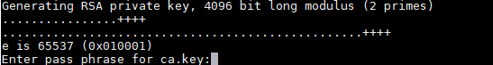
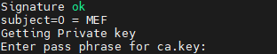

# 常用操作<a name="ZH-CN_TOPIC_0000001674256266"></a>

## 命令依赖安装参考<a name="ZH-CN_TOPIC_0000001722375509"></a>

**表 1**  常用命令依赖安装步骤

|依赖|安装命令步骤|
|--|--|
|iptables|<li>Ubuntu操作系统执行以下命令安装：<ul>```apt install iptables```</ul></li><li>openEuler操作系统执行以下命令安装：<ul>```yum install iptables```</ul></li>|
|uname|<li>Ubuntu操作系统执行以下命令安装：<ul>```apt install coreutils```</ul></li><li>openEuler操作系统执行以下命令安装：<ul>```yum install coreutils```</ul></li>|
|grep|<li>Ubuntu操作系统执行以下命令安装：<ul>```apt install grep```</ul></li><li>openEuler操作系统执行以下命令安装：<ul>```yum install grep```</ul></li>|
|useradd|<li>Ubuntu操作系统执行以下命令安装：<ul>```apt install passwd```</ul></li><li>openEuler操作系统执行以下命令安装：<ul>```yum install passwd```</ul></li>|
|dmidecode|<li>Ubuntu操作系统执行以下命令安装：<ul>```apt install dmidecode```</ul></li><li>openEuler操作系统执行以下命令安装：<ul>```yum install dmidecode```</ul></li>|
|systemctl|<li>Ubuntu操作系统执行以下命令安装：<ul>```apt install systemd```</ul></li><li>openEuler操作系统执行以下命令安装：<ul>```yum install systemd```</ul></li>|
|haveged|<li>Ubuntu操作系统执行以下命令安装：<ul>```apt install haveged```</ul></li><li>openEuler操作系统执行以下命令安装：<ul>```yum install haveged```</ul></li> > [!NOTE] 说明 <br>haveged安装后，需要执行以下命令启动haveged服务：<br>```systemctl enable haveged```</br>```systemctl start haveged```</br>|
|Docker|版本为18.09以上的版本，具体安装操作请参见[Docker官网](https://docs.docker.com/engine/install/)，请根据Docker官网及社区及时跟踪Docker漏洞和问题，保证使用的Docker合入相关修复补丁。|

## 配置本地域名映射<a id="ZH-CN_TOPIC_0000001722295397"></a>

本地域名映射配置用于适配第三方镜像仓库，当用户提供的第三方镜像仓库服务器地址为域名而不是IP地址时，需要配置本地域名映射。使用第三方镜像仓库功能请参考[配置接口](./RESTful.md#配置接口)。

> [!NOTE] 说明   
> 
>- 如果用户不需要使用第三方镜像仓库获取容器应用镜像，或者使用的第三方镜像仓库服务器地址为IP时，不需要配置此接口。
>- 域名和IP映射保存在用户“/etc/hosts“文件内，最多支持通过MEF Edge配置16份域名映射，用户重复配置相同域名时，会覆盖已配置的相同域名的IP地址。
>- 如果需要删除本地域名映射，请后台使用root用户打开“/etc/hosts“文件，选择不需要的域名映射进行删除。

1. 以root用户登录设备环境。
2. 执行以下命令，进入run.sh所在路径。

    ```bash
    cd 安装路径/MEFEdge/software/
    ```

3. 执行以下命令，进行本地域名映射配置。

    ```bash
    ./run.sh domainconfig --ip=<第三方镜像仓库实际IP地址> --domain=<第三方镜像仓库域名>
    ```

    **表 1**  domainconfig参数说明表<a id="domainconfig参数说明表"></a>

    |参数|说明|
    |--|--|
    |ip|可访问的第三方镜像仓库实际IP地址。仅支持IPv4，不能为全零地址（0.0.0.0），广播地址（255.255.255.255）和回环地址（127.0.0.1）。|
    |domain|第三方镜像仓库域名，支持长度3~63位，大小写字母、数字和符号（.-）的组合，且只能以大小写字母、数字开头和结尾，但是不能全为数字。<br> > [!NOTE] 说明 </br>第三方镜像仓库域名不能为localhost或其他等价于localhost的域名。|

## 设置系统服务资源限制<a id="ZH-CN_TOPIC_0000001722295441"></a>

用户可根据业务需要通过Linux系统服务配置对MEF Edge进程相关服务进行资源限制，若用户不设置则默认无限制。设置后可限制CPU和内存的资源使用量，使服务不会持续超过限值。

**表 1**  服务文件路径

|服务名称|服务文件路径|
|--|--|
|edgecore|/usr/lib/systemd/system/edgecore.service|
|device-plugin|/usr/lib/systemd/system/device-plugin.service|
|mef-edge-main|/usr/lib/systemd/system/mef-edge-main.service|
|mef-edge-om|/usr/lib/systemd/system/mef-edge-om.service|

1. 以root用户登录设备环境。
2. 执行以下命令，修改服务文件后<b>:wq</b>退出。以edgecore服务为例。

    ```bash
    vi /usr/lib/systemd/system/edgecore.service
    ```

    在[Service]字段中添加或修改“CPUQuota“和“MemoryMax“配置项。

    **表 2** 

    |配置项|参数说明|
    |--|--|
    |CPUQuota|此单元的进程设置CPU时间限额，必须设为一个以"%"结尾的百分数，表示该单元最多可使用单颗CPU总时间的百分比。|
    |MemoryMax|绝对刚性的限制该单元中的进程最多可以使用多少内存。选项值可以是以字节为单位的绝对大小（可以使用以1024为基数的K、M、G、T后缀），也可以是以百分比表示的相对大小（相对于系统的全部物理内存），还可以设为特殊值infinity表示不作限制。|

    修改后的服务文件示例如下。

    ```text
    [Service]
    UMask=0027
    User=MEFEdge
    ...
    CPUQuota=15%
    MemoryMax=50M
    ```

3. 执行以下命令，更新服务文件配置。

    ```bash
    systemctl daemon-reload
    ```

## 使用OpenSSL制作CA证书参考<a name="ZH-CN_TOPIC_0000001674256258"></a>

- 根据安全要求，RSA算法密钥长度至少为3072比特，建议使用**4096**比特。请确保使用“-aes256“等命令进行密钥加密，同时MD5、SHA1、RSA1024用于加密有安全风险，不建议使用。
- 请合理设置证书有效期，建议不要超过36个月。
- 制作自签名证书时如果输入的密码为空，产生的私钥是明文，有安全风险，输入口令建议满足一定的复杂度。
- 口令复杂度建议：
    1. 口令长度至少8个字符。
    2. 口令必须包含如下至少两种字符的组合：
        - 至少一个小写字母。
        - 至少一个大写字母。
        - 至少一个数字。
        - 至少一个特殊字符。

**使用OpenSSL制作CA证书<a name="section375752314414"></a>**

1. 登录到任意一台安装有OpenSSL工具的Linux机器。
2. 创建“cert\_v3“目录并进入该目录。

    ```bash
    mkdir cert_v3
    cd cert_v3
    ```

3. 在“cert\_v3“目录下，创建工作目录ca并进入该目录。

    ```bash
    mkdir ca
    cd ca
    ```

4. 创建CA证书的OpenSSL配置文件“ca\_cert.conf“，内容如下：

    ```text
    [ req ]
     distinguished_name     = req_distinguished_name 
     prompt                 = no  
    
    [ req_distinguished_name ]  
     O                      = MEF
    [ v3_ca ]
    subjectKeyIdentifier = hash
    authorityKeyIdentifier = keyid:always,issuer
    basicConstraints = critical, CA:true
    keyUsage = critical, digitalSignature, cRLSign, keyCertSign
    ```

5. 创建CA证书私钥文件“ca.key“。

    ```bash
    openssl genrsa -aes256 -out ca.key 4096
    ```

    

    > [!NOTE] 说明  
    > 请合理设置密码强度，长度至少为8个字符，且包含数字、大写字母、小写字母、特殊符号中的两种及以上字符组合。

6. 创建CA证书的csr请求文件“ca.csr“。

    ```bash
    openssl req -out ca.csr -key ca.key -new -config ./ca_cert.conf
    ```

7. 创建自签名的CA证书“ca.crt“。

    ```bash
    openssl x509 -req -in ca.csr -out ca.crt -sha256 -days 1000 -extfile ./ca_cert.conf -extensions v3_ca -signkey ca.key
    ```

    

## 查看日志信息<a id="ZH-CN_TOPIC_0000001722375565"></a>

描述日志路径位置和相关权限信息。

**MEF Center日志<a name="section12347525165315"></a>**

MEF Center软件安装成功后，具体的日志路径如下所示（默认安装路径为“/var“）：

- 安装日志：“_日志路径/_mef-center-log/mef-center-install“
- 运行日志：“_日志路径_/mef-center-log/mef-center-install/mef-center-install-run.log“

    > [!NOTE] 说明 
    > mef-center-install-run.log读取的时间为主机时间；其他MEF Center日志读取的时间为容器内时间。

- 操作日志：“_日志路径_/mef-center-log/mef-center-install/mef-center-install-operate.log“
- 各模块日志：“_日志路径_/mef-center-log/_模块名_“

**查看MEF Edge日志<a name="section1779074212536"></a>**

MEF Edge软件安装过程中进程运行日志或者软件的安装日志说明请参见[表1](#table日志权限说明)。若日志根路径为默认路径“/var/alog“，则日志记录位置为“/var/alog/MEFEdge\_log“，其中各组件日志文件夹权限为750，日志文件权限为640。MEF Edge日志读取的时间为主机时间。

**表 1** 日志权限说明<a id="table日志权限说明"></a>

|**文件夹**|**属主**|**权限**|
|--|--|--|
|MEFEdge_log<br>├── device_plugin<br>├── edge_core<br>├── edge_installer<br>├── edge_main<br>└── edge_om|root<br>root<br>root<br>root<br>MEFEdge<br>root|755750750750750750|

- MEF Edge安装部署的运行日志位置为“/var/alog/MEFEdge\_log/edge\_installer/edge\_installer\_run.log“。
- MEF Edge安装部署的操作日志位置为“/var/alog/MEFEdge\_log/edge\_installer/edge\_installer\_operate.log“。

**收集MEF Edge日志<a name="section1279784255"></a>**

通过命令行方式可以将MEF Edge各模块的日志文件收集至指定路径。

1. 以root用户登录MEF Edge设备环境。
2. 执行以下命令，进入run.sh所在路径，默认安装目录“/usr/local/mindx“。

    ```bash
    cd 安装目录/MEFEdge/software/
    ```

3. 执行以下命令，创建日志收集文件所在目录。

    ```bash
    mkdir -p /run/collect_log
    ```

4. 执行以下命令，收集MEF Edge日志。

    ```bash
    ./run.sh collectlog -log_pack_path=日志收集文件路径 -module=模块名
    ```

    **表 2**  collectlog参数说明表<a id="collectlog参数说明表"></a>

    |参数|说明|
    |--|--|
    |log_pack_path|日志收集文件路径只能为/run/collect_log/mef_edge.tar.gz。|
    |module|模块名，取值为“all”。|

## 配置KMC加密算法<a name="ZH-CN_TOPIC_0000001674256334"></a>

用户可根据业务需要配置KMC加密算法，如果用户不添加相应配置则使用默认配置。

**MEF Center配置加密算法<a name="section58561893819"></a>**

1. 以root用户登录MEF Center设备环境。
2. 执行以下命令，进入MEF Center配置文件路径，默认安装目录“/usr/local“。

    ```bash
    cd 安装路径/MEF-Center/mef-config/public-config
    ```

3. 编辑该路径下kmc-config.json中的“algorithms“字段，默认使用的加密算法为AES\_GCM\_256。

    ```json
    {
        "algorithms":"Aes256gcm"
    }
    ```

    **表 1**  algorithms字段说明

    |取值|说明|
    |--|--|
    |Aes256gcm|默认配置，表示使用的加密算法为AES_GCM_256。|
    |Aes128gcm|表示使用的加密算法为AES_GCM_128。|

4. 重新启动MEF Center后配置生效，具体操作参考[重启MEF Center](#重启mef-center)。

**MEF Edge配置加密算法<a name="section22913553482"></a>**

1. 以root用户登录MEF Edge设备环境。
2. 执行以下命令，进入MEF Edge配置文件路径，分别修改edge\_om和edge\_main的配置文件，默认安装目录“/usr/local/mindx“。
    - 进入edge\_om配置文件路径。

        ```bash
        cd 安装路径/MEFEdge/config/edge_om
        ```

        编辑该路径下kmc-config.json文件中的“algorithms“字段，默认使用的加密算法为AES\_GCM\_256。

        ```json
        {
            "algorithms":"Aes256gcm"
        }
        ```

    - 进入edge\_main配置文件路径。

        ```bash
        cd 安装路径/MEFEdge/config/edge_main
        ```

        编辑该路径下kmc-config.json文件中的“algorithms“字段，默认使用的加密算法为AES\_GCM\_256。

        ```json
        {
            "algorithms":"Aes256gcm"
        }
        ```

        **表 2**  algorithms字段说明

       |取值|说明|
       |--|--|
       |Aes256gcm|默认配置，表示使用的加密算法为AES_GCM_256。|
       |Aes128gcm|表示使用的加密算法为AES_GCM_128。|

3. 重新启动MEF Edge后配置生效，具体操作参考[重启MEF Edge](#重启mef-edge)。

## 更新KMC加密密钥<a name="ZH-CN_TOPIC_0000001674256250"></a>

用户可根据业务需要定期配置KMC加密组件密钥。

**MEF Center更新密钥<a name="section12188114884017"></a>**

1. 以root用户登录MEF Center设备环境。
2. 执行以下命令，进入run.sh所在路径，默认安装目录“/usr/local“。

    ```bash
    cd 安装路径/MEF-Center/mef-center
    ```

3. 执行以下命令，更新KMC组件密钥。

    ```bash
    ./run.sh updatekmc
    ```

    回显示例如下，表示更新密钥执行成功。

    ```bash
    update kmc keys successful
    ```

> [!NOTE] 说明 
> updatekmc具体功能已消减，属于预留接口，用户可自行实现底层kmc接口具体功能

**MEF Edge更新密钥<a name="section1730595715400"></a>**

1. 以root用户登录MEF Edge设备环境。
2. 执行以下命令，进入run.sh所在路径，默认安装目录“/usr/local/mindx“。

    ```bash
    cd 安装目录/MEFEdge/software/
    ```

3. 执行以下命令，更新KMC组件密钥。

    ```bash
    ./run.sh updatekmc
    ```

    回显示例如下，表示更新密钥执行成功。

    ```text
    Execute [updatekmc] command success!
    ```
> [!NOTE] 说明 
> updatekmc具体功能已消减，属于预留接口，用户可自行实现底层kmc接口具体功能
## 启动MEF Center<a id="ZH-CN_TOPIC_0000001722295461"></a>

如需要启动模块，请参见如下步骤。

1. 以root用户登录设备环境。
2. 执行以下命令，进入run.sh所在路径，默认安装目录“/usr/local“。

    ```bash
    cd 安装路径/MEF-Center/mef-center
    ```

3. 启动指定的模块。

    - 执行以下命令，启动所有模块。

        ```bash
        ./run.sh start -component=all
        ```

    - 执行以下命令，启动对应模块（如网关管理模块）。

        ```bash
        ./run.sh start -component=nginx-manager
        ```

    <a id="componenttable1"></a>
    **表 1**  component参数说明 

    |参数|说明|
    |--|--|
    |all|启动所有已安装模块。|
    |模块名|启动单个模块，一条启动命令只能启动一个模块。<ul><li>cert-manager：证书管理模块</li><li>edge-manager：容器管理模块</li><li>nginx-manager：网关管理模块</li><li>alarm-manager：告警管理模块</li></ul>|

    > [!NOTE] 说明 
    > run\.sh start支持的参数格式：
    >- ./run.sh start 参数可选，不带参数默认启动全部模块。
    >- ./run.sh start -component=all或者./run.sh start --component=all
    >- ./run.sh start -component all或者./run.sh start --component all
    >以上命令格式都可以正常运行，如果run\.sh start命令的参数不带“-”，如./run.sh start all，则会忽略该参数继续执行。

    回显示例如下，表示操作执行成功。

    ```text
    start nginx-manager component successful
    ```

## 重启MEF Center<a id="重启mef-center"></a>

1. 以root用户登录设备环境。
2. 执行以下命令，进入run.sh所在路径，默认安装目录“/usr/local“。

    ```bash
    cd 安装路径/MEF-Center/mef-center
    ```

3. 重启指定的模块。

    - 执行以下命令，重启所有模块。

        ```bash
        ./run.sh restart -component=all
        ```

    - 执行以下命令，重启对应模块（如网关管理模块）。

        ```bash
        ./run.sh restart -component=nginx-manager
        ```

    <a id="componenttable2"></a>
    **表 1**  component参数说明 

    |参数|说明|
    |--|--|
    |all|重启所有已安装模块。|
    |模块名|重启单个模块，一条重启命令只能重启一个模块。<ul><li>cert-manager：证书管理模块</li><li>edge-manager：容器管理模块</li><li>nginx-manager：网关管理模块</li><li>alarm-manager：告警管理模块</li></ul>|

    > [!NOTE] 说明   
    > run\.sh restart支持的参数格式：
    >- ./run.sh restart 参数可选，不带参数默认重启全部模块。
    >- ./run.sh restart -component=all或者./run.sh restart --component=all
    >- ./run.sh restart -component all或者./run.sh restart --component all
    >以上命令格式都可以正常运行，如果run\.sh restart命令的参数不带“-”，如./run.sh restart all，则会忽略该参数继续执行。

    回显示例如下，表示操作执行成功。

    ```text
    restart nginx-manager component successful
    ```

## 停止MEF Center<a name="ZH-CN_TOPIC_0000001674256318"></a>

1. 以root用户登录设备环境。
2. 执行以下命令，进入run.sh所在路径，默认安装目录“/usr/local“。

    ```bash
    cd 安装路径/MEF-Center/mef-center
    ```

3. 停止指定的模块。

    - 执行以下命令，停止所有模块。

        ```bash
        ./run.sh stop -component=all
        ```

    - 执行以下命令，停止对应模块（如网关管理模块）。

        ```bash
        ./run.sh stop -component=nginx-manager
        ```

    <a id="componenttable3"></a>
    **表 1**  component参数说明

    |参数|说明|
    |--|--|
    |all|停止所有已安装模块。|
    |模块名|停止单个模块，一条停止命令只能停止一个模块。<ul><li>cert-manager：证书管理模块</li><li>edge-manager：容器管理模块</li><li>nginx-manager：网关管理模块</li><li>alarm-manager：告警管理模块</li></ul>|

    > [!NOTE] 说明   
    > run\.sh stop支持的参数格式：
    >- ./run.sh stop 参数可选，不带参数默认停止全部模块。
    >- ./run.sh stop -component=all或者./run.sh stop --component=all
    >- ./run.sh stop -component all或者./run.sh stop --component all
    >以上命令格式都可以正常运行，如果run\.sh stop命令的参数不带“-”，如./run.sh stop all，则会忽略该参数继续执行。

    回显示例如下，表示操作执行成功。

    ```text
    stop nginx-manager component successful
    ```

## 启动MEF Edge<a name="ZH-CN_TOPIC_0000001674415926"></a>

1. 以root用户登录MEF Edge设备环境。
2. 执行以下命令，进入run.sh所在路径，默认安装目录“/usr/local/mindx“。

    ```bash
    cd 安装目录/MEFEdge/software/
    ```

3. 执行以下命令，启动MEF Edge。

    ```bash
    ./run.sh start
    ```

    回显示例如下，表示启动命令执行成功。

    ```text
    Execute [start] command success!
    ```

    > [!NOTE] 说明  
    > 重复启动软件会出现告警，示例可参考[MEF Edge重复启动或停止告警](./faq.md#mef-edge重复启动或停止告警)。

4. （可选）执行以下命令，查看进程启动情况。

    ```bash
    ps aux|grep MEFEdge|grep -v grep
    ```

    回显示例如下，表示MEF Edge已成功运行的进程。

    ```text
    root      588808       1  0 09:15 ?        00:00:00 /usr/local/mindx/MEFEdge/software/edge_om/bin/edge-om
    MEFEdge   588827       1  0 09:15 ?        00:00:00 /usr/local/mindx/MEFEdge/software/edge_main/bin/edge-main
    root      588946       1  6 09:15 ?        00:00:13 /usr/local/mindx/MEFEdge/software/edge_core/bin/edgecore --config=/usr/local/mindx/MEFEdge/software/edge_core/config/edgecore.json --logtostderr=false --log_file=/var/alog/MEFEdge_log/edge_core/edge_core_run.log --log_file_max_size=24
    root      588948       1  0 09:15 ?        00:00:00 /usr/local/mindx/MEFEdge/software/device_plugin/bin/device-plugin --logFile=/var/alog/MEFEdge_log/device_plugin/device_plugin_run.log --useAscendDocker=false
    ```

    **表 1**  进程说明

    |进程|说明|
    |--|--|
    |edge-om|主进程，包括升级模块等。属主为root。|
    |edge-main|对接MEF Edge边缘侧和MEF Center中心侧的进程。属主为MEFEdge。|
    |edgecore|edgecore进程。属主为root。|
    |device-plugin|device-plugin进程。属主为root。|

## 重启MEF Edge<a name="重启mef-edge"></a>

1. 以root用户登录MEF Edge设备环境。
2. 执行以下命令，进入run.sh所在路径，默认安装目录“/usr/local/mindx“。

    ```bash
    cd 安装目录/MEFEdge/software/
    ```

3. 执行以下命令，重启MEF Edge。

    ```text
    ./run.sh restart
    ```

    回显示例如下，表示重启命令执行成功。

    ```text
    Execute [restart] command success!
    ```

## 停止MEF Edge<a name="ZH-CN_TOPIC_0000001722375585"></a>

1. 以root用户登录MEF Edge设备环境。
2. 执行以下命令，进入run.sh所在路径，默认安装目录“/usr/local/mindx“。

    ```bash
    cd 安装目录/MEFEdge/software/
    ```

3. 执行以下命令，停止MEF Edge。

    ```bash
    ./run.sh stop
    ```

    回显示例如下，表示停止命令执行成功。

    ```text
    Execute [stop] command success!
    ```

    > [!NOTE] 说明  
    > 重复停止软件会出现告警，示例可参考[MEF Edge重复启动或停止告警](./faq.md#mef-edge重复启动或停止告警)。

## 查询MEF Edge版本号<a id="ZH-CN_TOPIC_0000001722375525"></a>

1. 以root用户登录MEF Edge设备环境。
2. 执行以下命令，进入run.sh所在路径。

    ```bash
    cd 安装目录/MEFEdge/software/
    ```

3. 执行以下命令，查询MEF Edge版本号。

    ```bash
    ./run.sh -version
    ```

    回显示例如下。

    ```text
    7.0.RC1
    ```

## MEF Edge配置和查询证书过期告警<a id="mef-center配置和查询证书过期告警"></a>

**配置MEF Center根证书过期告警<a name="section146055401295"></a>**

MEF Edge支持配置MEF Center根证书过期告警时间阈值和检测周期。

1. 以root用户登录MEF Edge设备环境。
2. 执行以下命令，进入run.sh所在路径。

    ```bash
    cd 安装目录/MEFEdge/software/
    ```

3. 执行以下命令，配置MEF Center根证书过期告警时间阈值和检测周期。

    ```bash
    ./run.sh alarmconfig -cert_threshold=证书告警过期时间阈值 -cert_period=证书告警检测周期
    ```

    **表 1**  alarmconfig参数说明<a id="alarmconfig参数说明"></a>

    |参数|说明|
    |--|--|
    |cert_threshold|可选。证书告警过期时间阈值，取值范围[7, 180]，默认值为90。|
    |cert_period|可选。证书告警检测周期，取值范围[1, 证书告警过期时间阈值-3]，默认值为7。|

    回显示例如下表明配置成功。

    ```text
    Execute [alarmconfig] command success!
    ```

4. 启动或重启MEF Edge后生效。

**查询MEF Center根证书过期告警<a name="section1014315803318"></a>**

MEF Edge支持查询MEF Center根证书过期告警时间阈值和检测周期。

1. 以root用户登录MEF Edge设备环境。
2. 执行以下命令，进入run.sh所在路径。

    ```bash
    cd 安装目录/MEFEdge/software/
    ```

3. 在启动MEF Edge后执行以下命令，查询MEF Center根证书过期告警时间阈值和检测周期。

    ```bash
    ./run.sh getalarmconfig
    ```

    回显示例如下表明查询成功，返回当前MEF Center根证书的过期告警时间阈值（cert\_threshold）和检测周期（cert\_period）。

    ```text
    cert_period is [1], the unit is day
    cert_threshold is [90], the unit is day
    Execute [getalarmconfig] command success!
    ```

## MEF Center配置和查询证书过期告警<a id="ZH-CN_TOPIC_0000001722295489"></a>

MEF Center支持配置和查询第三方管理平台的根证书、软件仓库证书和镜像仓库证书。

**配置证书过期告警<a name="section11903143018329"></a>**

MEF Center支持配置证书过期告警时间阈值和检测周期。

1. 以root用户登录MEF Center设备环境。
2. 执行以下命令，进入run.sh所在路径，默认安装目录“/usr/local“。

    ```bash
    cd 安装路径/MEF-Center/mef-center
    ```

3. 执行以下命令，配置证书过期告警时间阈值和检测周期。

    ```bash
    ./run.sh alarmconfig -cert_threshold=证书告警过期时间阈值 -cert_period=证书告警检测周期
    ```

    **表 1**  alarmconfig参数说明<a id="alarmconfigtable"></a>

    |参数|说明|
    |--|--|
    |cert_threshold|可选。证书告警过期时间阈值，取值范围[7, 180]，默认值为90。|
    |cert_period|可选。证书告警检测周期，取值范围[1, 证书告警过期时间阈值-3]，默认值为7。|

    回显示例如下表明配置成功。

    ```text
    update alarm config successful
    ```

4. 启动或重启MEF Center后生效。

**查询证书过期告警<a name="section1014315803318"></a>**

MEF Center支持查询证书过期告警时间阈值和检测周期。

1. 以root用户登录MEF Center设备环境。
2. 执行以下命令，进入run.sh所在路径，默认安装目录“/usr/local“。

    ```bash
    cd 安装路径/MEF-Center/mef-center
    ```

3. 执行以下命令，查询证书过期告警时间阈值和检测周期。

    ```bash
    ./run.sh getalarmconfig
    ```

    回显示例如下表明查询成功，返回当前证书的过期告警时间阈值（cert\_threshold）和检测周期（cert\_period）。

    ```text
    cert_period is [1], the unit is day
    cert_threshold is [90], the unit is day
    get alarm config successful
    ```

## 查询MEF Center已导入的根证书备份信息<a name="ZH-CN_TOPIC_0000001897652898"></a>

1. 以root用户登录MEF Center设备环境。
2. 执行以下命令，进入run.sh所在路径，默认安装目录“/usr/local/MEF-Center/mef-center“。

    ```bash
    cd 安装目录/MEF-Center/mef-center
    ```

3. 执行以下命令，获取根证书备份信息。

    ```bash
    ./run.sh getunusedcert -name=证书名称
    ```

    **表 1**  getunusedcert参数说明 <a id="getunusedcerttable"></a>

    |参数|说明|
    |--|--|
    |name|必选。证书名称，取值如下：<ul><li>north：集成方证书</li><li>software：软件仓库根证书</li><li>image：镜像仓库证书</li></ul>|

    回显示例如下，表示命令执行成功。

    ```text
    /usr/local/MEF-Center/mef-config/cert-manager/root-ca/north/root.crt.pre 
    get unused certificates of [north] ca successfully
    ```

    > [!NOTE] 说明   
    > 如果当前没有已经备份的根证书，该命令也会执行成功，但是不会显示证书路径。

## 删除MEF Center已导入的备份根证书<a name="ZH-CN_TOPIC_0000001937852401"></a>

1. 以root用户登录MEF Center设备环境。
2. 执行以下命令，进入run.sh所在路径，默认安装目录“/usr/local/MEF-Center/mef-center”。

    ```bash
    cd 安装目录/MEF-Center/mef-center
    ```

3. 执行以下命令，删除未使用的备份根证书。删除证书时，需要用户输入yes或no，确认是否进行删除操作。

    ```bash
    ./run.sh deletecert -name=证书名称
    ```

    **表 1**  deletecert参数说明<a id="deletecerttable"></a>

    |参数|说明|
    |--|--|
    |name|必选。证书名称，取值如下：<ul><li>north：集成方证书</li><li>software：软件仓库根证书</li><li>image：镜像仓库证书</li></ul>|

    回显示例如下，表示命令执行成功。

    ```text
    delete unused certificates of [north] ca successfully
    ```

## 恢复MEF Center已导入的根证书<a name="ZH-CN_TOPIC_0000001897812786"></a>

1. 以root用户登录MEF Center设备环境。
2. 执行以下命令，进入run.sh所在路径，默认安装目录“/usr/local/MEF-Center/mef-center”。

    ```bash
    cd 安装目录/MEF-Center/mef-center
    ```

3. 执行以下命令，恢复备份的根证书。

    ```bash
    ./run.sh restorecert -name=证书名称
    ```

    **表 1**  restorecert参数说明<a id="restorecerttable"></a>

    |参数|说明|
    |--|--|
    |name|必选。证书名称，取值如下：<ul><li>north：集成方证书</li><li>software：软件仓库证书</li><li>image：镜像仓库证书</li></ul>|

    回显示例如下，表示命令执行成功。

    ```text
    restore unused certificates of [north] ca successfully
    ```

    > [!NOTE] 说明   
    > 恢复成功后，当前证书会被替换成备份的证书。集成方证书恢复后，需要重启MEF Center才会生效；软件仓库或镜像仓库证书恢复后，需要5分钟左右自动生效。

## 查询MEF Edge云边对接根证书备份信息<a name="ZH-CN_TOPIC_0000001897812790"></a>

1. 以root用户登录MEF Edge设备环境。
2. 执行以下命令，进入run.sh所在路径，默认安装目录“/usr/local/mindx“。

    ```bash
    cd 安装目录/MEFEdge/software/
    ```

3. 执行以下命令，停止MEF Edge。

    ```bash
    ./run.sh getunusedcert -name=证书名称
    ```

    **表 1**  getunusedcert参数说明<a id="getunusedcert参数说明"></a>

    |参数|说明|
    |--|--|
    |name|必选。想要查询的证书名称。当前仅支持取值为“cloud_root”，表示云边对接根证书。|

    回显示例如下，表示查询命令执行成功。仅显示备份证书的路径，不显示其他信息。

    ```text
    /usr/local/mindx/MEFEdge/config/edge_main/hub_certs_import/cloud_root.crt.pre
    Execute [getunusedcert] command success!
    ```

    > [!NOTE] 说明   
    >- 只有重复进行网管配置后才会生成云边对接根证书的备份文件，首次进行网管配置不会生成。
    >- MEF Edge自动更新云边对接根证书的功能不适用于本场景，不会自动生成证书备份。

## 删除未使用的MEF Edge云边对接根证书<a name="ZH-CN_TOPIC_0000001937852405"></a>

1. 以root用户登录MEF Edge设备环境。
2. 执行以下命令，进入run.sh所在路径，默认安装目录“/usr/local/mindx“。

    ```bash
    cd 安装目录/MEFEdge/software/
    ```

3. 执行以下命令，停止MEF Edge。

    ```bash
    ./run.sh deletecert -name=证书名称
    ```

    **表 1**  deletecert参数说明<a id="deletecert参数说明"></a>

    |参数|说明|
    |--|--|
    |name|必选。想要删除的证书名称。当前仅支持取值为“cloud_root”，表示云边对接根证书。|

    回显如下，显示备份证书的路径，并需要用户输入yes或no，确认是否进行删除操作。

    ```text
    the following cert will be deleted, are you sure ? [yes | no]                                                                       /usr/local/mindx/MEFEdge/config/edge_main/hub_certs_import/cloud_root.crt.pre 
    ```

    确认删除后回显示例如下，表示删除成功。

    ```text
    delete certificate [cloud_root] successfully
    Execute [deletecert] command success!
    ```

    > [!NOTE] 说明  
    > 输入证书名字即可自动映射到证书路径，当前操作不支持手动指定证书路径。

## 恢复备份的MEF Edge云边对接根证书<a name="ZH-CN_TOPIC_0000001897652902"></a>

1. 以root用户登录MEF Edge设备环境。
2. 执行以下命令，进入run.sh所在路径，默认安装目录“/usr/local/mindx“。

    ```bash
    cd 安装目录/MEFEdge/software/
    ```

3. 执行以下命令，停止MEF Edge。

    ```bash
    ./run.sh restorecert -name=证书名称
    ```

    **表 1**  restorecert参数说明<a id="restorecert参数说明"></a>

    |参数|说明|
    |--|--|
    |name|必选。想要恢复的证书名称。当前仅支持取值为“cloud_root”，表示云边对接根证书。|

    回显示例如下，表示恢复证书命令执行成功。

    ```text
    restore certificate [cloud_root] successfully
    Execute [restorecert] command success!
    ```

    > [!NOTE] 说明  
    > 恢复成功后，当前证书会被替换成备份的证书，需要重启MEF Edge才会生效。

## 导入吊销列表<a name="ZH-CN_TOPIC_0000001674415934"></a>

**导入MEF Center吊销列表<a name="section5883292510"></a>**

MEF Edge支持导入MEF Center吊销列表，可用于验证MEF Center服务证书有效性。

1. 以root用户登录MEF Edge设备环境。
2. 执行以下命令，进入run.sh所在路径。

    ```bash
    cd 安装目录/MEFEdge/software/
    ```

3. 在完成[对接认证和网管配置](./usage.md#mef-center和mef-edge认证对接)后执行以下命令，将MEF Center吊销列表导入MEF Edge。吊销列表仅支持PEM格式，需在有效期内。

    ```bash
    ./run.sh importcrl -crl_path=吊销列表文件路径 -peer=mef_center
    ```

    回显示例如下表明MEF Center吊销列表已成功导入。

    ```text
    Execute [importcrl] command success!
    ```

    > [!NOTE] 说明  
    > 重新配置网管之后，MEF Edge会清空之前导入的MEF Center证书吊销列表。

    **表 1**  importcrl参数说明<a id="importcrltable"></a>

    |参数|是否必选|说明|
    |--|--|--|
    |crl_path|必选|crl_path目录不支持软链接且只支持绝对路径，路径取值长度应小于4096，目录层级小于99层，且同组和其他用户没有写权限，属主为root。crl_path指定的文件属主须为root，同组和其他用户没有写权限，且大小不超过1MB。|
    |peer|必选|仅支持“mef_center”。|

**导入第三方管理平台吊销列表<a name="section1953132505412"></a>**

MEF Center支持导入与MEF Center对接的集成方根证书链的对应吊销列表链，用于取消被吊销的集成方服务证书的RESTful请求访问权限。

- 方式一：调用[导入吊销列表](./RESTful.md#导入吊销列表)接口导入第三方管理平台吊销列表。
- 方式二：通过命令行方式导入第三方管理平台吊销列表。参见如下步骤。

1. 以root用户登录MEF Center设备环境。
2. 执行以下命令，进入run.sh所在路径，默认安装目录“/usr/local“。

    ```bash
    cd 安装路径/MEF-Center/mef-center
    ```

3. 在完成[对接用户管理平台](./usage.md#对接用户管理平台)后执行以下命令，将吊销列表导入MEF Center。吊销列表仅支持PEM格式，且需要满足在有效期内、和集成方根证书链拥有相同的级数，且必须包含导入的集成方根证书链的每一级根证书所签出的吊销列表。重复执行此命令会更新导入的吊销列表。导入吊销列表后，需要用户手动重启MEF Center后生效。

    ```bash
    ./run.sh importcrl -crl_path=吊销列表文件路径 -peer=north 
    ```

    回显示例如下表明第三方管理平台吊销列表已成功导入。

    ```text
    import crl successful
    ```

    > [!NOTE] 说明  
    > 执行证书交换操作重新导入第三方管理平台证书操作后，MEF Center会清空之前导入的证书吊销列表。

    **表 2**  importcrl参数说明

    |参数|是否必选|说明|
    |--|--|--|
    |crl_path|必选|crl_path导入的吊销列表的文件路径，只支持绝对路径，并且不能包含软链接，路径取值长度应小于4096，且大小不超过1MB。|
    |peer|必选|用于配置导入吊销列表的用途，只支持为north，即导入集成方证书吊销列表。|

## 查询MEF Center根证书<a id="ZH-CN_TOPIC_0000001674256346"></a>

1. 以root用户登录MEF Edge设备环境。
2. 执行以下命令，进入run.sh所在路径。

    ```bash
    cd 安装目录/MEFEdge/software/
    ```

3. 执行以下命令，查询MEF Center根证书。

    ```bash
    ./run.sh getcertinfo -certname=center
    ```

    **表 1**  getcertinfo参数说明<a id="getcertinfo参数说明"></a>

    |参数|是否必选|说明|
    |--|--|--|
    |certname|必选|查询MEF Center根证书，取值为“center”。|

    回显示例如下。

    ```text
    MEFCenter Southern Root Certificate：
        xxxxxxxxxxxxxxxxxxxxxxxxxxxxxxxxxxxxxxxxxxxxxxxxx
        xxxxxxxxxxxxxxxxxxxxxxxxxxxxxxxxxxxxxxxxxxxxxxxxx
    Execute [getcertinfo] command success!
    ```

## 制作推理镜像<a id="ZH-CN_TOPIC_0000001674256274"></a>

本章节介绍如何制作包含推理程序的镜像。

- 本文以一个resnet50图像分类样例为例，该样例已编译完成且带有模型。样例压缩包为“vpc\_resnet50\_imagenet\_classification.tar.gz“，样例可执行文件为“main“，在解压后的“vpc\_resnet50\_imagenet\_classification/out“目录中，将样例压缩包上传到服务器任意目录，如“/home/test“。

**业务典型场景示例<a name="zh-cn_topic_0000001539813896_zh-cn_topic_0000001525988820_section9989171974715"></a>**

在AI应用中需要使用到边缘设备的NPU算力，下文将展示怎样制作相应推理镜像，仅供参考。

该镜像具备以下特点：

- 该镜像以HwHiAiUser用户运行。
- 该容器应用部署时无需配置特权容器、能力集、主机网络等。

**前提条件<a name="zh-cn_topic_0000001539813896_zh-cn_topic_0000001525988820_section144511875018"></a>**

- 容器OS镜像由用户自行准备。
- 请按下表所示，获取离线推理引擎包与业务推理程序压缩包。

**表 1**  所需软件

<a name="zh-cn_topic_0000001539813896_t5d85786017a743deb534dc4a7dea13ed"></a>
<table><thead align="left"><tr id="zh-cn_topic_0000001539813896_r136f2ba079b54377a649b15a5e5bea0a"><th class="cellrowborder" valign="top" width="40%" id="mcps1.2.4.1.1"><p id="ac34538825d5f4ccca372187c2330c104"><a name="ac34538825d5f4ccca372187c2330c104"></a><a name="ac34538825d5f4ccca372187c2330c104"></a>软件包</p>
</th>
<th class="cellrowborder" valign="top" width="30%" id="mcps1.2.4.1.2"><p id="aa2861cf7e670403db757957ba7b6b2e7"><a name="aa2861cf7e670403db757957ba7b6b2e7"></a><a name="aa2861cf7e670403db757957ba7b6b2e7"></a>说明</p>
</th>
<th class="cellrowborder" valign="top" width="30%" id="mcps1.2.4.1.3"><p id="zh-cn_topic_0000001539813896_p1782443419117"><a name="zh-cn_topic_0000001539813896_p1782443419117"></a><a name="zh-cn_topic_0000001539813896_p1782443419117"></a>获取方法</p>
</th>
</tr>
</thead>
<tbody><tr id="zh-cn_topic_0000001539813896_ra7fc19b9ea5649e2b4010e390a6d0dde"><td class="cellrowborder" valign="top" width="40%" headers="mcps1.2.4.1.1 "><p id="ade53ce7851c94bf6983788962729c2d0"><a name="ade53ce7851c94bf6983788962729c2d0"></a><a name="ade53ce7851c94bf6983788962729c2d0"></a>Ascend-cann-<span id="ph886918154216"><a name="ph886918154216"></a><a name="ph886918154216"></a>toolkit</span>_<em id="zh-cn_topic_0000001539813896_zh-cn_topic_0000001525988820_zh-cn_topic_0000001209186286_zh-cn_topic_0000001136212988_zh-cn_topic_0000001126397281_i19347115435420"><a name="zh-cn_topic_0000001539813896_zh-cn_topic_0000001525988820_zh-cn_topic_0000001209186286_zh-cn_topic_0000001136212988_zh-cn_topic_0000001126397281_i19347115435420"></a><a name="zh-cn_topic_0000001539813896_zh-cn_topic_0000001525988820_zh-cn_topic_0000001209186286_zh-cn_topic_0000001136212988_zh-cn_topic_0000001126397281_i19347115435420"></a>{version}</em>_linux-aarch64.run</p>
<p id="p9131511439"><a name="p9131511439"></a><a name="p9131511439"></a>Ascend-cann-310b-ops_<em id="i16366613134319"><a name="i16366613134319"></a><a name="i16366613134319"></a>{version}</em>_linux-aarch64.run</p>
</td>
<td class="cellrowborder" valign="top" width="30%" headers="mcps1.2.4.1.2 "><p id="zh-cn_topic_0000001539813896_p208251234112"><a name="zh-cn_topic_0000001539813896_p208251234112"></a><a name="zh-cn_topic_0000001539813896_p208251234112"></a>离线推理引擎包。</p>
<p id="zh-cn_topic_0000001539813896_zh-cn_topic_0000001525988820_p476222165316"><a name="zh-cn_topic_0000001539813896_zh-cn_topic_0000001525988820_p476222165316"></a><a name="zh-cn_topic_0000001539813896_zh-cn_topic_0000001525988820_p476222165316"></a><em id="zh-cn_topic_0000001539813896_zh-cn_topic_0000001525988820_zh-cn_topic_0000001209186286_zh-cn_topic_0000001136212988_zh-cn_topic_0000001126397281_i11954175412164"><a name="zh-cn_topic_0000001539813896_zh-cn_topic_0000001525988820_zh-cn_topic_0000001209186286_zh-cn_topic_0000001136212988_zh-cn_topic_0000001126397281_i11954175412164"></a><a name="zh-cn_topic_0000001539813896_zh-cn_topic_0000001525988820_zh-cn_topic_0000001209186286_zh-cn_topic_0000001136212988_zh-cn_topic_0000001126397281_i11954175412164"></a>{version}</em>表示软件包版本。推荐<span id="ph877923618445"><a name="ph877923618445"></a><a name="ph877923618445"></a>8.5.0</span>版本。</p>
</td>
<td class="cellrowborder" valign="top" width="30%" headers="mcps1.2.4.1.3 "><p id="zh-cn_topic_0000001539813896_p206856153466"><a name="zh-cn_topic_0000001539813896_p206856153466"></a><a name="zh-cn_topic_0000001539813896_p206856153466"></a><a href="https://www.hiascend.com/zh/developer/download/community/result?module=ed%2Bcann" target="_blank" rel="noopener noreferrer">获取链接</a></p>
</td>
</tr>
<tr id="zh-cn_topic_0000001539813896_zh-cn_topic_0000001525988820_zh-cn_topic_0000001209186286_zh-cn_topic_0000001136212988_zh-cn_topic_0000001126397281_row196091530813"><td class="cellrowborder" valign="top" width="40%" headers="mcps1.2.4.1.1 "><p id="zh-cn_topic_0000001539813896_zh-cn_topic_0000001525988820_p9769222534"><a name="zh-cn_topic_0000001539813896_zh-cn_topic_0000001525988820_p9769222534"></a><a name="zh-cn_topic_0000001539813896_zh-cn_topic_0000001525988820_p9769222534"></a>Dockerfile</p>
</td>
<td class="cellrowborder" valign="top" width="30%" headers="mcps1.2.4.1.2 "><p id="zh-cn_topic_0000001539813896_zh-cn_topic_0000001525988820_p67642211530"><a name="zh-cn_topic_0000001539813896_zh-cn_topic_0000001525988820_p67642211530"></a><a name="zh-cn_topic_0000001539813896_zh-cn_topic_0000001525988820_p67642211530"></a>制作镜像需要。</p>
</td>
<td class="cellrowborder" valign="top" width="30%" headers="mcps1.2.4.1.3 "><p id="zh-cn_topic_0000001539813896_zh-cn_topic_0000001525988820_p87682275312"><a name="zh-cn_topic_0000001539813896_zh-cn_topic_0000001525988820_p87682275312"></a><a name="zh-cn_topic_0000001539813896_zh-cn_topic_0000001525988820_p87682275312"></a>用户根据业务自行准备。</p>
</td>
</tr>
<tr id="zh-cn_topic_0000001539813896_zh-cn_topic_0000001525988820_row0658324155414"><td class="cellrowborder" valign="top" width="40%" headers="mcps1.2.4.1.1 "><p id="a3ad8aeeac2224d86809df8caf197918d"><a name="a3ad8aeeac2224d86809df8caf197918d"></a><a name="a3ad8aeeac2224d86809df8caf197918d"></a>业务推理程序压缩包</p>
</td>
<td class="cellrowborder" valign="top" width="30%" headers="mcps1.2.4.1.2 "><p id="a17fdae25c8004ef3bca716b0f5623dee"><a name="a17fdae25c8004ef3bca716b0f5623dee"></a><a name="a17fdae25c8004ef3bca716b0f5623dee"></a>业务推理程序合集，包含模型文件、推理代码、配置文件等，可为tar、tar.gz等格式文件，install.sh安装业务推理程序的命令请根据实际情况适配。</p>
<div class="note" id="zh-cn_topic_0000001539813896_zh-cn_topic_0000001525988820_zh-cn_topic_0000001209186286_note17531635164111"><a name="zh-cn_topic_0000001539813896_zh-cn_topic_0000001525988820_zh-cn_topic_0000001209186286_note17531635164111"></a><a name="zh-cn_topic_0000001539813896_zh-cn_topic_0000001525988820_zh-cn_topic_0000001209186286_note17531635164111"></a><span class="notetitle"> > [!NOTE] 说明  </span><div class="notebody"><p id="zh-cn_topic_0000001539813896_zh-cn_topic_0000001525988820_p12218142211613"><a name="zh-cn_topic_0000001539813896_zh-cn_topic_0000001525988820_p12218142211613"></a><a name="zh-cn_topic_0000001539813896_zh-cn_topic_0000001525988820_p12218142211613"></a>容器应用内的运行用户需具备业务推理程序压缩包的相关权限。</p>
</div></div>
</td>
<td class="cellrowborder" valign="top" width="30%" headers="mcps1.2.4.1.3 "><p id="zh-cn_topic_0000001539813896_zh-cn_topic_0000001525988820_p14659112435414"><a name="zh-cn_topic_0000001539813896_zh-cn_topic_0000001525988820_p14659112435414"></a><a name="zh-cn_topic_0000001539813896_zh-cn_topic_0000001525988820_p14659112435414"></a>用户根据业务自行准备。</p>
</td>
</tr>
<tr id="zh-cn_topic_0000001539813896_zh-cn_topic_0000001525988820_row13536131013217"><td class="cellrowborder" valign="top" width="40%" headers="mcps1.2.4.1.1 "><p id="zh-cn_topic_0000001539813896_zh-cn_topic_0000001525988820_p753651062116"><a name="zh-cn_topic_0000001539813896_zh-cn_topic_0000001525988820_p753651062116"></a><a name="zh-cn_topic_0000001539813896_zh-cn_topic_0000001525988820_p753651062116"></a>slog.conf</p>
</td>
<td class="cellrowborder" valign="top" width="30%" headers="mcps1.2.4.1.2 "><p id="zh-cn_topic_0000001539813896_zh-cn_topic_0000001525988820_p1753615102211"><a name="zh-cn_topic_0000001539813896_zh-cn_topic_0000001525988820_p1753615102211"></a><a name="zh-cn_topic_0000001539813896_zh-cn_topic_0000001525988820_p1753615102211"></a>日志配置文件。每个推理镜像需要使用独立的配置文件，因此需要在制作推理镜像时拷贝到镜像里。</p>
</td>
<td class="cellrowborder" valign="top" width="30%" headers="mcps1.2.4.1.3 "><p id="zh-cn_topic_0000001539813896_zh-cn_topic_0000001525988820_p20796114882112"><a name="zh-cn_topic_0000001539813896_zh-cn_topic_0000001525988820_p20796114882112"></a><a name="zh-cn_topic_0000001539813896_zh-cn_topic_0000001525988820_p20796114882112"></a>从镜像制作环境或用户运行环境中获取。</p>
</td>
</tr>
<tr id="zh-cn_topic_0000001539813896_zh-cn_topic_0000001525988820_row3990182615545"><td class="cellrowborder" valign="top" width="40%" headers="mcps1.2.4.1.1 "><p id="adace9e2d3990450da34a1c96e8d5d77f"><a name="adace9e2d3990450da34a1c96e8d5d77f"></a><a name="adace9e2d3990450da34a1c96e8d5d77f"></a>install.sh</p>
</td>
<td class="cellrowborder" valign="top" width="30%" headers="mcps1.2.4.1.2 "><p id="ab69df42683f54b40a0e9f0bde61e1c64"><a name="ab69df42683f54b40a0e9f0bde61e1c64"></a><a name="ab69df42683f54b40a0e9f0bde61e1c64"></a>业务推理程序的安装脚本。</p>
</td>
<td class="cellrowborder" valign="top" width="30%" headers="mcps1.2.4.1.3 "><p id="zh-cn_topic_0000001539813896_zh-cn_topic_0000001525988820_p1991172675413"><a name="zh-cn_topic_0000001539813896_zh-cn_topic_0000001525988820_p1991172675413"></a><a name="zh-cn_topic_0000001539813896_zh-cn_topic_0000001525988820_p1991172675413"></a>用户根据业务自行准备。</p>
</td>
</tr>
<tr id="zh-cn_topic_0000001539813896_zh-cn_topic_0000001525988820_row2230112965419"><td class="cellrowborder" valign="top" width="40%" headers="mcps1.2.4.1.1 "><p id="a07a15b3ad6d14030a6acf9d1fdbc82c5"><a name="a07a15b3ad6d14030a6acf9d1fdbc82c5"></a><a name="a07a15b3ad6d14030a6acf9d1fdbc82c5"></a>run.sh</p>
</td>
<td class="cellrowborder" valign="top" width="30%" headers="mcps1.2.4.1.2 "><p id="ad924bd5d3a3c4eb2bc87a444d86842a2"><a name="ad924bd5d3a3c4eb2bc87a444d86842a2"></a><a name="ad924bd5d3a3c4eb2bc87a444d86842a2"></a>业务推理程序的运行脚本。</p>
</td>
<td class="cellrowborder" valign="top" width="30%" headers="mcps1.2.4.1.3 "><p id="zh-cn_topic_0000001539813896_zh-cn_topic_0000001525988820_p323012294548"><a name="zh-cn_topic_0000001539813896_zh-cn_topic_0000001525988820_p323012294548"></a><a name="zh-cn_topic_0000001539813896_zh-cn_topic_0000001525988820_p323012294548"></a>用户根据业务自行准备。</p>
</td>
</tr>
</tbody>
</table>

**软件数字签名验证<a name="section958783123413"></a>**

为了防止软件包在传递过程或存储期间被恶意篡改，下载软件包时需下载对应的数字签名文件用于完整性验证。

请单击[PGP数字签名工具包](https://support.huawei.com/enterprise/zh/tool/pgp-verify-TL1000000054)获取工具包，将工具包解压后，请参考文件夹中的《OpenPGP签名验证指南》，对下载的软件包进行PGP数字签名校验。如果校验失败，请不要使用该软件包，访问[支持与服务](https://www.hiascend.com/support)在论坛求助或提交技术工单。

**操作步骤<a name="zh-cn_topic_0000001539813896_zh-cn_topic_0000001525988820_section3905121210295"></a>**

1. <a id="步骤1"></a>将准备的软件包及脚本上传至同一目录（如“/home/test“）。
    - Ascend-cann-toolkit\__\{version\}_\_linux-aarch64.run
    - Ascend-cann-310b-ops_<i>{version}</i>_linux-aarch64.run
    - 业务推理程序压缩包
    - Dockerfile
    - slog.conf
    - install\.sh
    - run\.sh

2. 执行以下步骤准备Dockerfile文件。
    1. 以**root**用户登录，依次执行以下命令查询并记录镜像环境上用户HwHiAiUser，HwBaseUser，HwDmUser的UID和GID（“Dockerfile“文件中会使用到）。

        ```text
        id HwHiAiUser
        id HwBaseUser
        id HwDmUser
        ```

    2. 进入[步骤 1](#步骤1)中软件包上传目录，执行以下命令创建Dockerfile文件（文件名示例“Dockerfile“）。

        ```bash
        vi Dockerfile
        ```

    3. 写入以下内容后执行**:wq**命令保存，以Ubuntu  Arm操作系统为例（以下内容仅为编写示例，请用户根据实际情况结合自身理解进行二次开发）。

        ```text
        # 容器操作系统及TAG，根据实际修改
        FROM ubuntu:22.04
        
        ARG NNRT_PKG
        ARG DIST_PKG
        # 本文以/usr/local/Ascend目录为例作为NNRT安装目录，如果您希望安装在其他目录，请修改为您希望的目录
        ARG ASCEND_BASE=/usr/local/Ascend
        WORKDIR /home/AscendWork
        COPY $NNRT_PKG .
        COPY $DIST_PKG .
        COPY install.sh .
        
        # 推理程序需要使用到底层驱动，底层驱动的运行依赖HwHiAiUser，HwDmUser，HwBaseUser三个用户
        # 创建运行推理应用的用户及组，以步骤2第1点中查到的HwHiAiUse，HwDmUser，HwBaseUser的UID与GID分别为1000，1101，1102为例
        RUN umask 0022 && \
            groupadd  HwHiAiUser -g 1000 && \
            useradd -d /home/HwHiAiUser -u 1000 -g 1000 -m -s /bin/bash HwHiAiUser && \
            groupadd HwDmUser -g 1101 && \
            useradd -d /home/HwDmUser -u 1101 -g 1101 -m -s /bin/bash HwDmUser && \
            usermod -aG HwDmUser HwHiAiUser && \
            groupadd HwBaseUser -g 1102 && \
            useradd -d /home/HwBaseUser -u 1102 -g 1102 -m -s /bin/bash HwBaseUser && \
            usermod -aG HwBaseUser HwHiAiUser
           
        # 安装nnrt,解压推理程序
        RUN chmod +x $NNRT_PKG && \
            echo y | ./$NNRT_PKG --quiet --install --install-path=$ASCEND_BASE \
            --install-for-all --force && \
            sh install.sh && \
            chown -R HwHiAiUser:HwHiAiUser /home/AscendWork/ && \
            rm $NNRT_PKG && \
            rm $DIST_PKG && \
            rm install.sh
        
        ENV LD_LIBRARY_PATH=/usr/local/Ascend/nnrt/latest/lib64:/usr/local/Ascend/driver/lib64:/usr/lib64
        ENV LD_PRELOAD=/lib/aarch64-linux-gnu/libc.so.6
        
        RUN ln -sf /lib /lib64 && \
            mkdir /var/dmp && \
            mkdir /usr/slog && \
            chown HwHiAiUser:HwHiAiUser /usr/slog && \
            chown HwHiAiUser:HwHiAiUser /var/dmp
        
        # 拷贝日志配置文件
        COPY --chown=HwHiAiUser:HwHiAiUser slog.conf /etc
        
        COPY --chown=HwHiAiUser:HwHiAiUser run.sh /home/AscendWork/run.sh
        RUN chmod 640 /etc/slog.conf && \
            chmod +x /home/AscendWork/run.sh
        
        # 若用户需要使用AICPU算子，则请用户将如下指令中的注释“#”删除
        #RUN cp /usr/local/Ascend/nnrt/latest/opp/Ascend/aicpu/Ascend-aicpu_syskernels.tar.gz /home/HwHiAiUser/ && \
        #    rm -rf /usr/local/Ascend/nnrt/latest/opp/Ascend/aicpu/Ascend-aicpu_syskernels.tar.gz && \
        #    echo $(wc -c /home/HwHiAiUser/Ascend-aicpu_syskernels.tar.gz|awk ' {print$1} ') > /home/HwHiAiUser/aicpu_package_install.info && \
        #    tail -c +8449 /home/HwHiAiUser/Ascend-aicpu_syskernels.tar.gz > /home/HwHiAiUser/aicpu.tar.gz && \
        #    rm -rf /home/HwHiAiUser/Ascend-aicpu_syskernels.tar.gz && \
        #    chown HwHiAiUser:HwHiAiUser /home/HwHiAiUser/aicpu.tar.gz && \
        #    mkdir -p /home/HwHiAiUser/aicpu_kernels
        #RUN tar -xvf /home/HwHiAiUser/aicpu.tar.gz -C /home/HwHiAiUser/ 2>/dev/null;exit 0
        #RUN rm -rf /home/HwHiAiUser/aicpu.tar.gz && \
        #    mv /home/HwHiAiUser/aicpu_kernels_device/* /home/HwHiAiUser/aicpu_kernels/ && \
        #    chown -R HwHiAiUser:HwHiAiUser /home/HwHiAiUser/
        
        # 若用户不需要使用AICPU算子，请将如下指令的注释“#”删除
        #RUN rm -rf /usr/local/Ascend/nnrt/latest/opp/Ascend/aicpu/Ascend-aicpu_syskernels.tar.gz && \
        #    chown -R HwHiAiUser:HwHiAiUser /home/HwHiAiUser/
        
        USER 1000
        CMD bash /home/AscendWork/run.sh
        ```

    4. 在创建Dockerfile文件后，执行以下命令修改Dockerfile文件权限。

        ```bash
        chmod 600 Dockerfile
        ```

    5. install.sh编写示例：

        ```bash
        cd /home/AscendWork
        #解压业务推理程序压缩包，请根据压缩包格式适配
        tar -xzvf vpc_resnet50_imagenet_classification.tar.gz
        ```

        run.sh编写示例：

        ```shell
        #!/bin/bash
        mkdir /dev/shm/dmp
        nohup /var/dmp_daemon -I -M -U 8087 >&/dev/null &
        /var/slogd -d
        #进入业务推理程序的可执行文件所在目录，用户需根据实际路径修改
        cd /home/AscendWork/vpc_resnet50_imagenet_classification/out
        #运行可执行文件，用户需根据实际应用修改
        ./main
        ```

3. 进入软件包所在目录，执行以下命令，构建容器镜像。

    ```bash
    docker build -t image-name:tag --build-arg NNRT_PKG=nnrt-name --build-arg DIST_PKG=distpackage-name .
    ```

    当出现“Successfully built xxx”表示镜像构建成功，命令解释如[表2](#table命令参数说明)所示。

    > [!NOTE] 说明  
    > 注意不要遗漏命令结尾的“.“。

    **表 2**  命令参数说明 <a id="table命令参数说明"></a>

    |参数|说明|
    |--|--|
    |*image-name:tag*|镜像名称与标签，用户可自行设置。|
    |NNRT_PKG|*nnrt-name*为离线推理引擎包名称，注意不要遗漏文件后缀，请用户自行更换。|
    |DIST_PKG|*distpackage-name*为业务推理程序压缩包名称，注意不要遗漏文件后缀，请用户自行更换。|

4. 执行以下命令保存容器镜像到磁盘。

    ```bash
    docker save image-name:tag |gzip -c > image-name.tar.gz
    ```
