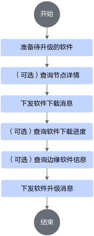

# 安装MEF<a name="ZH-CN_TOPIC_0000001722375521"></a>

## 安装流程<a name="ZH-CN_TOPIC_0000001674256270"></a>

**图 1** MEF安装流程图<a name="fig99444416538"></a>  


## 安装前必读<a name="ZH-CN_TOPIC_0000001722295421"></a>

MEF Center和MEF Edge的公共安装须知。

- MEF Center和MEF Edge需要安装在不同的服务器上。
- MEF Center和MEF Edge需要保持软件版本一致。
- 使用的CloudCore和edgecore版本需要保持一致。
- 所有环境中GNU LIBC版本不能低于2.28。
- 所有环境中Docker版本为18.09以上的版本。
- 合理配置K8s压力磁盘驱逐阈值，使得物理节点的磁盘使用空间不高于85%且剩余空间不低于200M。

- 检查并保证设备正常运行。

## 安装部署MEF Center<a name="ZH-CN_TOPIC_0000001674415918"></a>

### 环境准备<a name="ZH-CN_TOPIC_0000001674256282"></a>

#### 支持的设备形态<a name="ZH-CN_TOPIC_0000001674256226"></a>

MEF Center支持部署在管理节点通用服务器上，当前只支持安装部署在单master的集群设备上。

- 需要确保设备的操作系统为Ubuntu和openEuler。
- 支持的软件架构为AArch64和x86\_64。
- 资源规格推荐配置参考[表2](#table2)。

**表 1**  支持的操作系统

|操作系统|版本说明|
|--|--|
|Ubuntu|20.04<br> > [!NOTICE] 须知 <br>Ubuntu 20.04系统开机默认开启交换分区。开启交换分区会导致K8s启动失败，用户需要手动关闭交换分区，可通过执行**swapoff -a**命令关闭。|
|openEuler|22.03|

**表 2**  资源规格推荐配置<a id="table2"></a>

|配置项|服务器典型配置|MEF Center资源要求（纳管50个边缘节点）|MEF Center资源要求（纳管200个边缘节点）|MEF Center资源要求（纳管700个边缘节点）|MEF Center资源要求（纳管1024个边缘节点）|
|--|--|--|--|--|--|
|CPU|2* 鲲鹏920 5220处理器（2*32核）|建议为MEF预留8核CPU资源|建议为MEF预留16核CPU资源|建议为MEF预留32核CPU资源|建议为MEF预留48核CPU资源|
|内存|12 * 16GB（DDR4，2933MT/s）|建议为MEF预留10G内存|建议为MEF预留10G内存|建议为MEF预留20G内存|建议为MEF预留25G内存|
|磁盘空间|2 * 480GB SATA硬盘|建议为MEF预留10G以上硬盘|建议为MEF预留10G以上硬盘|建议为MEF预留20G以上硬盘|建议为MEF预留20G以上硬盘|

#### 准备安装环境<a name="ZH-CN_TOPIC_0000001674256214"></a>

准备安装环境中需要的依赖。

**准备基础镜像<a name="section026910214410"></a>**

1. 登录准备安装MEF Center的设备环境。
2. 执行以下命令，获取基础镜像。

    ```bash
    docker pull ubuntu:22.04
    ```
 
    > [!NOTICE] 须知   
    > MEF Center组件部署形式为容器化部署方式，ubuntu基础镜像作为容器基础镜像用于构建MEF Center组件的容器镜像，手动删除该镜像会导致容器无法正常拉起。

**准备开源系统<a name="section158713543105"></a>**

> [!NOTICE] 须知   
>
>- 对于用户集成的开源和第三方软件，漏洞和问题请自行跟踪社区并及时进行修复；可以并且不限于通过[CVE（通用漏洞字典）官网](https://cve.mitre.org/cve/search_cve_list.html)确认对应开源软件版本的已知漏洞，并通过版本升级、使用patch补丁包更新等方式修复。
>- 开源软件和第三方软件存在支持不安全的密码算法套件（如含CBC对称密码算法的加密套件等）、支持TLS1.0、TLS1.1等不安全协议、服务存在全零侦听等不安全项，请用户使用之前进行严格的安全加固，并且修复相关问题。

环境中需要安装以下开源系统：

- Kubernetes（简称K8s）版本为1.19\~1.22，具体安装操作请参见[Kubernetes官网](https://kubernetes.io/zh/docs/setup/production-environment/tools/)。
- KubeEdge，CloudCore的版本为1.12.2，且MEF Center依赖的CloudCore必须以systemd系统服务的方式运行，具体安装操作参见[KubeEdge官网](https://kubeedge.io/)。

    安装CloudCore后，需要执行以下命令，手动删除原有CloudCore的根证书和服务证书，重启CloudCore后自动生成新的证书。

    ```bash
    rm -rf /etc/kubeedge/ca /etc/kubeedge/certs
    kubectl delete secret casecret cloudcoresecret -n kubeedge
    systemctl restart cloudcore
    ```

    >[!NOTICE] 须知        
    >如果用户未使用推荐的CloudCore版本的KubeEdge，MEF Center的功能可能无法正常使用。

- Docker版本为18.09以上的版本，具体安装操作请参见[Docker官网](https://docs.docker.com/engine/install/)，请根据Docker官网及社区及时跟踪Docker漏洞和问题，保证使用的Docker合入相关修复补丁。

**准备命令依赖<a name="section327517455329"></a>**

环境中需要存在下列依赖，部分安装方式可参考[命令依赖安装参考](./common_operations.md#命令依赖安装参考)。

> [!NOTICE] 须知   
>对于用户集成的开源和第三方依赖软件，漏洞和问题请自行跟踪社区并及时进行修复；建议通过版本升级、使用patch补丁包更新等方式修复。

**表 1**  依赖说明表

|依赖|说明|检查安装需要的命令依赖|
|--|--|--|
|sh|用于执行sh命令。|系统自带命令。若损坏则需手动更换二进制文件，确保该命令可用。|
|cp|命令主要用于复制文件或目录。|系统自带命令。若损坏则需手动更换二进制文件，确保该命令可用。|
|uname|命令用于显示系统信息。|通过执行**uname**命令进行确认，如果uname命令存在表示已安装uname，无需再安装。|
|grep|命令用于查找文件里符合条件的字符串。|通过执行**grep**命令进行确认，如果grep命令存在表示已安装grep，无需再安装。|
|useradd|命令用于建立用户账号。|通过执行**useradd**命令进行确认，如果useradd命令存在表示已安装useradd，无需再安装。|
|（可选）haveged|KMC加密依赖随机数，为防止随机数耗尽，推荐安装haveged。|通过执行**ps -axu \| grep haveged**命令进行确认，如果回显中存在haveged，表示已安装，无需再安装。|

#### 获取软件包<a name="ZH-CN_TOPIC_0000001722375485"></a>

**下载软件包<a name="section4499122813189"></a>**

软件安装前，请根据下表获取软件包。

**表 1**  软件下载

|组件名称|说明|获取地址|
|--|--|--|
|MEF Center|MEF Center软件包|[获取链接](https://www.hiascend.com/zh/developer/download/community/result?module=ed+cann)（选择对应版本获取软件包。）|

### 安装须知<a name="ZH-CN_TOPIC_0000001674416026"></a>

**K8s相关说明<a name="section194350171124"></a>**

- 若K8s因内存、磁盘、CPU等资源限制给集群节点打上taint污点标识时，可能会导致服务无法正常部署。
- 安装K8s后，若Master节点含有污点，用户需手动设置Master节点的污点容忍策略和MEF Center业务Pod的污点容忍策略。
- 若K8s因部署和运行MEF Center时节点内存、磁盘、PID等资源不足，触发节点压力驱逐机制时，会导致服务无法正常运行。若服务运行异常，可参考[节点压力驱逐机制导致MEF Center运行异常](./faq.md#节点压力驱逐机制导致mef-center运行异常)章节进行处理。
- 若用户自行配置K8s分配到设备节点的资源，除K8s默认占用资源外，MEF Center需要至少1.5核CPU和1.5GB内存。
- 安装K8s后，可手动设置MEF Center对接K8s签发证书的有效期。用户可以修改kube-controller-manager.yaml文件中的--cluster-signing-duration字段（该值默认为1年），建议设置该字段取值为87600h（10年）。
- 若K8s和KubeEdge使用的端口被拦截，会导致MEF Center和MEF Edge间的云边链接失败，端口详情可参考[表 MEF Center占用端口说明表](./usage.md#MEF-Center)。

**安装环境说明<a name="section113771154111314"></a>**

- 检查磁盘空间是否充足，若磁盘空间不足会导致软件无法正常安装。MEF Center要求可用空间≥ 750 MB。
- 若当前环境的对应节点上存在mef-center-node节点标签，会导致安装失败。
- 若当前环境中存在和ascend-*模块名*同名同tag（如ascend-*cert-manager.v1*）的镜像，会导致安装失败。
- 若nginx-manager模块配置文件中指定的节点端口被占用，会导致启动失败。
- 若指定安装路径、日志路径或日志转储路径在临时文件系统下，会导致安装失败。
- 建议选择权限为755的安装路径，后台命令可能会修改路径权限为755。
- 若强制终止安装，会导致无法再次安装或环境出现未知安全隐患。请[卸载MEF Center](#卸载mef-center)后可重新安装。
- 软件不支持重复安装。

**MEFCenter用户说明<a name="section8108103141516"></a>**

MEF Center部分运行进程用户为非root用户，用户名为MEFCenter。该用户不可登录，可在进程中查看该用户的用户ID（uid）和组ID（gid），停止或卸载软件不会删除系统中的MEFCenter用户。

- 安装时将会创建普通用户MEFCenter，默认用户ID和组ID均为8000；若当前系统已存在该用户ID和组ID，系统会重新分配新的ID。
- 安装MEF Center软件时，软件会检测MEFCenter用户是否可登录。如果可登录，将禁止继续安装（以减少安全风险），此时需要先修改为不可登录，然后重新安装MEF Center软件。
- 若系统已存在指定的账户，则已有账户的用户名和组名必须为MEFCenter，且是nologin类型，否则会安装失败；且MEFCenter组内不能包含其他用户，MEFCenter用户不能存在家目录。
- 若系统不存在指定的账户，则系统上home目录下不能存在与指定账户名相同的文件或目录，否则会安装失败。

### 安装软件<a name="ZH-CN_TOPIC_0000001722375529"></a>

1. 以root用户登录准备安装MEF Center的设备环境。
2. 将获取到的软件包上传至设备任意路径下（建议该目录权限为root且其他用户不可写）。
3. 解压软件包。
    1. 执行以下命令，解压软件包。

        ```bash
        unzip Ascend-mindxedge-mefcenter_{version}_linux-{arch}.zip
        ```

        **表 1**  解压后文件

        |文件名|说明|
        |--|--|
        |Ascend-mindxedge-mefcenter_*{version}*_linux-*{arch}*.tar.gz|安装包|

        > [!NOTE] 说明    
        > Ascend-mindxedge-mefcenter\__\{version\}_\_linux-_\{arch\}_.zip以获取的实际包名为准。

    2. 执行以下命令，将解压后得到的tar.gz包再次进行解压。

        ```bash
        tar -zxvf Ascend-mindxedge-mefcenter_{version}_linux-{arch}.tar.gz
        ```

        **表 2**  解压后目录

        |目录|说明|
        |--|--|
        |installer/|MEF Center安装模块|
        |cert-manager/|证书管理模块|
        |edge-manager/|容器管理模块|
        |nginx-manager/|网关管理模块|
        |alarm-manager/|告警管理模块|

4. 安装MEF Center。
    1. 进入安装路径。

        ```bash
        cd 软件包上传路径/installer
        ```

    2. 执行以下命令，安装MEF Center。

        ```bash
        ./install.sh 
        ```

        安装MEF Center时会自动安装cert-manager（证书管理）、nginx-manager（网关管理）、edge-manager（容器管理）和alarm-manager（告警管理）模块，其他参数请参见[表3](#installtable)。

        **表 3**  install.sh命令参数说明<a id="installtable"></a>

       |参数|是否可选|说明|
       |--|--|--|
       |install_path|可选|安装路径参数，MEF Center安装路径。不带该参数将会进行默认安装，默认安装路径为/usr/local。指定路径安装需要使用绝对路径。|
       |log_path|可选|日志路径参数，MEF Center日志安装路径。不带该参数将会进行默认安装，默认安装路径为/var。指定路径安装需要使用绝对路径。建议该目录预留5.3G磁盘空间。|
       |log_backup_path|可选|日志转储路径参数，MEF Center日志转储路径。不带该参数将会进行默认安装，默认安装路径为/var。指定路径安装需要使用绝对路径。建议该目录预留5.3G磁盘空间。|

        > [!NOTE] 说明    
        > install.sh支持的参数格式（以-install\_path参数为例）：
        >- ./install.sh -install\_path：不带子参数则使用默认安装路径“/usr/local“执行命令。
        >- ./install.sh -install\_path=*/usr/local*或者./install.sh --install\_path=*/usr/local*
        >- ./install.sh -install\_path */usr/local*或者./install.sh --install\_path */usr/local*  
        > 以上命令格式都可以正常运行，如果install.sh命令的参数不带“-”，如./install.sh h，则会忽略该参数继续执行。
        > 安装路径、日志路径和转储日志路径均不可位于临时文件系统中且不支持软链接，路径取值长度应小于4096，目录层级小于99层，且同组和其他用户没有写权限，属主为root。
        >- -version/--version：用于查询软件版本。
        >- -h/--h/-help/--help：用于打印帮助信息。

    3. 回显示例如下，表示MEF Center安装成功。

        ```text
        install MEF center success
        ```

        安装成功后，软件部署在“_安装路径_/MEF-Center“目录下，日志存放在“_日志路径_/mef-center-log“目录下，转储日志存放在“_日志转储路径_/mef-center-log-backup“目录下，具体日志路径可参见[查看日志信息](./common_operations.md#查看日志信息)。

        > [!NOTE] 说明    
        > 修改系统时间可能导致转储日志丢失。

5. 启动MEF Center。

    1. 执行以下命令，进入MEF Center所在路径。

        ```bash
        cd 安装路径/MEF-Center/mef-center
        ```

    2. 执行以下命令，启动MEF Center所有模块。

        ```bash
        ./run.sh start
        ```

    回显示例如下，表示操作执行成功。

    ```text
    start all component successful
    ```

    run.sh命令需要root权限。run.sh命令包含几个子命令，参考[表 run.sh参数说明](#run.sh)。

    **表 4**  run.sh参数说明<a id="run.sh"></a>

    |命令|子命令参考|说明|
    |--|--|--|
    |start|[start参数说明](./common_operations.md#启动mef-center)|启动MEF Center模块|
    |restart|[restart参数说明](./common_operations.md#重启mef-center)|重启MEF Center模块|
    |stop|[stop参数说明](./common_operations.md#componenttable3)|暂停MEF Center模块|
    |upgrade|[upgrade参数说明表](#upgradetable1)|升级MEF Center模块|
    |uninstall|无|卸载MEF Center软件|
    |exchangeca|[exchangeca参数说明](./usage.md#exchangecatable)|与MEF Center交换根证书|
    |importcrl|[importcrl参数说明](./common_operations.md#importcrltable)|导入第三方管理平台吊销列表|
    |updatekmc|无|预留接口|
    |alarmconfig|[alarmconfig参数说明](./common_operations.md#alarmconfigtable)|进行告警配置操作。参见[MEF Center配置和查询证书过期告警](./common_operations.md#mef-center配置和查询证书过期告警)。|
    |getalarmconfig|无|获取告警配置信息。参见[MEF Center配置和查询证书过期告警](./common_operations.md#mef-center配置和查询证书过期告警)。|
    |getunusedcert|[getunusedcert参数说明](./common_operations.md#getunusedcerttable)|查询MEF Center已导入的根证书备份信息。|
    |deletecert|[deletecert参数说明](./common_operations.md#deletecerttable)|删除MEF Center已导入的备份根证书。|
    |restorecert|[restorecert参数说明](./common_operations.md#restorecerttable)|恢复MEF Center已导入的根证书。|
    |-h/--h/-help/--help|无|打印帮助信息|
    |-version/--version|无|打印二进制版本|

**后续处理<a name="section18124144410477"></a>**

若回显示例如下表示模块启动失败（以edge-manager为例），可尝试对该模块进行重启。重启模块具体操作请参见[重启MEF Center](./common_operations.md#重启mef-center)。

```bash
start component edge-manager failed
```

## 安装部署MEF Edge<a name="ZH-CN_TOPIC_0000001722295453"></a>

### 环境准备<a name="ZH-CN_TOPIC_0000001674256254"></a>

#### 支持的设备形态<a name="ZH-CN_TOPIC_0000001722295425"></a>

MEF Edge支持部署在边缘计算节点上。当前支持的软件架构仅为AArch64。

**表 1**  支持的设备形态

|产品形态|操作系统|
|--|--|
|Atlas 200I A2 加速模块<br>Atlas 200I DK A2 开发者套件|openEuler 22.03<br>Ubuntu 22.04|
|Atlas 500 Pro 智能边缘服务器（型号 3000）（插Atlas 300I Pro 推理卡A300I Pro 推理卡）|openEuler 22.03|

> [!NOTE] 说明    
> Atlas 500 Pro 智能边缘服务器（型号 3000）支持多推理卡场景，现不支持不同推理卡混插。

#### 准备安装环境<a name="ZH-CN_TOPIC_0000001722295493"></a>

**准备命令依赖<a name="section220963111517"></a>**

> [!NOTICE] 须知   
>
>- 对于用户集成的开源和第三方依赖软件，漏洞和问题请自行跟踪社区并及时进行修复；可以并且不限于通过[CVE（通用漏洞字典）官网](https://cve.mitre.org/cve/search_cve_list.html)确认对应开源软件版本的已知漏洞，并通过版本升级、使用patch补丁包更新等方式修复。
>- 开源软件和第三方软件存在支持不安全的密码算法套件（如含CBC对称密码算法的加密套件等）、支持TLS1.0、TLS1.1等不安全协议、服务存在全零侦听等不安全项，请用户使用之前进行严格的安全加固，并且修复相关问题。

环境中需要存在下列依赖，部分安装方式可参考[命令依赖安装参考](./common_operations.md#命令依赖安装参考)。

**表 1**  依赖说明表

|依赖|说明|命令检查|
|--|--|--|
|cat|命令用于读取和合并文件，并将其内容写入到标准输出。|系统自带命令。若损坏则需手动更换二进制文件，确保该命令可用。|
|arch|用于获取系统架构信息。|系统自带命令。若损坏则需手动更换二进制文件，确保该命令可用。|
|file|用于获取文件信息。|系统自带命令。若损坏则需手动更换二进制文件，确保该命令可用。|
|docker|用于执行Docker命令。|通过执行**docker**命令进行确认，如果docker命令存在表示已安装Docker，无需再安装。如果环境上没有docker组，需执行**groupadd -g docker**命令，创建docker组。|
|dmidecode|命令用于通过DMI获取主机的硬件信息。|通过执行**dmidecode**命令进行确认，如果dmidecode命令存在表示已安装dmidecode，无需再安装。|
|systemctl|命令用于管理系统服务。|通过执行**systemctl**命令进行确认，如果systemctl命令存在表示已安装systemctl，无需再安装。|
|useradd|命令用于建立用户账号。|通过执行**useradd**命令进行确认，如果useradd命令存在表示已安装useradd，无需再安装。|
|iptables|命令用于管理网络封包的处理和转发。|通过执行**iptables**命令进行确认，如果iptables命令存在表示已安装iptables，无需再安装。|
|（可选）haveged|KMC加密依赖随机数，为防止随机数耗尽，推荐安装haveged。|通过执行**ps -axu \| grep haveged**命令进行确认，如果回显中存在haveged，表示已安装，无需再安装。|
|（可选）sqlite|用于数据库备份，防止备份或恢复数据库时数据库损坏。|通过执行sqlite3命令进行确认，如果sqlite3命令存在表示已安装sqlite，无需再安装。|
|（可选）rsync|用于日志备份，防止重启设备导致临时文件系统中的日志丢失。|通过执行**rsync**命令进行确认，如果rsync命令存在表示已安装rsync，无需再安装。|

#### 获取软件包<a name="ZH-CN_TOPIC_0000001722375593"></a>

**下载软件包<a name="section195816188917"></a>**

软件安装前，请根据下表获取软件包。

**表 1**  软件下载

|软件包|说明|获取地址|
|--|--|--|
|MEF Edge|MEF Edge软件包|[获取链接](https://www.hiascend.com/zh/developer/download/community/result?module=ed+cann)（选择对应版本获取软件包）|

#### （可选）配置设备序列号<a name="ZH-CN_TOPIC_0000001722295513"></a>

安装MEF Edge时，软件需获取设备上的序列号（SN号），可通过以下两种方式设置SN号：

> [!NOTE] 说明  
> Atlas 500 Pro 智能边缘服务器（型号 3000）默认使用系统自动生成的SN号，请跳过本章节。

- 方式一：用户手动配置序列号配置文件中的SN号。用户在安装前如果通过序列号配置文件写入指定的SN号，软件安装时将获取该配置文件中的SN号。
- 方式二：软件自动生成随机的SN号。用户在安装前未通过序列号配置文件写入指定的SN号，软件安装时将自行生成随机的SN号。

**手动配置序列号配置文件中的SN号<a name="section20245125117535"></a>**

如果用户在安装前已通过序列号配置文件写入指定的SN号，软件安装时将获取该配置文件中的SN号。

1. 进入序列号配置文件所在路径“_软件包解压目录_/config/edge\_installer/“。
2. 打开配置文件，在如下位置写入"serialNumber"字段对应的值。

    ```json
    {
      "serialNumber": ""
    }
    ```

    > [!NOTE] 说明  
    >- “serialNumber“需满足如下格式，否则MEF Center无法通过该“serialNumber“下发批量需求：支持小写字母、大写字母，数字，下划线和连字符；不能以下划线或中划线开头和结尾；最大长度为64字节。
    >- 该值需与设备真实序列号相同，否则可能导致MEF Center通过该“serialNumber“进行管理时出现未知问题。
    >- 该值不能与已纳管设备的序列号相同，否则会导致纳管失败。

### 安装须知<a name="ZH-CN_TOPIC_0000001674256302"></a>

**安装环境说明<a name="section1195304815134"></a>**

- 检查磁盘空间是否充足，若磁盘空间不足会导致软件无法正常安装。MEF Edge要求可用空间≥ 520 MB，日志文件要求可用空间≥ 84 MB，日志转储文件要求可用空间≥ 108 MB。
- 由于MEF Edge部分组件涉及使用root权限，系统权限较高，建议用户做好管理面和业务面隔离（通过为管理面和业务面分配不同网口和网段实现隔离，保证无法通过业务面访问到管理面），将MEF Edge安装到管理面中，避免业务面中的应用被攻破后通过MEF Edge获得root权限。
- MEF Edge当前仅支持IPv4，不支持IPv6。
- 建议选择权限为755的安装路径，后台命令可能会修改路径权限为755。
- 如果安装、日志或日志转储路径在临时文件系统中，路径下的内容会在设备重启后清除。
- 若强制终止安装，会导致无法再次安装或环境出现未知安全隐患。请[卸载MEF Edge](#ZH-CN_TOPIC_0000001722375581)后可重新安装。
- “/var/lib/docker“剩余磁盘空间若低于10%，会触发压力驱逐，清理已部署的Pod和镜像。

**网络要求说明<a name="section1184143784219"></a>**

为保障MEF系统的正常使用，避免出现卡顿、上传或者下载任务过慢的问题，MEF Edge所在边缘设备的网络带宽必须满足基本要求，推荐值如下。

- MEF Edge所在边缘设备与MEF Center通用服务器之间的带宽≥ 50Mbit/s。
- 其他网络要求：时延 < 30ms，丢包率 < 3%。

**MEFEdge用户说明<a name="section49131623171212"></a>**

MEF Edge部分运行进程用户为非root用户，用户名为MEFEdge。该用户不可登录，可在进程中查看该用户的用户ID（uid）和组ID（gid），停止或卸载软件不会删除系统中的MEFEdge用户。

- 安装时MEF Edge软件将会创建普通用户MEFEdge，默认用户ID和组ID均为1225；若当前系统已存在该用户ID和组ID，系统会重新分配新的ID。
- 安装时MEF Edge软件会检测MEFEdge用户是否可登录。如果可登录，将禁止继续安装（以减少安全风险），此时需要先修改为不可登录，然后重新安装MEF Edge软件。
- 若系统已存在指定的账户，则已有账户的用户名和组名必须为MEFEdge，且是nologin类型，否则会安装失败；且MEFEdge组内不能包含其他用户，MEFEdge用户不能存在家目录。
- 若系统不存在指定的账户，则系统上home目录下不能存在与指定账户名相同的文件或目录，否则会安装失败。

### 安装软件<a name="ZH-CN_TOPIC_0000001722375533"></a>

1. 以root用户登录准备安装MEF Edge的设备环境。
2. 将获取到的软件包上传至设备任意路径下（该目录须为root属主，且目录权限为属组及其他用户不可写）。
3. 解压软件包。

    1. 执行以下命令，解压软件包。

        ```bash
        unzip Ascend-mindxedge-mefedgesdk_{version}_linux-aarch64.zip
        ```

        **表 1**  解压后文件

       |文件名|说明|
       |--|--|
       |Ascend-mindxedge-mefedgesdk_*{version}*_linux-aarch64.tar.gz|安装包|

        > [!NOTE] 说明  
        > Ascend-mindxedge-mefedgesdk\__\{version\}_\_linux-aarch64.zip以获取的实际包名为准。

    2. 执行以下命令，将解压后得到的tar.gz包再次进行解压。

        ```bash
        tar -zxvf Ascend-mindxedge-mefedgesdk_{version}_linux-aarch64.tar.gz
        ```

    **表 2**  解压后文件或目录

    |文件或目录|说明|
    |--|--|
    |config/|配置目录|
    |software/|软件目录|
    |install\.sh|安装脚本文件|
    |version.xml|软件版本文件|

4. 安装MEF Edge。
    1. MEF Edge软件的安装可以选择默认安装和指定路径安装。建议用户选择默认安装，默认安装路径见[表 install.sh参数说明](#installtable3)。
        - 默认安装。

            ```bash
            ./install.sh
            ```

        - 指定路径安装。安装命令示例如下。

            ```bash
            ./install.sh --install_dir=安装路径 --log_dir=日志路径 --log_backup_dir=日志转储路径
            ```

            **表 3**  install.sh参数说明<a id="installtable3"></a>

            |参数|是否可选|说明|
            |--|--|--|
            |install_dir|可选|用于指定安装目录位置。不带该参数将会进行默认安装，默认路径/usr/local/mindx。|
            |log_dir|可选|用于指定日志目录位置。不带该参数将会进行默认安装，默认日志路径/var/alog。|
            |log_backup_dir|可选|用于指定日志转储目录位置。不带该参数将会进行默认安装，默认日志转储路径/home/log。|
            |allow_tmpfs|可选|是否允许安装及日志转储在临时文件系统参数。不带该参数将默认为不允许安装及日志转储在临时文件系统。<br>（可选）支持的子参数：<ul><li>true：表示允许安装路径和日志转储路径在临时文件系统。</li><li>false：不带该子参数时默认为false。表示不允许安装路径和日志转储路径在临时文件系统。</li></ul> > [!NOTICE] 须知 <br>如果设置子参数为true，可能会导致日志和软件丢失，请用户自行保证相关功能的安全可用。<br> > [!NOTE] 说明 <br>如果指定的路径在临时文件系统，且allow_tmpfs参数为不允许安装在临时文件系统，会导致软件安装失败。|

            > [!NOTE] 说明    
            > install.sh参数说明：
            >- 与预定义安装参数不相符的参数以./install.sh **-xxx**或./install.sh **--xxx**格式输入时，会因参数错误导致安装程序提前结束。
            >- 以./install.sh **xxx**格式输入时，该参数会被直接忽视，安装程序将继续执行，安装路径使用默认路径。
            >- 指定安装路径、日志、日志转储路径进行安装时，需要指定当前设备中存在的路径，且为绝对路径。
            >- 安装、日志、日志转储路径取值长度应小于4096，目录层级小于99层，属主为root，且属组和其他用户没有写权限，不包含软链接。
            >- -version/--version：用于查询软件版本。
            >- -h/--h/-help/--help：用于打印帮助信息。

    2. 回显示例如下，表示MEF Edge安装成功。

        ```text
        install MEFEdge success
        ```

        安装成功后，软件部署在“_安装路径_/MEFEdge“目录下，日志存放在“_日志路径_/MEFEdge\_log“目录下，转储日志存放在“_日志转储路径_/MEFEdge\_logbackup“，具体日志路径和权限信息可参见[查看日志信息](./common_operations.md#查看日志信息)。

5. （可选）完成MEF Edge安装后，可通过[设置系统服务资源限制](./common_operations.md#设置系统服务资源限制)设置MEF Edge进程相关服务使用资源限制，限制CPU和内存的资源使用量，使服务不会持续超过限值。
6. 启动MEF Edge。
    1. 执行以下命令，进入run.sh所在路径。

        ```bash
        cd 安装目录/MEFEdge/software/
        ```

    2. 执行以下命令，启动MEF Edge。

        ```bash
        ./run.sh start
        ```

    回显示例如下，表示启动命令执行成功。

    ```text
    Execute [start] command success!
    ```

    run.sh命令执行需要root权限。run.sh命令包含几个子命令，参考[表 run.sh参数说明](#runtable)。

    **表 4**  run.sh参数说明<a id="runtable"></a>
    
    <table><thead align="left"><tr id="row1312512764820"><th class="cellrowborder" valign="top" width="19.81%" id="mcps1.2.4.1.1"><p id="p1912512714482"><a name="p1912512714482"></a><a name="p1912512714482"></a>命令</p>
    </th>
    <th class="cellrowborder" valign="top" width="33.6%" id="mcps1.2.4.1.2"><p id="p7601728181612"><a name="p7601728181612"></a><a name="p7601728181612"></a>子命令参考</p>
    </th>
    <th class="cellrowborder" valign="top" width="46.589999999999996%" id="mcps1.2.4.1.3"><p id="p2125117164817"><a name="p2125117164817"></a><a name="p2125117164817"></a>说明</p>
    </th>
    </tr>
    </thead>
    <tbody><tr id="row37377171527"><td class="cellrowborder" valign="top" width="19.81%" headers="mcps1.2.4.1.1 "><p id="p11599133035819"><a name="p11599133035819"></a><a name="p11599133035819"></a>netconfig</p>
    </td>
    <td class="cellrowborder" valign="top" width="33.6%" headers="mcps1.2.4.1.2 "><p id="p5601172861614"><a name="p5601172861614"></a><a name="p5601172861614"></a><a href="./usage.md#netconfig参数说明">netconfig参数说明</a></p>
    </td>
    <td class="cellrowborder" valign="top" width="46.589999999999996%" headers="mcps1.2.4.1.3 "><p id="p135991530125818"><a name="p135991530125818"></a><a name="p135991530125818"></a>进行网管配置操作，用于对接<span id="ph374313818523"><a name="ph374313818523"></a><a name="ph374313818523"></a>MEF Edge</span>和<span id="ph17253174072711"><a name="ph17253174072711"></a><a name="ph17253174072711"></a>MEF Center</span>。</p>
    </td>
    </tr>
    <tr id="row1771217710818"><td class="cellrowborder" valign="top" width="19.81%" headers="mcps1.2.4.1.1 "><p id="p77121771188"><a name="p77121771188"></a><a name="p77121771188"></a>getnetconfig</p>
    </td>
    <td class="cellrowborder" valign="top" width="33.6%" headers="mcps1.2.4.1.2 "><p id="p37121375811"><a name="p37121375811"></a><a name="p37121375811"></a>无</p>
    </td>
    <td class="cellrowborder" valign="top" width="46.589999999999996%" headers="mcps1.2.4.1.3 "><div class="p" id="p16712971811"><a name="p16712971811"></a><a name="p16712971811"></a>获取当前的网管配置模式信息。<a name="ul691943481112"></a><a name="ul691943481112"></a><ul id="ul691943481112"><li>MEF：<span id="ph1448154452514"><a name="ph1448154452514"></a><a name="ph1448154452514"></a>MEF Center</span>和<span id="ph41181418185513"><a name="ph41181418185513"></a><a name="ph41181418185513"></a>MEF Edge</span>云边认证，退出码为2（当前仅支持此模式）。</li><li>FD：退出码为0（安装后未配置网管时默认回显，当前不可用）。</li></ul>
    </div>
    <div class="note" id="note53358801513"><a name="note53358801513"></a><a name="note53358801513"></a><span class="notetitle"> > [!NOTE] 说明 </span><div class="notebody"><p id="p11335198201516"><a name="p11335198201516"></a><a name="p11335198201516"></a>退出码的预留值为1；获取网管配置模式信息失败的错误退出码为255。</p>
    </div></div>
    </td>
    </tr>
    <tr id="row253613511538"><td class="cellrowborder" valign="top" width="19.81%" headers="mcps1.2.4.1.1 "><p id="p185371654539"><a name="p185371654539"></a><a name="p185371654539"></a>domainconfig</p>
    </td>
    <td class="cellrowborder" valign="top" width="33.6%" headers="mcps1.2.4.1.2 "><p id="p136011128151619"><a name="p136011128151619"></a><a name="p136011128151619"></a><a href="./common_operations.md#domainconfig参数说明表">domainconfig参数说明表</a></p>
    </td>
    <td class="cellrowborder" valign="top" width="46.589999999999996%" headers="mcps1.2.4.1.3 "><p id="p35370518530"><a name="p35370518530"></a><a name="p35370518530"></a>进行配置本地域名映射操作。</p>
    </td>
    </tr>
    <tr id="row13180164052"><td class="cellrowborder" valign="top" width="19.81%" headers="mcps1.2.4.1.1 "><p id="p118074857"><a name="p118074857"></a><a name="p118074857"></a>alarmconfig</p>
    </td>
    <td class="cellrowborder" valign="top" width="33.6%" headers="mcps1.2.4.1.2 "><p id="p91811141259"><a name="p91811141259"></a><a name="p91811141259"></a><a href="./common_operations.md#alarmconfig参数说明">alarmconfig参数说明</a></p>
    </td>
    <td class="cellrowborder" valign="top" width="46.589999999999996%" headers="mcps1.2.4.1.3 "><p id="p151811441653"><a name="p151811441653"></a><a name="p151811441653"></a>进行告警配置操作。目前仅支持<span id="ph3479163410495"><a name="ph3479163410495"></a><a name="ph3479163410495"></a>MEF Edge</span>根证书过期告警，参见<a href="./common_operations.md#mef-edge配置和查询证书过期告警">MEF Edge配置和查询证书过期告警</a>。</p>
    </td>
    </tr>
    <tr id="row666242320517"><td class="cellrowborder" valign="top" width="19.81%" headers="mcps1.2.4.1.1 "><p id="p1466218231257"><a name="p1466218231257"></a><a name="p1466218231257"></a>getalarmconfig</p>
    </td>
    <td class="cellrowborder" valign="top" width="33.6%" headers="mcps1.2.4.1.2 "><p id="p9662823955"><a name="p9662823955"></a><a name="p9662823955"></a>无</p>
    </td>
    <td class="cellrowborder" valign="top" width="46.589999999999996%" headers="mcps1.2.4.1.3 "><p id="p1662132315513"><a name="p1662132315513"></a><a name="p1662132315513"></a>获取告警配置信息。目前仅支持<span id="ph17989164765012"><a name="ph17989164765012"></a><a name="ph17989164765012"></a>MEF Edge</span>根证书过期告警，参见<a href="./common_operations.md#mef-edge配置和查询证书过期告警">MEF Edge配置和查询证书过期告警</a>。</p>
    </td>
    </tr>
    <tr id="row111391757087"><td class="cellrowborder" valign="top" width="19.81%" headers="mcps1.2.4.1.1 "><p id="p141396571081"><a name="p141396571081"></a><a name="p141396571081"></a>effect</p>
    </td>
    <td class="cellrowborder" valign="top" width="33.6%" headers="mcps1.2.4.1.2 "><p id="p51394572816"><a name="p51394572816"></a><a name="p51394572816"></a>无</p>
    </td>
    <td class="cellrowborder" valign="top" width="46.589999999999996%" headers="mcps1.2.4.1.3 "><p id="p11391578818"><a name="p11391578818"></a><a name="p11391578818"></a>升级后生效<span id="ph10518553135414"><a name="ph10518553135414"></a><a name="ph10518553135414"></a>MEF Edge</span>软件。</p>
    </td>
    </tr>
    <tr id="row141254715485"><td class="cellrowborder" valign="top" width="19.81%" headers="mcps1.2.4.1.1 "><p id="p1312520712489"><a name="p1312520712489"></a><a name="p1312520712489"></a>start</p>
    </td>
    <td class="cellrowborder" valign="top" width="33.6%" headers="mcps1.2.4.1.2 "><p id="p18601182813163"><a name="p18601182813163"></a><a name="p18601182813163"></a>无</p>
    </td>
    <td class="cellrowborder" valign="top" width="46.589999999999996%" headers="mcps1.2.4.1.3 "><p id="p412577144820"><a name="p412577144820"></a><a name="p412577144820"></a>启动<span id="ph1738613449522"><a name="ph1738613449522"></a><a name="ph1738613449522"></a>MEF Edge</span>软件。</p>
    </td>
    </tr>
    <tr id="row1612547184818"><td class="cellrowborder" valign="top" width="19.81%" headers="mcps1.2.4.1.1 "><p id="p1727784125216"><a name="p1727784125216"></a><a name="p1727784125216"></a>restart</p>
    </td>
    <td class="cellrowborder" valign="top" width="33.6%" headers="mcps1.2.4.1.2 "><p id="p19602182811162"><a name="p19602182811162"></a><a name="p19602182811162"></a>无</p>
    </td>
    <td class="cellrowborder" valign="top" width="46.589999999999996%" headers="mcps1.2.4.1.3 "><p id="p9125177154813"><a name="p9125177154813"></a><a name="p9125177154813"></a>重启<span id="ph3916144517522"><a name="ph3916144517522"></a><a name="ph3916144517522"></a>MEF Edge</span>软件。</p>
    </td>
    </tr>
    <tr id="row1012527104815"><td class="cellrowborder" valign="top" width="19.81%" headers="mcps1.2.4.1.1 "><p id="p142602054185218"><a name="p142602054185218"></a><a name="p142602054185218"></a>stop</p>
    </td>
    <td class="cellrowborder" valign="top" width="33.6%" headers="mcps1.2.4.1.2 "><p id="p156021428131611"><a name="p156021428131611"></a><a name="p156021428131611"></a>无</p>
    </td>
    <td class="cellrowborder" valign="top" width="46.589999999999996%" headers="mcps1.2.4.1.3 "><p id="p1512520724816"><a name="p1512520724816"></a><a name="p1512520724816"></a>暂停<span id="ph11495547135213"><a name="ph11495547135213"></a><a name="ph11495547135213"></a>MEF Edge</span>软件。</p>
    </td>
    </tr>
    <tr id="row114551419135320"><td class="cellrowborder" valign="top" width="19.81%" headers="mcps1.2.4.1.1 "><p id="p1245512198531"><a name="p1245512198531"></a><a name="p1245512198531"></a>uninstall</p>
    </td>
    <td class="cellrowborder" valign="top" width="33.6%" headers="mcps1.2.4.1.2 "><p id="p12602102814163"><a name="p12602102814163"></a><a name="p12602102814163"></a>无</p>
    </td>
    <td class="cellrowborder" valign="top" width="46.589999999999996%" headers="mcps1.2.4.1.3 "><p id="p5456151925314"><a name="p5456151925314"></a><a name="p5456151925314"></a>卸载<span id="ph11910194818522"><a name="ph11910194818522"></a><a name="ph11910194818522"></a>MEF Edge</span>软件。</p>
    </td>
    </tr>
    <tr id="row1314118286584"><td class="cellrowborder" valign="top" width="19.81%" headers="mcps1.2.4.1.1 "><p id="p71411028195814"><a name="p71411028195814"></a><a name="p71411028195814"></a>upgrade</p>
    </td>
    <td class="cellrowborder" valign="top" width="33.6%" headers="mcps1.2.4.1.2 "><p id="p560212818163"><a name="p560212818163"></a><a name="p560212818163"></a><a href="#upgrade参数说明表">upgrade参数说明表</a></p>
    </td>
    <td class="cellrowborder" valign="top" width="46.589999999999996%" headers="mcps1.2.4.1.3 "><p id="p121411228115810"><a name="p121411228115810"></a><a name="p121411228115810"></a>升级<span id="ph19293195105212"><a name="ph19293195105212"></a><a name="ph19293195105212"></a>MEF Edge</span>软件。</p>
    </td>
    </tr>
    <tr id="row1383564014610"><td class="cellrowborder" valign="top" width="19.81%" headers="mcps1.2.4.1.1 "><p id="p18351240262"><a name="p18351240262"></a><a name="p18351240262"></a>updatekmc</p>
    </td>
    <td class="cellrowborder" valign="top" width="33.6%" headers="mcps1.2.4.1.2 "><p id="p16835144015615"><a name="p16835144015615"></a><a name="p16835144015615"></a>无</p>
    </td>
    <td class="cellrowborder" valign="top" width="46.589999999999996%" headers="mcps1.2.4.1.3 "><p id="p283511402616"><a name="p283511402616"></a><a name="p283511402616"></a>更新<span id="ph15778720103"><a name="ph15778720103"></a><a name="ph15778720103"></a>KMC</span>加密密钥。</p>
    </td>
    </tr>
    <tr id="row448814232176"><td class="cellrowborder" valign="top" width="19.81%" headers="mcps1.2.4.1.1 "><p id="p248914234177"><a name="p248914234177"></a><a name="p248914234177"></a>getcertinfo</p>
    </td>
    <td class="cellrowborder" valign="top" width="33.6%" headers="mcps1.2.4.1.2 "><p id="p8629488240"><a name="p8629488240"></a><a name="p8629488240"></a><a href="./common_operations.md#getcertinfo参数说明">getcertinfo参数说明</a></p>
    </td>
    <td class="cellrowborder" valign="top" width="46.589999999999996%" headers="mcps1.2.4.1.3 "><p id="p948992381719"><a name="p948992381719"></a><a name="p948992381719"></a>查询<span id="ph166721474533"><a name="ph166721474533"></a><a name="ph166721474533"></a>MEF Edge</span>根证书。参见<a href="./common_operations.md#查询mef-center根证书">查询MEF Center根证书</a>。</p>
    </td>
    </tr>
    <tr id="row11255953145717"><td class="cellrowborder" valign="top" width="19.81%" headers="mcps1.2.4.1.1 "><p id="p172553539576"><a name="p172553539576"></a><a name="p172553539576"></a>importcrl</p>
    </td>
    <td class="cellrowborder" valign="top" width="33.6%" headers="mcps1.2.4.1.2 "><p id="p13255553125717"><a name="p13255553125717"></a><a name="p13255553125717"></a><a href="./common_operations.md#importcrltable">importcrl参数说明</a></p>
    </td>
    <td class="cellrowborder" valign="top" width="46.589999999999996%" headers="mcps1.2.4.1.3 "><p id="p2025518537574"><a name="p2025518537574"></a><a name="p2025518537574"></a>导入<span id="ph963219501532"><a name="ph963219501532"></a><a name="ph963219501532"></a>MEF Edge</span>吊销列表。</p>
    </td>
    </tr>
    <tr id="row169321733966"><td class="cellrowborder" valign="top" width="19.81%" headers="mcps1.2.4.1.1 "><p id="p6932433269"><a name="p6932433269"></a><a name="p6932433269"></a>collectlog</p>
    </td>
    <td class="cellrowborder" valign="top" width="33.6%" headers="mcps1.2.4.1.2 "><p id="p19932103313618"><a name="p19932103313618"></a><a name="p19932103313618"></a><a href="./common_operations.md#collectlog参数说明表">collectlog参数说明表</a></p>
    </td>
    <td class="cellrowborder" valign="top" width="46.589999999999996%" headers="mcps1.2.4.1.3 "><p id="p179327339617"><a name="p179327339617"></a><a name="p179327339617"></a>收集<span id="ph5777102420246"><a name="ph5777102420246"></a><a name="ph5777102420246"></a>MEF Edge</span>日志。</p>
    </td>
    </tr>
    <tr id="row38131420172316"><td class="cellrowborder" valign="top" width="19.81%" headers="mcps1.2.4.1.1 "><p id="p1081392052313"><a name="p1081392052313"></a><a name="p1081392052313"></a>getunusedcert</p>
    </td>
    <td class="cellrowborder" valign="top" width="33.6%" headers="mcps1.2.4.1.2 "><p id="p78137206232"><a name="p78137206232"></a><a name="p78137206232"></a><a href="./common_operations.md#getunusedcert参数说明">getunusedcert参数说明</a></p>
    </td>
    <td class="cellrowborder" valign="top" width="46.589999999999996%" headers="mcps1.2.4.1.3 "><p id="p6813162062311"><a name="p6813162062311"></a><a name="p6813162062311"></a>查询<span id="ph172851612113211"><a name="ph172851612113211"></a><a name="ph172851612113211"></a>MEF Edge</span>云边对接根证书备份信息。</p>
    </td>
    </tr>
    <tr id="row11575192217237"><td class="cellrowborder" valign="top" width="19.81%" headers="mcps1.2.4.1.1 "><p id="p165761322192313"><a name="p165761322192313"></a><a name="p165761322192313"></a>deletecert</p>
    </td>
    <td class="cellrowborder" valign="top" width="33.6%" headers="mcps1.2.4.1.2 "><p id="p12576122112311"><a name="p12576122112311"></a><a name="p12576122112311"></a><a href="./common_operations.md#deletecert参数说明">deletecert参数说明</a></p>
    </td>
    <td class="cellrowborder" valign="top" width="46.589999999999996%" headers="mcps1.2.4.1.3 "><p id="p18576152215232"><a name="p18576152215232"></a><a name="p18576152215232"></a>删除未使用的<span id="ph116271086292"><a name="ph116271086292"></a><a name="ph116271086292"></a>MEF Edge</span>云边对接根证书。</p>
    </td>
    </tr>
    <tr id="row164693245239"><td class="cellrowborder" valign="top" width="19.81%" headers="mcps1.2.4.1.1 "><p id="p8469924172315"><a name="p8469924172315"></a><a name="p8469924172315"></a>restorecert</p>
    </td>
    <td class="cellrowborder" valign="top" width="33.6%" headers="mcps1.2.4.1.2 "><p id="p1261442512284"><a name="p1261442512284"></a><a name="p1261442512284"></a><a href="./common_operations.md#restorecert参数说明">restorecert参数说明</a></p>
    </td>
    <td class="cellrowborder" valign="top" width="46.589999999999996%" headers="mcps1.2.4.1.3 "><p id="p7469124122318"><a name="p7469124122318"></a><a name="p7469124122318"></a>恢复备份的<span id="ph6228106172814"><a name="ph6228106172814"></a><a name="ph6228106172814"></a>MEF Edge</span>云边对接根证书。</p>
    </td>
    </tr>
    <tr id="row156610341758"><td class="cellrowborder" valign="top" width="19.81%" headers="mcps1.2.4.1.1 "><p id="p13677341457"><a name="p13677341457"></a><a name="p13677341457"></a>-version/--version</p>
    </td>
    <td class="cellrowborder" valign="top" width="33.6%" headers="mcps1.2.4.1.2 "><p id="p360217283166"><a name="p360217283166"></a><a name="p360217283166"></a>无</p>
    </td>
    <td class="cellrowborder" valign="top" width="46.589999999999996%" headers="mcps1.2.4.1.3 "><p id="p146763419514"><a name="p146763419514"></a><a name="p146763419514"></a>打印版本信息。参见<a href="./common_operations.md#查询mef-edge版本号">查询MEF Edge版本号</a>。</p>
    </td>
    </tr>
    <tr id="row174504363516"><td class="cellrowborder" valign="top" width="19.81%" headers="mcps1.2.4.1.1 "><p id="p164517362514"><a name="p164517362514"></a><a name="p164517362514"></a>-h/--h/-help/--help</p>
    </td>
    <td class="cellrowborder" valign="top" width="33.6%" headers="mcps1.2.4.1.2 "><p id="p36021328131610"><a name="p36021328131610"></a><a name="p36021328131610"></a>无</p>
    </td>
    <td class="cellrowborder" valign="top" width="46.589999999999996%" headers="mcps1.2.4.1.3 "><p id="p8451193618517"><a name="p8451193618517"></a><a name="p8451193618517"></a>打印帮助信息。</p>
    </td>
    </tr>
    </tbody>
    </table>

# 升级<a name="ZH-CN_TOPIC_0000001674415978"></a>

## MEF Center升级<a name="ZH-CN_TOPIC_0000001722295517"></a>

MEF Center支持用户手动导入升级软件包到后台环境上，进行离线升级，具体的升级步骤如下。

**操作步骤<a name="section1852218184718"></a>**

1. 以root用户登录。
2. 将获取的MEF Center软件包上传至任意路径。该路径需属主为root，属组和其他用户不可写，且不包含软链接。
3. 执行以下命令，进入安装路径。默认路径为“/usr/local“。

    ```bash
    cd MEF-Center安装路径/MEF-Center/mef-center
    ```

4. 执行以下命令，升级MEF Center软件。

    ```bash
    ./run.sh upgrade -file=升级tar.gz包上传路径
    ```

    **表 1**  upgrade参数说明表<a id="upgradetable1"></a>

    |参数|说明|
    |--|--|
    |-file|MEF Center升级tar.gz包上传路径，需要具体到软件包名称；只支持绝对路径。|

5. 回显示例如下，表示MEF Center软件升级成功。

    ```text
    upgrade MEF-Center successful
    ```

    > [!NOTICE] 须知 
    > 执行升级操作成功后，如果需要执行run.sh的其他命令。需要重新执行**cd** _MEFCenter安装路径_/**MEF-Center/mef-center**命令进入软件安装路径后再进行具体操作。

## MEF Edge升级<a name="ZH-CN_TOPIC_0000001722295477"></a>

### 通过命令行升级<a name="ZH-CN_TOPIC_0000001674415950"></a>

MEF Edge支持用户手动导入升级软件包到边缘设备上，进行离线升级，具体的升级步骤如下。

**操作步骤<a name="section589391822917"></a>**

1. 以root用户登录后台环境。
2. 将获取的MEF Edge软件包上传至任意路径下。

    > [!NOTE] 说明  
    > 该路径必须是root属主，属组及其他用户不可拥有写权限，且不包含软链接。

3. 执行以下命令，进入安装路径。默认安装路径为“/usr/local/mindx“。

    ```bash
    cd MEFEdge安装路径/MEFEdge/software
    ```

4. 执行以下命令，升级MEF Edge软件。

    通过命令行升级MEF Edge软件，支持上传解压后的文件升级。

    1. 上传MEF Edge软件解压后文件。

        ```bash
        ./run.sh upgrade -file=MEFEdge升级包tar.gz [-delay=true]
        ```

    2. 当延迟生效升级MEF Edge软件（即“delay“取值为“true“）时，升级会在执行如下命令后生效。

        ```bash
        ./run.sh effect
        ```

    回显示例如下表明MEF Edge软件已升级成功。

    ```text
    Execute [upgrade] command success!
    ```

    > [!NOTICE] 须知 
    >- 升级过程中的日志在“/_日志路径_/MEFEdge\_log/edge\_installer”，其中edge\_installer\_run.log为运行日志，edge\_installer\_operate.log为操作日志。
    >- 在升级过程中，系统会自动进行软件包的验签和解压，其解压路径为“/home/data/mefedge/unpack/edge\_installer“。
    >- 若当前MEF Edge软件处于运行状态，升级成功后系统会自动重启MEF Edge软件，此时MEF Edge和MEF Center的对接会中断。
    >- 执行升级操作成功后，如果需要执行run.sh的其他命令。需要重新执行**cd  _MEFEdge安装路径_/MEFEdge/software**命令进入软件安装路径后再进行具体操作。

    **表 1**  upgrade参数说明表<a id="upgrade参数说明表"></a>

    |参数|说明|
    |--|--|
    |-file|MEF Edge升级tar.gz包上传路径，需要具体到软件包名称；只支持绝对路径。|
    |-delay|可选。选择MEF Edge通过tar.gz包升级时是否延迟生效（使用后生效），取值为“true”或“false”，默认为“false”。若为“true”，该升级会在执行./run.sh effect命令后生效。|

### 通过MEF Center在线升级MEF Edge<a name="ZH-CN_TOPIC_0000001674415910"></a>

本章节指导开发者根据MEF Center接口进行MEF Edge的升级，可按如下[图1](#fig114085158279)所示操作步骤进行。

> [!NOTE] 说明  
>升级场景会涉及到对接的第三方软件仓库的账户和密码，该账户和密码由第三方软件仓库统一管理。

**图 1** MEF Edge升级流程图<a name="fig114085158279"></a>  


**升级流程介绍<a name="section1313451918520"></a>**

**表 1**  升级流程

<table><thead align="left"><tr id="zh-cn_topic_0235159015_row234335421710"><th class="cellrowborder" valign="top" width="11.61883811618838%" id="mcps1.2.5.1.1"><p id="p2063678601"><a name="p2063678601"></a><a name="p2063678601"></a>场景</p>
</th>
<th class="cellrowborder" valign="top" width="22.047795220477955%" id="mcps1.2.5.1.2"><p id="p147413201269"><a name="p147413201269"></a><a name="p147413201269"></a>步骤</p>
</th>
<th class="cellrowborder" valign="top" width="37.45625437456254%" id="mcps1.2.5.1.3"><p id="p16749201269"><a name="p16749201269"></a><a name="p16749201269"></a>描述</p>
</th>
<th class="cellrowborder" valign="top" width="28.877112288771123%" id="mcps1.2.5.1.4"><p id="p27416206617"><a name="p27416206617"></a><a name="p27416206617"></a>接口参考</p>
</th>
</tr>
</thead>
<tbody><tr id="row17875193841213"><td class="cellrowborder" rowspan="2" valign="top" width="11.61883811618838%" headers="mcps1.2.5.1.1 "><p id="p563611816014"><a name="p563611816014"></a><a name="p563611816014"></a>升级前准备</p>
</td>
<td class="cellrowborder" valign="top" width="22.047795220477955%" headers="mcps1.2.5.1.2 "><p id="p148761338171220"><a name="p148761338171220"></a><a name="p148761338171220"></a>准备待升级的软件</p>
</td>
<td class="cellrowborder" valign="top" width="37.45625437456254%" headers="mcps1.2.5.1.3 "><p id="p19876638161217"><a name="p19876638161217"></a><a name="p19876638161217"></a>如果使用软件仓库准备待升级软件，用户需要确保<span id="ph19778112584"><a name="ph19778112584"></a><a name="ph19778112584"></a>MEF Edge</span>设备和软件仓库之间的网络连接，以及软件仓库本身能够使用。</p>
<p id="p5258105620157"><a name="p5258105620157"></a><a name="p5258105620157"></a>请至少保证下发软件下载消息时指定的https网址可获取到待升级的软件。</p>
</td>
<td class="cellrowborder" valign="top" width="28.877112288771123%" headers="mcps1.2.5.1.4 "><p id="p13823850182017"><a name="p13823850182017"></a><a name="p13823850182017"></a>软件仓库准备及对接具体请参见章节。</p>
<p id="p475314712119"><a name="p475314712119"></a><a name="p475314712119"></a><a href="./usage.md#准备软件仓库">准备软件仓库</a></p>
<p id="p39453441426"><a name="p39453441426"></a><a name="p39453441426"></a><a href="./usage.md#对接软件仓库">对接软件仓库</a></p>
</td>
</tr>
<tr id="row11263104692618"><td class="cellrowborder" valign="top" headers="mcps1.2.5.1.1 "><p id="p12639461269"><a name="p12639461269"></a><a name="p12639461269"></a>（可选）查询节点详情</p>
</td>
<td class="cellrowborder" valign="top" headers="mcps1.2.5.1.2 "><p id="p1526414463265"><a name="p1526414463265"></a><a name="p1526414463265"></a>软件升级时，请求中涉及到<span id="ph19301930193618"><a name="ph19301930193618"></a><a name="ph19301930193618"></a>MEF Edge</span>边缘设备的设备序列号，若用户不清楚设备序列号，可通过RESTful接口查询节点详情，查看对应节点的设备序列号。</p>
</td>
<td class="cellrowborder" valign="top" headers="mcps1.2.5.1.3 "><p id="p12264194672612"><a name="p12264194672612"></a><a name="p12264194672612"></a>具体请参见<a href="./RESTful.md#查询节点详情">查询节点详情</a>章节。</p>
</td>
</tr>
<tr id="row10995167205718"><td class="cellrowborder" rowspan="4" valign="top" width="11.61883811618838%" headers="mcps1.2.5.1.1 "><p id="p189105083517"><a name="p189105083517"></a><a name="p189105083517"></a>升级<span id="ph1411117213369"><a name="ph1411117213369"></a><a name="ph1411117213369"></a>MEF Edge</span>软件</p>
</td>
<td class="cellrowborder" valign="top" width="22.047795220477955%" headers="mcps1.2.5.1.2 "><p id="p674102016613"><a name="p674102016613"></a><a name="p674102016613"></a>下发软件下载消息</p>
</td>
<td class="cellrowborder" valign="top" width="37.45625437456254%" headers="mcps1.2.5.1.3 "><p id="p47472018613"><a name="p47472018613"></a><a name="p47472018613"></a>通过RESTful接口下发软件下载消息，触发边缘设备下载待升级软件。</p>
</td>
<td class="cellrowborder" rowspan="4" valign="top" width="28.877112288771123%" headers="mcps1.2.5.1.4 "><p id="p39217491449"><a name="p39217491449"></a><a name="p39217491449"></a>升级接口信息请参见<a href="./RESTful.md#升级接口">升级接口</a>。</p>
</td>
</tr>
<tr id="row163371281978"><td class="cellrowborder" valign="top" headers="mcps1.2.5.1.1 "><p id="p322621165614"><a name="p322621165614"></a><a name="p322621165614"></a>（可选）查询软件下载进度</p>
</td>
<td class="cellrowborder" valign="top" headers="mcps1.2.5.1.2 "><p id="p53389281713"><a name="p53389281713"></a><a name="p53389281713"></a>下发软件下载消息的同时，可通过RESTful接口查询软件下载的进度。</p>
</td>
</tr>
<tr id="row43757329287"><td class="cellrowborder" valign="top" headers="mcps1.2.5.1.1 "><p id="p23751632132811"><a name="p23751632132811"></a><a name="p23751632132811"></a>（可选）查询软件信息</p>
</td>
<td class="cellrowborder" valign="top" headers="mcps1.2.5.1.2 "><p id="p1537563214286"><a name="p1537563214286"></a><a name="p1537563214286"></a>触发软件下载后，可通过RESTful接口查询当前<span id="ph1785201816594"><a name="ph1785201816594"></a><a name="ph1785201816594"></a>MEF Edge</span>软件信息，包括软件当前版本和待升级版本。</p>
</td>
</tr>
<tr id="row1922465412119"><td class="cellrowborder" valign="top" headers="mcps1.2.5.1.1 "><p id="p19750201463"><a name="p19750201463"></a><a name="p19750201463"></a>下发软件升级消息</p>
</td>
<td class="cellrowborder" valign="top" headers="mcps1.2.5.1.2 "><p id="p1575220563"><a name="p1575220563"></a><a name="p1575220563"></a>通过RESTful接口下发软件升级消息，触发边缘设备升级<span id="ph16571646154319"><a name="ph16571646154319"></a><a name="ph16571646154319"></a>MEF Edge</span>软件。</p>
</td>
</tr>
</tbody>
</table>

# 卸载<a name="ZH-CN_TOPIC_0000001722295393"></a>

## 卸载MEF Center<a id="卸载mef-center"></a>

> [!NOTE] 说明   
>
>- 卸载MEF Center软件时，系统会清空mef-center命名空间。用户若在该命名空间存放其他数据，将会被同时清空。
>- 卸载MEF Center软件时，系统会删除在当前节点上的mef-center-node标签。未正常删除此节点标签将会导致无法再次安装。
>- 如果强制终止安装后通过命令行执行一键式卸载失败，手动删除之前安装路径下的MEF Center文件夹即可（默认安装路径为“/usr/local“）。

1. 以root用户登录设备环境。
2. 执行以下命令，进入MEF Center所在路径。

    ```bash
    cd 安装路径/MEF-Center/mef-center
    ```

3. 执行以下命令，卸载MEF Center软件。

    ```bash
    ./run.sh uninstall
    ```

    回显示例如下表明MEF Center软件已成功卸载。

    ```text
    uninstall MEF-Center successful
    ```

## 卸载MEF Edge<a id="ZH-CN_TOPIC_0000001722375581"></a>

> [!NOTE] 说明  
>
>- 卸载操作会将MEF Edge软件相关文件、配置以及环境上的所有容器清除。
>- 如果强制终止安装后通过命令行执行一键式卸载失败，手动删除之前安装路径下的MEF Edge文件夹即可（默认安装路径为“/usr/local/mindx“）。
>- 卸载MEF Edge之后，需要在纳管MEF Edge的MEF Center上调用接口（[删除未被MEF纳管的节点](./RESTful.md#删除未被mindedge-framework纳管的节点)或[删除已被MEF纳管的节点](./RESTful.md#删除已被mindedge-framework纳管的节点)），删除对应的MEF Edge节点，否则可能导致功能异常。

1. 以root用户登录设备环境。
2. 执行以下命令，进入MEF Edge所在路径。

    ```bash
    cd 安装路径/MEFEdge/software/
    ```

3. 执行以下命令，卸载MEF Edge软件。

    ```bash
    ./run.sh uninstall
    ```

    回显示例如下时，表明MEF Edge软件已经卸载完成。

    ```text
    Execute [uninstall] command success!
    ```

    卸载完成后的日志位置：

    - 运行日志位置：/_日志目录_/MEFEdge\_log/edge\_installer/edge\_installer\_run.log
    - 操作日志位置：/_日志目录_/MEFEdge\_log/edge\_installer/edge\_installer\_operate.log

    > [!NOTE] 说明  
    > **./run.sh uninstall**不带任何参数，如果命令以 **./run.sh uninstall -xxx**、**./run.sh uninstall --xxx**或 **./run.sh uninstall xxx**形式输入时，该参数会被直接忽略，卸载程序将继续执行。
