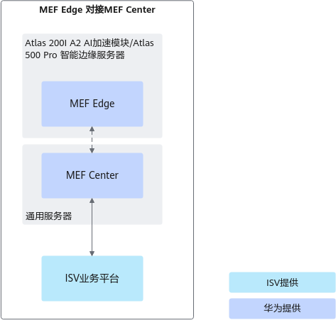
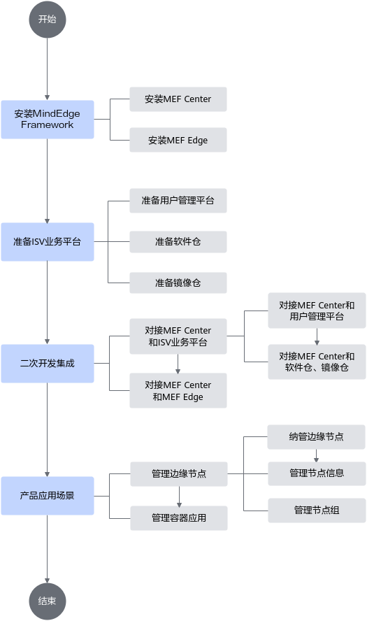

# 产品简介

**产品背景**

随着AI技术的演进，交通、能源、安防等行业的智能化转型诉求愈发强烈，端边云应用落地越来越多。海量的终端设备实时产生数据，集中式云计算在带宽负载、网络延时、数据管理成本等方面适应数据频繁交互的需求，使得边缘计算的价值进一步凸显。边缘计算需求的增长必然带来边缘计算设备数量的增加，如何管理数量众多的边缘设备，以及如何将边缘计算应用批量部署到边缘设备成为系统管理人员重点关注的问题。

**产品定义**

MEF是一款定位为被集成的轻量化端边云协同使能框架。MEF作为昇腾推理解决方案中的一部分，用于智能边缘设备使能，提供边缘节点管理和智能推理业务（容器应用）管理的功能。可通过MEF Edge和MEF Center进行边云协同管理，用户可通过二次开发，对接ISV（Independent Software Vendor）业务平台，集成所需功能。

- MEF Edge部署在智能边缘设备上，负责与中心网管对接，完成智能推理业务（容器应用）的部署和管理，为算法应用提供服务。
- MEF Center部署在通用服务器上，负责对边缘节点实现批量管理、业务部署和系统监测。

**产品价值**

使用MEF，用户可从业务面和管理面两大层面感受产品价值。

**表 1**  产品价值说明

|使用层面|产品价值|
|--|--|
|业务面|MEF生态开放，全栈使能，便于集成，降低用户的使用门槛。|
|管理面|MEF极简易用，安全可信。|

# MEF架构

MEF依托于开源系统KubeEdge完成MEF Center和MEF Edge之间控制链路的建立和管理。MEF Center为用户提供RESTful接口，其他第三方应用集成调用，使其可以通过接口访问服务。

**图 1** MEF架构图  

- MEF Center是MEF用于提供对外接口对接ISV业务平台和云边协同对接MEF Edge的中心管理软件。该软件集成了节点管理模块和容器管理模块等模块，提供了节点管理服务和容器应用管理服务等功能。

    **表 1** MEF Center模块说明

    |模块名称|模块功能定位|
    |--|--|
    |APIG(API Gateway)|对外提供ISV业务平台的双向认证和RESTful接口。用于ISV业务平台调用并使用MEF Center提供的服务。|
    |edge-manager|边缘节点管理模块及容器应用管理模块。实现对边缘节点接入和节点上运行容器应用的管理。|
    |cert-manager|证书管理模块。用于对MEF使用的内外部证书实施统一管理。|
    |alarm-manager|告警管理模块。用于管理MEF Edge和MEF Center的告警和事件。|

- MEF Edge是对接MEF Center的边缘管理软件。MEF Edge主要通过接收MEF Center消息并将相关信息收集、转发到MEF Center，实现对相关软件的安装升级、容器应用的全生命周期管理等功能。同时MEF具备离线自治能力，当MEF Edge所在边缘节点与MEF Center所在中心节点链路中断后，边缘节点推理业务不中断；边缘节点发生重启，推理业务可以在边缘节点重启完成之后自行恢复。

    **表 2** MEF Edge模块说明

    |模块名称|模块功能定位|
    |--|--|
    |edge-om|主进程模块，包括升级模块等。|
    |edge-main|对接MEF Edge和MEF Center的进程模块。|
    |EdgeCore|开源系统KubeEdge的边侧部分。负责边缘节点容器生命周期管理。|
    |Device-Plugin|NPU（昇腾AI处理器）的设备发现插件。|

# 应用场景

MEF的主要应用场景包括边缘节点管理和容器应用管理。MEF通过将集群中的边缘节点纳管入MEF系统中，实现对边缘节点信息的统一管理，提供纳管节点、查询、修改和删除节点或节点组信息等功能。容器应用管理作为MEF的基础特性，承担着对用户应用进行全生命周期管理的任务。用户应用以容器镜像的形式发布，MEF对用户的容器应用镜像进行管理，涉及容器应用的增、删、改、查等功能。

MEF由MEF Edge对接MEF Center进行云边协同，对外通过北向接口对接ISV业务平台实现对边缘节点和容器应用的管理。

**图 1** MEF对接方式  

**MEF Edge对接MEF Center应用流程**

**图 2** MEF Edge和MEF Center云边协同应用流程  

MEF Edge对接MEF Center进行云边协同的应用流程主要包括安装MEF，二次开发集成MEF和管理边缘节点及容器应用三部分。安装MEF分为MEF Center和MEF Edge的准备与安装；用户完成定制化修改等二次开发后，集成MEF与开发者平台，对外通过北向接口对接ISV业务平台，对内实现MEF Center和MEF Edge的云边对接；并通过ISV业务平台完成对边缘节点和容器应用的管理。

# 支持的产品形态和OS清单

**表 1** MEF Edge对接MEF Center方式支持的产品列表

<table><thead align="left"><tr id="row919217382919"><th class="cellrowborder" valign="top" width="20%" id="mcps1.2.6.1.1">
安装节点

</th>
<th class="cellrowborder" valign="top" width="20%" id="mcps1.2.6.1.2">
软件

</th>
<th class="cellrowborder" valign="top" width="20%" id="mcps1.2.6.1.3">
产品形态

</th>
<th class="cellrowborder" valign="top" width="20%" id="mcps1.2.6.1.4">
软件架构

</th>
<th class="cellrowborder" valign="top" width="20%" id="mcps1.2.6.1.5">
操作系统

</th>
</tr>
</thead>
<tbody><tr id="row719216381197"><td class="cellrowborder" valign="top" width="20%" headers="mcps1.2.6.1.1 ">
管理节点

</td>
<td class="cellrowborder" valign="top" width="20%" headers="mcps1.2.6.1.2 ">
MEF Center

</td>
<td class="cellrowborder" valign="top" width="20%" headers="mcps1.2.6.1.3 ">
通用服务器

</td>
<td class="cellrowborder" valign="top" width="20%" headers="mcps1.2.6.1.4 ">
AArch64和x86_64

</td>
<td class="cellrowborder" valign="top" width="20%" headers="mcps1.2.6.1.5 ">
Ubuntu 20.04

openEuler 22.03

</td>
</tr>
<tr id="row219203820914"><td class="cellrowborder" rowspan="2" valign="top" width="20%" headers="mcps1.2.6.1.1 ">
计算节点

</td>
<td class="cellrowborder" rowspan="2" valign="top" width="20%" headers="mcps1.2.6.1.2 ">
MEF Edge

</td>
<td class="cellrowborder" valign="top" width="20%" headers="mcps1.2.6.1.3 ">
Atlas 200I A2 加速模块

Atlas 200I DK A2 开发者套件

</td>
<td class="cellrowborder" valign="top" width="20%" headers="mcps1.2.6.1.4 ">
AArch64

</td>
<td class="cellrowborder" valign="top" width="20%" headers="mcps1.2.6.1.5 ">
openEuler 22.03

Ubuntu 22.04

</td>
</tr>
<tr id="row11488658181115"><td class="cellrowborder" valign="top" headers="mcps1.2.6.1.1 ">
Atlas 500 Pro 智能边缘服务器（型号 3000）（插Atlas 300I Pro 推理卡A300I Pro 推理卡）

</td>
<td class="cellrowborder" valign="top" headers="mcps1.2.6.1.2 ">
AArch64

</td>
<td class="cellrowborder" valign="top" headers="mcps1.2.6.1.3 ">
openEuler 22.03

</td>
</tr>
</tbody>
</table>
