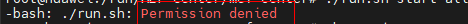

# 故障处理<a name="ZH-CN_TOPIC_0000001722295481"></a>

## MEF Center执行run.sh命令失败<a name="ZH-CN_TOPIC_0000001674256306"></a>

### MEF Center执行run.sh命令拒绝访问<a name="ZH-CN_TOPIC_0000001722295501"></a>

**问题现象描述<a name="section13754951112814"></a>**

**run.sh**命令在有x权限（可被执行权限）时仍执行失败，回显显示“Permission denied”，示例如下。

**图 1**  目录权限<a name="fig6240121814544"></a>  


**图 2**  运行./run.sh失败<a name="fig0572103614540"></a>  


**原因分析<a name="section77551626153617"></a>**

当前路径的挂载点可能设置了“noexec“参数，导致无法在此路径下执行命令。

**解决措施<a name="section157021112307"></a>**

- 方法一：更换至无“noexec“参数的路径下安装软件并运行。
- 方法二：可使用**bash**命令执行run\.sh，示例如下。

    ```bash
    bash ./run.sh start all
    ```

### MEF Center执行run.sh命令连接超时<a name="ZH-CN_TOPIC_0000001674256242"></a>

**问题现象描述<a name="section13754951112814"></a>**

**run\.sh**命令执行失败，日志显示“unable to connect to the server：Gateway Time-out”。

**原因分析<a name="section77551626153617"></a>**

系统代理可能导致kubectl不可用。可能是因为代理配置问题，导致中心侧无法与K8s建立连接。

**解决措施<a name="section157021112307"></a>**

执行如下命令，禁用HTTPS连接，使用默认K8s连接。

```bash
unset https_proxy
```

## MEF Edge执行run.sh命令失败<a name="ZH-CN_TOPIC_0000001674416042"></a>

**问题现象描述<a name="section13754951112814"></a>**

**run\.sh**命令在有x权限（可被执行权限）时仍执行失败，回显显示“Permission denied”，示例如下。

**图 1**  目录权限<a name="fig6240121814544"></a>  


**图 2**  运行./run.sh失败<a name="fig0572103614540"></a>  


**原因分析<a name="section77551626153617"></a>**

当前路径的挂载点可能设置了“noexec“参数，导致无法在此路径下执行命令。

**解决措施<a name="section157021112307"></a>**

- 方法一：更换至无“noexec“参数的路径下安装软件并运行。
- 方法二：可使用**bash**命令执行run\.sh，示例如下。

    ```bash
    bash ./run.sh start
    ```

## MEF Edge查询MEF Center根证书失败<a name="ZH-CN_TOPIC_0000001674416038"></a>

**问题描述<a name="section1965862418191"></a>**

通过命令行在MEF Edge设备环境上查询MEF Center根证书返回“Execute [getcertinfo] command failed.”，具体错误信息如下。

```text
get cert info failed, cert does not exist. Execute command [netconfig] first.
```

**解决措施<a name="section1919182851920"></a>**

MEF Center根证书需在配置网管并导入证书之后才可通过getcertinfo查询并获取，请先参考[MEF Center和MEF Edge认证对接](./usage.md#mef-center和mef-edge认证对接)完成对接。

## MEF Center和MEF Edge执行网管配置对接失败<a id="ZH-CN_TOPIC_0000001674416002"></a>

**问题描述<a name="section281692625610"></a>**

MEF Center和MEF Edge执行网管配置命令失败，回显示例如下。

```text
Execute [netconfig] command failed!
```

**解决措施<a name="section19769112012133"></a>**

1. 打开[MEF Edge安装部署的运行日志](./common_operations.md#运行日志)（默认位置为“/var/alog/MEFEdge\_log/edge\_installer/edge\_installer\_run.log“）。
2. 查看日志中网管配置失败的原因。
    - 若错误如下，需要检查token正确性。

        ```text
        token is incorrect
        https return error status code: 401
        ```

        若token认证失败超过5次（包括test\_connect测试次数），MEF Center会锁定本次认证对接5分钟。请在5分钟后重新对接并输入正确的token。

        ```text
        ip is lock
        https return error status code: 423
        ```

    - 若为其他错误，可尝试检查MEF Center和MEF Edge网络连通性或网管配置中其他参数是否正确。

3. 重新尝试[MEF Center和MEF Edge认证对接](./usage.md#mef-center和mef-edge认证对接)。

## MEF Center卸载失败<a name="ZH-CN_TOPIC_0000001722295401"></a>

**问题现象描述<a name="section13754951112814"></a>**

MEF Center卸载执行失败，返回无法删除引用镜像错误，示例如下。

```text
delete ascend-nginx-manager's docker image command exec failed: Error response from daemon: conflict: unable to remove repository reference "ascend-nginx-manager:v1" (must force) - container xxxxxxxxx is using its referenced image xxxxxxxxx
```

**原因分析<a name="section77551626153617"></a>**

MEF Center安装后会生成名为“ascend-_模块名_:_tag_”（如ascend-_cert-manager_:_v1_）的组件镜像，若卸载时存在通过MEF Center以外的方式启动和使用这类组件镜像的容器，会导致卸载失败。

**解决措施<a name="section157021112307"></a>**

请手动删除占用镜像的容器之后重新尝试卸载MEF Center。

## MEF Edge自动更新MEF Center根证书失败<a id="ZH-CN_TOPIC_0000001722295437"></a>

**问题现象描述<a name="section13754951112814"></a>**

MEF Center进行MEF Center根证书自动更新后，MEF Edge无法成功连接到MEF Center，错误示例如下。

```text
check edgehub client cert error: get cert from center error: Post \"https***\": x509: certificate signed by unknown authority
```

**原因分析<a name="section77551626153617"></a>**

MEF Center自动更新根证书时，MEF Edge由于网络中断或者其他原因未能正常完成MEF Center根证书自动更新。待MEF Center根证书强制更新后，MEF Edge设备中过期的MEF Center根证书无法成功校验，导致对接失败。

**解决措施<a name="section157021112307"></a>**

重新获取MEF Center根证书和云边认证token，并在MEF Edge设备上进行网管配置，具体操作请参见[MEF Center和MEF Edge认证对接](./usage.md#mef-center和mef-edge认证对接)。
