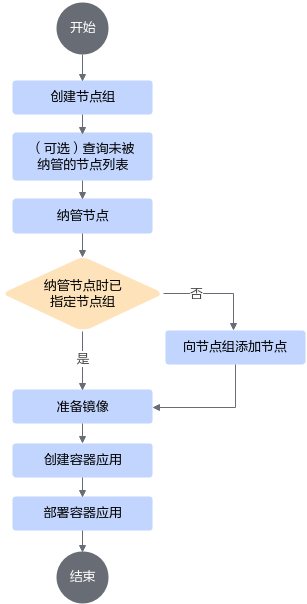

# 使用指导<a name="ZH-CN_TOPIC_0000001674256294"></a>

## 开发前准备<a name="ZH-CN_TOPIC_0000001722295409"></a>

MEF提供管理边缘节点容器应用的功能，其中包括边缘节点接入管理和容器应用管理。用户通过二次开发，对接ISV业务平台后，可通过MEF Center的RESTful接口实现初始化配置第三方镜像仓库和软件仓库、拉取镜像以及升级MEF Edge软件包功能。

**MEF Center开发须知<a name="section37459330376"></a>**

在MEF Center的设备环境上，MEF已占用如下端口，在开发第三方组件时需避免使用相同端口。

**表 1** MEF Center占用端口说明表<a id="MEF-Center"></a>

|目的端口|使用组件|端口说明|
|--|--|--|
|30003|MEF Center|用于边缘节点对接MEF Center网管的服务端口|
|30004|MEF Center|用于边缘节点对接MEF Center网管的测试连接和认证信息的端口|
|10002|CloudCore|用于边缘节点的edgecore对接CloudCore时进行证书获取等操作|
|10000|CloudCore|用于边缘节点的edgecore对接CloudCore进行业务交互|
|6443|K8s|K8s的API server侦听端口，为MEF Center客户端提供服务|
|30035|MEF Center|用于访问MEF Center提供的restful接口|

**准备用户管理平台<a name="section7851111143812"></a>**

用户需要准备具备通过https进行传输功能的用户管理平台，该管理平台与MEF Center交换根证书认证后通过RESTful接口成功对接，使用MEF提供的功能。

**准备镜像仓库<a name="section44409575391"></a>**

用户需要准备符合Docker接口标准的开源镜像仓库或自有镜像仓库，该镜像仓库需要具备通过https上传和拉取镜像的功能。

**准备软件仓库<a id="准备软件仓库"></a>**

用户需要准备统一RESTful接口的开源软件仓库或自有软件仓库，该软件仓库需要具备通过https进行文件上传和下载的功能。

## MEF Center对接业务平台<a name="ZH-CN_TOPIC_0000001722375561"></a>

使用北向RESTful接口对接用户管理平台、镜像仓库和软件仓库。

### 对接用户管理平台<a id="ZH-CN_TOPIC_0000001722375517"></a>

MEF Center的对外接口需要与第三方平台进行双向证书认证。

1. 交换MEF Center和第三方管理平台的根证书。MEF Center必须启动cert-manager才能进行证书交换。

    执行以下命令，进行证书交换。

    ```bash
    安装路径/MEF-Center/mef-center/run.sh exchangeca -export_path MEF根证书文件路径 -import_path 管理平台根证书文件路径
    ```

    > [!NOTE] 说明  
    >- 若对接后需要更新第三方管理平台根证书，MEF Center须在执行证书交换命令后重启nginx-manager，参见[重启MEF Center](./common_operations.md#重启mef-center)。
    >- 根证书的有效期建议大于[证书告警的检测周期](./common_operations.md#mef-center配置和查询证书过期告警)（默认值为7）。
    >- 重复导入根证书会备份之前导入的前一份证书。

    **表 1**  exchangeca参数说明<a id="exchangecatable"></a>

    |参数|说明|
    |--|--|
    |-export_path/--export_path|保存的MEF根证书文件路径，用于第三方模块认证MEF Center，需具体到文件名。该文件路径只支持绝对路径，且不能为已存在文件。|
    |-import_path/--import_path|管理平台根证书文件路径，用于MEF Center认证第三方模块，需具体到文件名。可支持证书链，最多10级，单个证书校验。该文件路径只支持绝对路径。管理平台根证书应符合以下要求：<ul><li>证书需要是PEM格式。</li><li>根CA证书中签名正确。</li><li>根CA证书处于有效期内。</li><li>证书须为X.509 V3数字证书，根CA证书的“基本限制”扩展域须标明为“CA”，“密钥用法”扩展域中须包含“证书签名”。</li><li>密钥要求为RSA算法，长度不小于3072，摘要算法需为SHA256、SHA384、SHA512；或ECDSA，长度不小于256。</li></ul>|

    > [!NOTE] 说明  
    >- export\_path的目录不支持软链接，路径取值长度应小于4096，目录层级小于99层，且同组和其他用户没有写权限，属主为root。
    >- export\_path指定的文件属主须为root，同组和其他用户没有写权限，且大小不超过1MB。
    >- import\_path指定的文件必须存在，属主须为root，同组和其他用户没有写权限，且大小不超过1MB。

    - 回显示例如下或命令返回值为0，表示操作执行成功。

        ```text
        exchange certs successful
        ```

    - 回显示例如下或命令返回值为4，则可等待cert-manager初始化完成后重试进行证书交换。

        ```text
        the root ca has not yet generated, please start cert manager first
        exchange certs failed
        ```

2. 确认对接结果。调用版本查询接口确认对接结果，调用成功则表示对接成功。

    ```bash
    https://{ip}:{port}/edgemanager/v1/version
    ```

    接口具体信息请参见[查询edge-manager版本](./RESTful.md#查询edge-manager版本)。

    > [!NOTE] 说明    
    > 进行证书交换成功后，需等待1s后确认对接结果。

**后续操作<a name="section1311312511389"></a>**

如果需要获取第三方管理平台根证书信息，请参见[获取集成方证书信息](./RESTful.md#获取集成方证书信息)。

### 对接镜像仓库<a id="ZH-CN_TOPIC_0000001674416006"></a>

用户使用第三方镜像仓库需要先导入镜像仓库根证书，再配置镜像下载信息完成对接。配置第三方镜像仓库时会使用到第三方镜像仓库提供的账号和密码，该账号和密码的安全性由用户保证。

1. 导入镜像仓库根证书。

    用户使用第三方镜像仓库需要先导入镜像仓库证书。

    ```bash
    https://{ip}:{port}/certmanager/v1/certificates/import
    ```

    接口具体信息请参见[导入根证书](./RESTful.md#导入根证书)。

2. 导入镜像仓库配置。

    用于配置第三方镜像仓库地址和账号密码，仓库服务器地址支持域名或者IP地址。重复调用接口时，会更新已有的镜像下载信息配置。

    ```bash
    https://{ip}:{port}/edgemanager/v1/image/config
    ```

    接口具体信息请参见[配置镜像下载信息](./RESTful.md#配置镜像下载信息)。

3. （可选）配置域名和IP地址的映射关系。

    当调入镜像仓库配置时使用域名，需要在边缘设备的MEF Edge的主机目录“/etc/hosts“中，配置域名和IP地址的映射关系，具体操作请参考[配置本地域名映射](./common_operations.md#配置本地域名映射)。

    ```bash
    ./run.sh domainconfig -domain=xxx -ip=xxx
    ```

### 对接软件仓库<a id="ZH-CN_TOPIC_0000001674256310"></a>

用户使用第三方软件仓库需要先导入软件仓库根证书完成对接。

```bash
https://{ip}:{port}/certmanager/v1/certificates/import
```

接口具体信息请参见[导入根证书](./RESTful.md#导入根证书)。

## MEF Center和MEF Edge认证对接<a id="ZH-CN_TOPIC_0000001722295385"></a>  

获取MEF Center根证书和云边认证token，并在MEF Edge设备上进行网管配置，用于MEF Center和MEF Edge间的双向认证和云边对接。

**前提条件<a name="section9259204510567"></a>**

要求待纳管的设备系统时间与MEF Center的系统时间一致，否则可能导致对接MEF Center失败。

**操作步骤<a name="section1073368171320"></a>**

1. 以root用户登录MEF Edge设备环境。
2. 获取MEF Center根证书和云边认证token。
    1. 导出根证书参考[导出根证书](./RESTful.md#导出根证书)，URL参数选择“hub\_svr“。
    2. 获取有效的云边认证token参考[获取云边认证token](./RESTful.md#获取云边认证token)，获取的token有效期为7天。

3. 将MEF Center根证书上传至MEF Edge设备任意路径下（该目录权限建议为其他用户不可写）。
4. 执行以下命令，进入到网管配置文件所在路径。

    ```bash
    cd 安装路径/MEFEdge/software/
    ```

5. 执行以下命令，进行网管配置。

    ```bash
    ./run.sh netconfig -root_ca=<MEF Center根证书路径/证书名.crt> -ip=<MEF Center IP地址> [-port=<MEF Center端口号>] [-net_type=MEF]  [-test_connect=true] [-auth_port=<MEF Center认证端口号>]
    ```

    **表 1**  netconfig参数说明<a id="netconfig参数说明"></a>

    |参数|是否可选|说明|
    |--|--|--|
    |root_ca|必选|表示导入的MEF Center根证书文件路径，且该路径需要为绝对路径。路径要求其属主为root，属组和其他用户没有写权限，且大小不超过1MB。<div> > [!NOTE] 说明  </div>当证书过期或者被吊销导致设备无法与MEF Center对接时，请重新导入MEF Center根证书文件。|
    |ip|必选|MEF Center的访问IP地址。<div> > [!NOTE] 说明  </div>仅支持IPv4，不能为全零地址（0.0.0.0），广播地址（255.255.255.255）和本地IP。|
    |port|可选|表示MEF Center的端口号，取值范围为1025~65535。不配置该参数时，使用默认端口30003。如果曾多次配置端口号，以最近一次配置的端口号为准。|
    |net_type|可选|表示网管模式，取值为MEF。不配置该参数时，默认为MEF。|
    |test_connect|可选|表示网管配置时是否对MEF Edge设备与MEF Center的连通性进行测试。测试连接默认值为true，不配置该值会默认进行连通性测试。<ul><li>如果配置该参数且取值配置为true，则会对设备与MEF Center的连通性进行测试，如果测试不通过，则对接MEF Center失败。</li><li>如果配置该参数且取值配置为false，则不会对设备与MEF Center的连通性进行测试，但可能会导致后续对接MEF Center失败。</li></ul>|
    |auth_port|可选|MEF Center用于进行认证的端口号，取值范围为1025~65535。该参数为可选参数，不配置该参数时，使用默认端口30004。|

6. 按提示输入云边认证token，完成对接。

    ```text
    Please enter token:
    ```

    回显示例如下，表示对接成功。若对接失败，请参考[MEF Center和MEF Edge执行网管配置对接失败](./troubleshooting.md#mef-center和mef-edge执行网管配置对接失败)。

    ```text
    Execute [netconfig] command success!
    ```

7. 对接成功后执行以下命令，重启MEF Edge。

    ```bash
    ./run.sh restart
    ```

    回显示例如下，表示重启命令执行成功。

    ```text
    Execute [restart] command success!
    ```

> [!NOTE] 说明   
> 
>- MEF Center不支持迁移容器应用，重新配置网管前，建议用户[卸载已部署的容器](./RESTful.md#卸载容器应用)避免资源残留。
>- 如需自行配置MEF Center根证书过期告警时间阈值和检测周期，可参考[MEF Edge配置和查询证书过期告警](./common_operations.md#mef-edge配置和查询证书过期告警)。
>- 重新配置网管参数后，需要重启MEF Edge才能生效。

## 部署容器应用<a id="ZH-CN_TOPIC_0000001722375569"></a>

本章节指导开发者根据MEF Center提供的RESTful接口进行容器应用的部署，可按如下[图1](#fig1367012586547)所示操作步骤进行。

> [!NOTE] 说明  
> 建议不要在MEF Center节点上通过命令方式和调用API接口的方式操作集群资源（如容器应用），否则可能导致MEF Center环境异常。

**图 1**  部署容器应用流程图<a id="fig1367012586547"></a>  


**部署容器应用流程介绍<a name="section871716499479"></a>**

**表 1**  部署容器应用流程
<table><thead align="left"><tr id="zh-cn_topic_0235159015_row234335421710"><th class="cellrowborder" valign="top" width="12.7%" id="mcps1.2.5.1.1"><p id="p889383005413"><a name="p889383005413"></a><a name="p889383005413"></a>场景</p>
</th>
<th class="cellrowborder" valign="top" width="20.330000000000002%" id="mcps1.2.5.1.2"><p id="p147413201269"><a name="p147413201269"></a><a name="p147413201269"></a>操作</p>
</th>
<th class="cellrowborder" valign="top" width="35.85%" id="mcps1.2.5.1.3"><p id="p16749201269"><a name="p16749201269"></a><a name="p16749201269"></a>描述</p>
</th>
<th class="cellrowborder" valign="top" width="31.119999999999997%" id="mcps1.2.5.1.4"><p id="p27416206617"><a name="p27416206617"></a><a name="p27416206617"></a>接口参考</p>
</th>
</tr>
</thead>
<tbody><tr id="row10995167205718"><td class="cellrowborder" rowspan="7" valign="top" width="12.7%" headers="mcps1.2.5.1.1 "><p id="p04141721204315"><a name="p04141721204315"></a><a name="p04141721204315"></a>纳管边缘节点</p>
</td>
<td class="cellrowborder" valign="top" width="20.330000000000002%" headers="mcps1.2.5.1.2 "><p id="p81351543181212"><a name="p81351543181212"></a><a name="p81351543181212"></a>创建节点组</p>
</td>
<td class="cellrowborder" valign="top" width="35.85%" headers="mcps1.2.5.1.3 "><p id="p1113504310124"><a name="p1113504310124"></a><a name="p1113504310124"></a>通过RESTful接口创建节点组或使用已有节点组。</p>
</td>
<td class="cellrowborder" rowspan="7" valign="top" width="31.119999999999997%" headers="mcps1.2.5.1.4 "><p id="p624110516551"><a name="p624110516551"></a><a name="p624110516551"></a>节点管理接口信息请参见<a href="./RESTful.md#节点管理接口介绍">节点管理接口介绍</a>。</p>
</td>
</tr>
<tr id="row163371281978"><td class="cellrowborder" valign="top" headers="mcps1.2.5.1.1 "><p id="p14241556122"><a name="p14241556122"></a><a name="p14241556122"></a>（可选）查询未被纳管的节点列表</p>
</td>
<td class="cellrowborder" valign="top" headers="mcps1.2.5.1.2 "><p id="p94241155141210"><a name="p94241155141210"></a><a name="p94241155141210"></a>纳管节点前，可通过RESTful接口查询未被纳管的节点列表，找到当前未纳管的<span id="ph5796105872215"><a name="ph5796105872215"></a><a name="ph5796105872215"></a>MEF Edge</span>设备节点对应的节点ID。</p>
</td>
</tr>
<tr id="row43757329287"><td class="cellrowborder" valign="top" headers="mcps1.2.5.1.1 "><p id="p642418554129"><a name="p642418554129"></a><a name="p642418554129"></a>纳管节点</p>
</td>
<td class="cellrowborder" valign="top" headers="mcps1.2.5.1.2 "><p id="p144241655191217"><a name="p144241655191217"></a><a name="p144241655191217"></a>通过RESTful接口纳管节点。</p>
</td>
</tr>
<tr id="row1922465412119"><td class="cellrowborder" valign="top" headers="mcps1.2.5.1.1 "><p id="p4424135515126"><a name="p4424135515126"></a><a name="p4424135515126"></a>（可选）向节点组添加节点</p>
</td>
<td class="cellrowborder" valign="top" headers="mcps1.2.5.1.2 "><p id="p12424175531219"><a name="p12424175531219"></a><a name="p12424175531219"></a>若纳管节点时未指定“groupIDs”，可通过RESTful接口将节点添加至指定节点组。</p>
</td>
</tr>
<tr id="row595114820457"><td class="cellrowborder" valign="top" headers="mcps1.2.5.1.1 "><p id="p495217484451"><a name="p495217484451"></a><a name="p495217484451"></a>（可选）修改节点</p>
</td>
<td class="cellrowborder" valign="top" headers="mcps1.2.5.1.2 "><p id="p9952194812459"><a name="p9952194812459"></a><a name="p9952194812459"></a>通过RESTful接口修改节点的名称和描述。</p>
</td>
</tr>
<tr id="row10250948192317"><td class="cellrowborder" valign="top" headers="mcps1.2.5.1.1 "><p id="p182501148192315"><a name="p182501148192315"></a><a name="p182501148192315"></a>（可选）删除节点</p>
</td>
<td class="cellrowborder" valign="top" headers="mcps1.2.5.1.2 "><p id="p142501148132316"><a name="p142501148132316"></a><a name="p142501148132316"></a>通过RESTful接口批量删除节点。</p>
</td>
</tr>
<tr id="row144191717254"><td class="cellrowborder" valign="top" headers="mcps1.2.5.1.1 "><p id="p74198732515"><a name="p74198732515"></a><a name="p74198732515"></a>（可选）将节点移出节点组</p>
</td>
<td class="cellrowborder" valign="top" headers="mcps1.2.5.1.2 "><p id="p04191975256"><a name="p04191975256"></a><a name="p04191975256"></a>通过RESTful接口将节点移出指定节点组实现删除单个容器应用的Pod，实现对应的容器应用卸载。</p>
</td>
</tr>
<tr id="row48414131310"><td class="cellrowborder" valign="top" width="12.7%" headers="mcps1.2.5.1.1 "><p id="p6893183025419"><a name="p6893183025419"></a><a name="p6893183025419"></a>准备容器镜像</p>
</td>
<td class="cellrowborder" valign="top" width="20.330000000000002%" headers="mcps1.2.5.1.2 "><p id="p1966111716158"><a name="p1966111716158"></a><a name="p1966111716158"></a>准备容器镜像</p>
</td>
<td class="cellrowborder" valign="top" width="35.85%" headers="mcps1.2.5.1.3 "><p id="p1666181741512"><a name="p1666181741512"></a><a name="p1666181741512"></a><span id="ph13170154424716"><a name="ph13170154424716"></a><a name="ph13170154424716"></a>MEF</span>可以通过Docker公共镜像仓库、第三方镜像仓库或<span id="ph3525163816271"><a name="ph3525163816271"></a><a name="ph3525163816271"></a>MEF Edge</span>手动导入镜像三种方式使用容器应用的镜像。</p>
<p id="p14661517161515"><a name="p14661517161515"></a><a name="p14661517161515"></a>当使用镜像仓库时，用户需要确保安装<span id="ph18301043115713"><a name="ph18301043115713"></a><a name="ph18301043115713"></a>MEF Edge</span>设备和镜像仓库之间的网络连接，以及镜像仓库本身能够使用。</p>> [!NOTE] 说明  <div>部署容器应用时，会使用由第三方镜像仓库下发的镜像仓库账户和密码，该账户和密码由第三方统一管理。</div>
</td>
<td class="cellrowborder" valign="top" width="31.119999999999997%" headers="mcps1.2.5.1.4 "><a name="ul362985313248"></a><a name="ul362985313248"></a><ul id="ul362985313248"><li>如果用户在<span id="ph33441146105719"><a name="ph33441146105719"></a><a name="ph33441146105719"></a>MEF Edge</span>设备环境手动导入镜像，可参考Docker命令在任意路径下导入：<strong id="b185143414551"><a name="b185143414551"></a><a name="b185143414551"></a>docker load -i xxxx.tar.gz</strong></li><li>如果用户需要使用第三方镜像仓库获取镜像，使用流程请参见<a href="./RESTful.md#配置接口介绍">配置接口介绍</a>进行操作。</li><li>容器镜像的制作可参考<a href="./common_operations.md#制作推理镜像">制作推理镜像</a>或<span id="ph1126911412338"><a name="ph1126911412338"></a><a name="ph1126911412338"></a>《<a href="https://support.huawei.com/enterprise/zh/doc/EDOC1100423566" target="_blank" rel="noopener noreferrer">Atlas 200I A2 加速模块 昇腾软件快速安装指南</a>》</span>中的<span class="menucascade" id="menucascade856261318102"><a name="menucascade856261318102"></a><a name="menucascade856261318102"></a>“<span class="uicontrol" id="uicontrol17562613171014"><a name="uicontrol17562613171014"></a><a name="uicontrol17562613171014"></a>容器部署场景</span> &gt; <span class="uicontrol" id="uicontrol562491818103"><a name="uicontrol562491818103"></a><a name="uicontrol562491818103"></a>制作容器镜像</span>”</span>章节。</li></ul>
</td>
</tr>
<tr id="row14249152715157"><td class="cellrowborder" rowspan="7" valign="top" width="12.7%" headers="mcps1.2.5.1.1 "><p id="p68097363440"><a name="p68097363440"></a><a name="p68097363440"></a>管理容器应用</p>
</td>
<td class="cellrowborder" valign="top" width="20.330000000000002%" headers="mcps1.2.5.1.2 "><p id="p126424412152"><a name="p126424412152"></a><a name="p126424412152"></a>创建容器应用</p>
</td>
<td class="cellrowborder" valign="top" width="35.85%" headers="mcps1.2.5.1.3 "><p id="p5264194481514"><a name="p5264194481514"></a><a name="p5264194481514"></a>通过RESTful接口为节点组创建容器应用。</p>
</td>
<td class="cellrowborder" rowspan="7" valign="top" width="31.119999999999997%" headers="mcps1.2.5.1.4 "><p id="p2334184885417"><a name="p2334184885417"></a><a name="p2334184885417"></a>容器应用管理接口信息请参见<a href="./RESTful.md#容器应用管理接口">容器应用管理接口</a>。</p>> [!NOTE] 说明 <div>若用户将非MEF Center管理的容器应用部署到设备节点，可能导致容器应用因资源不足无法部署。</div>
</td>
</tr>
<tr id="row59891229102617"><td class="cellrowborder" valign="top" headers="mcps1.2.5.1.1 "><p id="p16989629112612"><a name="p16989629112612"></a><a name="p16989629112612"></a>（可选）查询容器应用列表</p>
</td>
<td class="cellrowborder" valign="top" headers="mcps1.2.5.1.2 "><p id="p498932992616"><a name="p498932992616"></a><a name="p498932992616"></a>通过RESTful接口查询待部署的容器应用列表。</p>
</td>
</tr>
<tr id="row134721051141512"><td class="cellrowborder" valign="top" headers="mcps1.2.5.1.1 "><p id="p1344555751512"><a name="p1344555751512"></a><a name="p1344555751512"></a>部署容器应用</p>
</td>
<td class="cellrowborder" valign="top" headers="mcps1.2.5.1.2 "><p id="p144595771519"><a name="p144595771519"></a><a name="p144595771519"></a>通过RESTful接口为节点组创建容器应用。</p>
</td>
</tr>
<tr id="row124111802167"><td class="cellrowborder" valign="top" headers="mcps1.2.5.1.1 "><p id="p17471185141613"><a name="p17471185141613"></a><a name="p17471185141613"></a>（可选）查询已部署的容器应用列表</p>
</td>
<td class="cellrowborder" valign="top" headers="mcps1.2.5.1.2 "><p id="p14711055166"><a name="p14711055166"></a><a name="p14711055166"></a>部署容器应用后，可通过RESTful接口查询已部署的容器应用列表。</p>
</td>
</tr>
<tr id="row2045711226477"><td class="cellrowborder" valign="top" headers="mcps1.2.5.1.1 "><p id="p10457162220478"><a name="p10457162220478"></a><a name="p10457162220478"></a>（可选）更新容器应用</p>
</td>
<td class="cellrowborder" valign="top" headers="mcps1.2.5.1.2 "><p id="p245752284719"><a name="p245752284719"></a><a name="p245752284719"></a>通过RESTful接口更新对应已部署的容器应用。目前只支持修改容器镜像名称和容器镜像版本的更新。</p>
</td>
</tr>
<tr id="row1033823610479"><td class="cellrowborder" valign="top" headers="mcps1.2.5.1.1 "><p id="p1484210467478"><a name="p1484210467478"></a><a name="p1484210467478"></a>（可选）卸载容器应用</p>
</td>
<td class="cellrowborder" valign="top" headers="mcps1.2.5.1.2 "><p id="p20338636144711"><a name="p20338636144711"></a><a name="p20338636144711"></a>通过RESTful接口卸载容器应用。</p>
</td>
</tr>
<tr id="row10377257134717"><td class="cellrowborder" valign="top" headers="mcps1.2.5.1.1 "><p id="p83774578477"><a name="p83774578477"></a><a name="p83774578477"></a>（可选）删除容器应用</p>
</td>
<td class="cellrowborder" valign="top" headers="mcps1.2.5.1.2 "><p id="p4377105717475"><a name="p4377105717475"></a><a name="p4377105717475"></a>通过RESTful接口删除容器应用。删除容器应用时只允许删除没有被部署的应用。如果对应容器应用已部署，需先卸载该容器应用。</p>
</td>
</tr>
</tbody>
</table>

> [!NOTE] 说明  
> 如需根据MEF Center提供的RESTful接口收集MEF Edge节点设备的日志，请参见[日志收集接口](./RESTful.md#日志收集接口)。若需要直接登录设备环境查看日志，请参见[查看日志信息](./common_operations.md#查看日志信息)。
